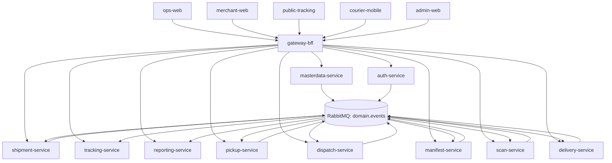
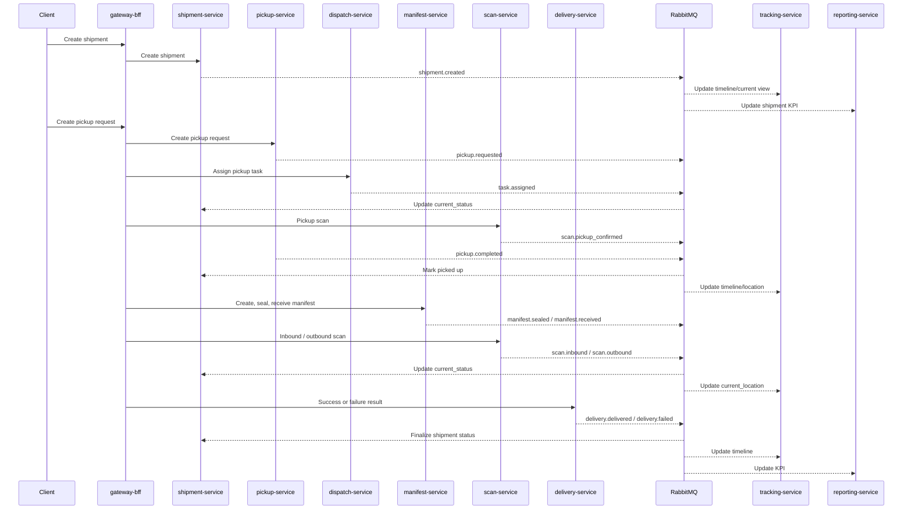
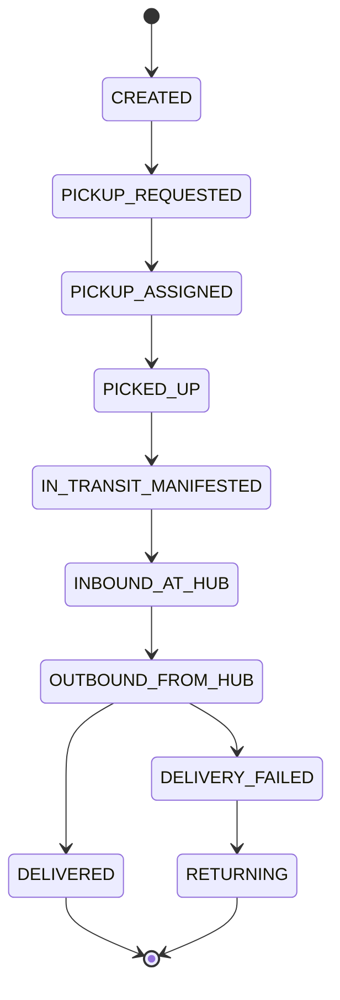

# Nexus Express System

> A production-oriented logistics platform built with microservices to manage the full shipment lifecycle across pickup, hub operations, delivery, tracking, and operational reporting.


---

## Overview

**Logistics Management System** is a microservices-based platform designed for modern warehouse and delivery operations.  
It manages a shipment from the moment it is created, through pickup and hub scanning, to successful delivery or failure handling, while also supporting public tracking and operations KPI reporting.

The platform is built around **clear service ownership**, **event-driven communication**, and **read models optimized for speed**, making it suitable for systems that need both operational flexibility and scalable architecture.

---

## Why This Project Stands Out

### 1. Clear domain ownership
Each service owns its own schema and business boundary.  
This keeps the architecture modular, avoids cross-service database coupling, and makes the platform easier to evolve.

### 2. Gateway-first client access
All clients go through `gateway-bff` instead of calling internal services directly.  
This creates a clean entry point for authentication, routing, permission checks, and request orchestration.

### 3. Event-driven by design
The platform uses RabbitMQ and domain events to connect business workflows across services.  
Core actions such as shipment creation, pickup completion, hub scan updates, manifest handover, and delivery results are propagated asynchronously.

### 4. Reliable asynchronous processing
Write-side services use the **Outbox pattern**, which improves reliability by ensuring business data and outgoing events are committed safely.

### 5. Strong separation of status and location ownership
This is one of the most important design decisions in the system:

- `shipment-service` is the **canonical owner of current shipment status**
- `scan-service` is the **source of truth for scan events and current location**

This avoids ambiguity when multiple operational events affect the same shipment.

### 6. Fast read models for user-facing queries
Two dedicated read-model services are used for high-performance queries:

- `tracking-service` for shipment timeline, current status, and current location
- `reporting-service` for KPI aggregation and operational dashboards

---

## System Scope

The platform supports key logistics workflows across:

- Shipment creation
- Pickup request management
- Courier task assignment
- Pickup confirmation scan
- Manifest creation, seal, and receive
- Hub inbound and outbound scanning
- Successful delivery with POD or OTP
- Failed delivery with NDR, reschedule, or return
- Public tracking
- Operations reporting

---

## Architecture at a Glance



---

## Core Design Principles

### Database-per-service by schema
All services use PostgreSQL, but each service owns its own schema.  
No service should query another service's schema directly.

### Event-driven integration
Services communicate through RabbitMQ using domain events, reducing tight coupling and improving scalability.

### Outbox pattern
Write-side services persist business data and event records in the same transaction, then publish through an outbox worker.

### Idempotency for critical operational actions
Repeated actions such as scans and delivery confirmation must include `idempotencyKey` to prevent duplicate processing.

### Role-based access control
The platform is designed for multiple actors with distinct responsibilities and permissions.

### Audit and timeline readiness
The system is naturally traceable because important business transitions are represented as events and projections.

---

## Core Services

| Service | Role |
|---|---|
| `gateway-bff` | Unified entry point for all web and mobile clients |
| `auth-service` | Authentication, JWT, refresh tokens, and RBAC |
| `masterdata-service` | Hubs, warehouses, zones, NDR reasons, and system configuration |
| `shipment-service` | Shipment lifecycle management and canonical current status |
| `pickup-service` | Pickup request lifecycle |
| `dispatch-service` | Task creation, assignment, and reassignment for pickup, delivery, and return |
| `manifest-service` | Shipment handover and manifest operations |
| `scan-service` | Pickup, inbound, and outbound scan events with location ownership |
| `delivery-service` | POD, OTP, delivery outcome, NDR, reschedule, and return |
| `tracking-service` | Read model for public and internal tracking queries |
| `reporting-service` | Read model for KPI and operational reporting |

---

## Client Applications

| Client | Primary Users | Purpose |
|---|---|---|
| `ops-web` | Operations staff | Shipment review, task assignment, manifest processing, hub operations, dashboards |
| `merchant-web` | Merchants | Shipment creation, pickup request, tracking, update requests |
| `public-tracking` | Guests, receivers, merchants | Public shipment lookup |
| `courier-mobile` | Couriers | Task handling, scan operations, delivery confirmation, failure reporting |
| `admin-web` | Admins | User management, roles, system configuration, master data |

---

## Critical Ownership Rules

### Canonical shipment status
`shipment-service` is the only service responsible for deciding the current shipment status.

Examples:
- `CREATED`
- `PICKUP_ASSIGNED`
- `PICKED_UP`
- `INBOUND_AT_HUB`
- `OUTBOUND_FROM_HUB`
- `DELIVERED`
- `DELIVERY_FAILED`
- `RETURNING`

### Source of truth for current location
`scan-service` owns:
- pickup scan
- inbound scan
- outbound scan
- current location

This keeps physical movement tracking separate from business-state decisions.

---

## Main Business Flow



---

## Example Shipment Lifecycle



---

## Event-Driven Messaging

### Exchange
- `domain.events` (topic exchange)

### Typical routing keys
- `shipment.created`
- `shipment.updated`
- `pickup.requested`
- `pickup.completed`
- `task.assigned`
- `manifest.sealed`
- `manifest.received`
- `scan.inbound`
- `scan.outbound`
- `delivery.delivered`
- `delivery.failed`
- `ndr.created`
- `return.started`

### Queue naming convention
- `<service>.q`
- `<service>.dlq`
- `<service>.retry.10s`
- `<service>.retry.1m`

Examples:
- `tracking.q`
- `tracking.dlq`
- `tracking.retry.10s`
- `tracking.retry.1m`

---

## Event Envelope

```json
{
  "event_id": "uuid",
  "event_type": "shipment.created",
  "occurred_at": "2026-04-21T10:00:00Z",
  "shipment_code": "SHP000001",
  "actor": {
    "user_id": "u_123",
    "role": "merchant"
  },
  "location": {
    "hub_id": "HCM01",
    "zone_id": "SOUTH"
  },
  "data": {},
  "idempotency_key": "uuid-or-hash"
}
```

---

## Read Models

### `tracking-service`
Purpose:
- fast shipment lookup
- public tracking
- current status view
- current location view
- timeline projection

### `reporting-service`
Purpose:
- daily KPI
- monthly KPI
- delivery success rate
- pickup success rate
- NDR rate
- operational dashboards by hub, zone, and courier

---

## Monorepo Structure

```text
jms-logistics/
|- apps/
|  |- backend/
|  |  |- gateway-bff/
|  |  |- auth-service/
|  |  |- masterdata-service/
|  |  |- shipment-service/
|  |  |- pickup-service/
|  |  |- dispatch-service/
|  |  |- manifest-service/
|  |  |- scan-service/
|  |  |- delivery-service/
|  |  |- tracking-service/
|  |  `- reporting-service/
|  `- frontend/
|     |- ops-web/
|     |- merchant-web/
|     |- public-tracking/
|     |- admin-web/
|     `- courier-mobile/
|- libs/
|  |- shared/
|  |- messaging/
|  `- testing/
|- contracts/
|  |- openapi/
|  `- events/
|- infra/
|  |- dev/
|  `- k8s/
|- scripts/
`- docs/
```

### Key folders

| Folder | Purpose |
|---|---|
| `apps/backend` | Deployable backend services and gateway |
| `apps/frontend` | Web and mobile clients |
| `libs/shared` | Shared config, logger, auth utils, error helpers |
| `libs/messaging` | RabbitMQ wrapper, outbox helpers, serializers |
| `libs/testing` | Test utilities, fixtures, factories |
| `contracts/openapi` | Sync API contracts |
| `contracts/events` | Event contracts and payload examples |
| `infra/dev` | Local development infrastructure |
| `infra/k8s` | Deployment scaffolding |
| `docs/architecture` | Architecture, ownership, events, and status model |

---

## Tech Stack

### Backend
- Node.js
- NestJS
- TypeScript
- Prisma

### Infrastructure
- PostgreSQL
- RabbitMQ
- Redis (optional)
- MinIO (optional)

### Frontend
- React + Vite
- React Native for courier operations

### Monorepo Tooling
- pnpm workspaces
- Turborepo

---

## Non-Functional Focus

### Security
- JWT-based authentication
- RBAC
- service boundary isolation through Gateway BFF

### Reliability
- Outbox pattern
- retry queues
- dead-letter queues
- idempotency for repeated requests

### Performance
- dedicated tracking read model
- dedicated reporting read model
- asynchronous event processing

### Observability
- structured logs
- metrics-ready service boundaries
- audit-friendly event timeline

---

## Why This Architecture Matters

This project is more than a basic shipment CRUD application.

It is designed as a **real logistics platform** with:
- multiple actors
- operational workflows
- event-driven communication
- separation between write-side and read-side models
- explicit ownership of status and location
- room to scale services independently

That makes it a strong foundation for:
- academic system design projects
- portfolio presentation
- internal logistics prototypes
- production-oriented architecture evolution

---

## Future Expansion

Potential extensions include:
- notification service
- billing or COD settlement
- SLA monitoring
- observability stack
- fraud and risk checks
- independent scaling for tracking/reporting consumers
- separate deployment pipelines per service

---

## Summary

**Logistics Management System** is a microservices-based, event-driven platform for warehouse and delivery operations.

Its strongest architectural advantages are:

- clear service ownership
- reliable async workflows with outbox
- strict separation between shipment status and physical location
- optimized read models for tracking and reporting
- support for real operational logistics flows

If extended further, this architecture can evolve from a strong project foundation into a scalable logistics platform ready for real-world workflows.

