<div align="center">

# 🚚 NEXUS EXPRESS SYSTEM (NEXUS LOGISTICS)
### NỀN TẢNG QUẢN LÝ VẬN HÀNH LOGISTICS & CHUYỂN PHÁT NHANH BƯU CHÍNH ĐA KÊNH
**Khóa luận Tốt nghiệp Đại học Chuyên ngành Công nghệ Thông tin / Kỹ thuật Phần mềm**

[](https://www.typescriptlang.org/)
[](https://nestjs.com/)
[](https://react.dev/)
[](https://expo.dev/)
[](https://www.rabbitmq.com/)
[](https://www.postgresql.org/)
[](https://www.prisma.io/)
[](https://ai.google.dev/)
[](#2-sơ-đồ-kiến-trúc-tổng-thể-hệ-thống)
[](#)

</div>

> 🎓 **TÀI LIỆU BÁO CÁO TỔNG QUAN ĐỒ ÁN (DÀNH CHO GIẢNG VIÊN HƯỚNG DẪN & HỘI ĐỒNG BẢO VỆ):**  
> Hệ thống mô phỏng và số hóa toàn diện chuỗi cung ứng logistics bưu chính hiện đại với **15 Microservices độc lập**, **6 Ứng dụng Client đa nền tảng** (4 Web React + 2 Mobile Expo/React Native), Động cơ định giá chuẩn hóa quốc tế **IATA $V/6000$**, Quy trình xử lý ngoại lệ chuẩn hóa tuân thủ **Điều 24 & Điều 25 Luật Bưu chính số 49/2010/QH12**, và Phân hệ **Trợ lý Trí tuệ Nhân tạo AI Logistics RAG** vận hành thời gian thực.

---

## 📑 MỤC LỤC TRÌNH BÀY

1. [TỔNG QUAN ĐỀ TÀI & TÍNH CẤP THIẾT](#1-tổng-quan-đề-tài--tính-cấp-thiết)
2. [SƠ ĐỒ KIẾN TRÚC TỔNG THỂ HỆ THỐNG](#2-sơ-đồ-kiến-trúc-tổng-thể-hệ-thống)
3. [CHÚNG TA CÓ GÌ? - TỔNG HỢP CÁC SẢN PHẨM ĐÃ XÂY DỰNG HOÀN THIỆN](#3-chúng-ta-có-gì---tổng-hợp-các-sản-phẩm-đã-xây-dựng-hoàn-thiện)
   - [3.1. Phân hệ 6 Ứng dụng Client (4 Web + 2 Mobile)](#31-phân-hệ-6-ứng-dụng-client-4-web--2-mobile)
   - [3.2. Phân hệ 15 Backend Microservices Độc Lập](#32-phân-hệ-15-backend-microservices-độc-lập)
   - [3.3. Tầng Cơ sở dữ liệu (Database per Service) & MinIO S3](#33-tầng-cơ-sở-dữ-liệu-database-per-service--minio-s3)
   - [3.4. Trục truyền thông sự kiện (RabbitMQ Event Bus)](#34-trục-truyền-thông-sự-kiện-rabbitmq-event-bus)
4. [ĐẶC TẢ NGHIỆP VỤ & SƠ ĐỒ QUY TRÌNH THEO TỪNG LOẠI ĐƠN HÀNG](#4-đặc-tả-nghiệp-vụ--sơ-đồ-quy-trình-theo-từng-loại-đơn-hàng)
   - [4.1. Đơn Tiêu Chuẩn Thu Hộ COD (Standard COD Shipment)](#41-đơn-tiêu-chuẩn-thu-hộ-cod-standard-cod-shipment)
   - [4.2. Đơn Hỏa Tốc / Nội Thành 6h - 12h (Express & Same-Day Service)](#42-đơn-hỏa-tốc--nội-thành-6h---12h-express--same-day-service)
   - [4.3. Đơn Hàng Cồng Kềnh / Quá Khổ Quy Đổi IATA V/6000 (Bulky Freight)](#43-đơn-hàng-cồng-kềnh--quá-khổ-quy-đổi-iata-v6000-bulky-freight)
   - [4.4. Đơn Khai Giá Bảo Hiểm 100% (High-Value & Insured Shipment)](#44-đơn-khai-giá-bảo-hiểm-100-high-value--insured-shipment)
   - [4.5. Đơn Hàng Dễ Vỡ & Quy Chuẩn Đóng Gói SOP (Fragile Goods)](#45-đơn-hàng-dễ-vỡ--quy-chuẩn-đóng-gói-sop-fragile-goods)
5. [MÔ HÌNH THIẾT GIÁP BỊT KÍN 8 NHÓM LỖ HỔNG VẬN HÀNH & SỰ CỐ BƯU CHÍNH](#5-mô-hình-thiết-giáp-bịt-kín-8-nhóm-lỗ-hổng-vận-hành--sự-cố-bưu-chính)
   - [5.1. Khách từ chối nhận hàng (NDR) & Tự động Tái điều phối](#51-khách-từ-chối-nhận-hàng-ndr--tự-động-tái-điều-phối)
   - [5.2. Chuyển hoàn 3 tầng, Chống tráo hàng & Bưu phẩm vô chủ (Điều 19 Luật Bưu chính)](#52-chuyển-hoàn-3-tầng-chống-tráo-hàng--bưu-phẩm-vô-chủ-điều-19-luật-bưu-chính)
   - [5.3. Hàng hỏng / Bể vỡ / Mất mát & Thẩm định bồi thường (Điều 24 & Điều 25 Luật Bưu chính)](#53-hàng-hỏng--bể-vỡ--mất-mát--thẩm-định-bồi-thường-điều-24--điều-25-luật-bưu-chính)
   - [5.4. Quyền đồng kiểm (3 cờ kiểm tra) & Hạn mức trần tiền mặt Shipper](#54-quyền-đồng-kiểm-3-cờ-kiểm-tra--hạn-mức-trần-tiền-mặt-shipper)
   - [5.5. Đổi địa chỉ liên tỉnh (Re-routing Fee) & Khóa in lại tem nhiệt](#55-đổi-địa-chỉ-liên-tỉnh-re-routing-fee--khóa-in-lại-tem-nhiệt)
   - [5.6. Chênh lệch kiểm đếm mở bao (Manifest Discrepancy) & Cảnh báo sai luồng Hub](#56-chênh-lệch-kiểm-đếm-mở-bao-manifest-discrepancy--cảnh-báo-sai-luồng-hub)
   - [5.7. Khóa van tài chính khi Dư nợ âm & Ghi nợ thiếu tiền COD](#57-khóa-van-tài-chính-khi-dư-nợ-âm--ghi-nợ-thiếu-tiền-cod)
   - [5.8. Cảnh báo vùng xa ngoài phục vụ (ODA) & Chuyển tiếp CSKH AI sang người thật](#58-cảnh-báo-vùng-xa-ngoài-phục-vụ-oda--chuyển-tiếp-cskh-ai-sang-người-thật)
6. [MẠNG LƯỚI HUB 4 CẤP & CHUYẾN XE TRUNG CHUYỂN LINEHAUL](#6-mạng-lưới-hub-4-cấp--chuyến-xe-trung-chuyển-linehaul)
7. [PHÂN HỆ TRỢ LÝ TRÍ TUỆ NHÂN TẠO (AI LOGISTICS ASSISTANT RAG)](#7-phân-hệ-trợ-lý-trí-tuệ-nhân-tạo-ai-logistics-assistant-rag)
8. [SƠ ĐỒ VÒNG ĐỜI VẬN ĐƠN TOÀN TRÌNH TỪ A ĐẾN Z (END-TO-END WORKFLOW)](#8-sơ-đồ-vòng-đời-vận-đơn-toàn-trình-từ-a-đến-z-end-to-end-workflow)
9. [MA TRẬN ĐỐI CHIẾU CÔNG NGHỆ: NEXUS VS ĐỒ ÁN TRUYỀN THỐNG](#9-ma-trận-đối-chiếu-công-nghệ-nexus-vs-đồ-án-truyền-thống)
10. [KỊCH BẢN DEMO THỰC CHIẾN 5 PHÚT DÀNH CHO THẦY CÔ](#10-kịch-bản-demo-thực-chiến-5-phút-dành-cho-thầy-cô)
11. [HƯỚNG DẪN KHỞI CHẠY HỆ THỐNG & TÀI KHOẢN KIỂM THỬ](#11-hướng-dẫn-khởi-chạy-hệ-thống--tài-khoản-kiểm-thử)

---

## 1. TỔNG QUAN ĐỀ TÀI & TÍNH CẤP THIẾT

### 1.1. Bối cảnh thực tiễn ngành Logistics & Thương mại Điện tử
Thị trường logistics bưu chính và giao hàng chặng cuối (Last-mile Delivery) tại Việt Nam đang bùng nổ mạnh mẽ cùng làn sóng Thương mại Điện tử. Tuy nhiên, các doanh nghiệp logistics truyền thống luôn phải đối mặt với các bài toán vận hành hóc búa:
1. **Nghẽn cổ chai kiến trúc nguyên khối (Monolithic Bottleneck):** Trong các đợt cao điểm khuyến mãi (Mega Sale 11/11, 12/12), lưu lượng quét mã vạch kho và tra cứu vận đơn tăng đột biến từ hàng chục đến hàng trăm lần, làm sập toàn bộ hệ thống dùng chung một CSDL duy nhất.
2. **Sai lệch biểu phí cước giữa các nền tảng:** Cùng một kiện hàng nhưng Web của người bán tính một giá, App di động của tài xế tính một giá và Bot chăm sóc khách hàng lại tư vấn một giá khác do logic nghiệp vụ bị phân tán, thiếu chuẩn hóa.
3. **Tranh chấp bồi thường hàng dễ vỡ & Thất thoát cước chuyển hoàn:** Tình trạng "bom hàng" (giao thất bại phải hoàn về) gây lãng phí chi phí xe tải chiều về. Việc thiếu quy chuẩn phân loại hàng dễ vỡ và không bám sát **Điều 24 & Điều 25 Luật Bưu chính** dẫn đến xung đột pháp lý kéo dài khi xảy ra sự cố vỡ nát hàng hóa.
4. **Áp lực tổng đài hỗ trợ khách hàng:** Hơn 70% các cuộc gọi lên tổng đài chỉ để hỏi các câu hỏi mang tính thủ tục lặp lại (*"Đơn hàng đang ở đâu?"*, *"Cước kiện 3kg vào Sài Gòn bao nhiêu?"*, *"Pin sạc dự phòng có được gửi máy bay không?"*).

### 1.2. Mục tiêu nghiên cứu và giải pháp của Đồ án
Đồ án xây dựng nền tảng **Nexus Express System** nhằm giải quyết trọn vẹn các thách thức trên thông qua:
- **Kiến trúc 15 Microservices chuyên biệt:** Phân chia ranh giới Bounded Context rõ ràng, áp dụng mô hình Database-per-service và Event-Driven Architecture qua RabbitMQ.
- **Hệ sinh thái 6 Ứng dụng Client hoàn chỉnh:** Đảm bảo mọi đối tượng trong chuỗi cung ứng (Admin, Ops bưu cục, Chủ shop B2B, Tài xế giao hàng, Khách lẻ C-End) đều có công cụ chuyên nghiệp.
- **Động cơ định giá chuẩn hóa liên nền tảng (`NEXUS_RATES_2026_05`):** Tính toán cước phí tự động theo công thức quy đổi thể tích hàng không quốc tế IATA $V/6000$ và 3 vùng cước chuẩn.
- **Trợ lý AI Logistics RAG (Retrieval-Augmented Generation):** Kết hợp mô hình Google Gemini 3 Flash / OpenAI GPT-4o-mini với 5 công cụ tra cứu động (Function Calling) và truyền dữ liệu streaming thời gian thực qua Server-Sent Events (SSE).

---

## 2. SƠ ĐỒ KIẾN TRÚC TỔNG THỂ HỆ THỐNG

Sơ đồ phân tầng kiến trúc tổng thể mô tả luồng giao tiếp giữa 6 Client Apps, API Gateway BFF, 15 Backend Microservices, Trục Bus RabbitMQ và các Cơ sở dữ liệu:


```mermaid
graph TD
    %% TẦNG CLIENT
    subgraph CLIENT_TIER ["TẦNG ỨNG DỤNG NGƯỜI DÙNG (6 CLIENT APPLICATIONS)"]
        direction LR
        APP_ADMIN["Admin Portal<br/>(React / Vite)<br/>Port: 5175"]
        APP_OPS["Operations Hub Web<br/>(React / Vite)<br/>Port: 5173"]
        APP_MERCHANT["Merchant B2B Web<br/>(React / Vite)<br/>Port: 5174"]
        APP_GUEST["Guest & Public Tracking<br/>(React / Vite)<br/>Port: 5177"]
        APP_COURIER["Courier Mobile App<br/>(Expo / React Native)<br/>Port: 8081"]
        APP_CUSTOMER["Customer Mobile App<br/>(Expo / React Native)<br/>Port: 8082"]
    end

    %% TẦNG API GATEWAY
    subgraph GATEWAY_TIER ["TẦNG CỔNG GIAO TIẾP DUY NHẤT (API GATEWAY / BFF)"]
        GW["gateway-bff (Port: 3000)<br/>- Reverse Proxy & Perimeter Auth Guard<br/>- SSE Streaming Proxy cho AI Chatbot<br/>- Upload đa phương tiện POD chữ ký qua MinIO/S3<br/>- Tích hợp Webhook Sàn TMĐT & Thanh toán SePay"]
    end

    %% TẦNG BACKEND MICROSERVICES
    subgraph DOMAIN_TIER ["TẦNG 15 BACKEND MICROSERVICES ĐỘC LẬP (NESTJS 10 & TYPESCRIPT)"]
        direction TB

        subgraph CORE_BUSINESS ["Nhóm Nghiệp Vụ Vận Đơn & Khai Thác Kho"]
            SVC_SHIPMENT["shipment-service (:3002)<br/>Quản trị vòng đời đơn & State Machine"]
            SVC_PICKUP["pickup-service (:3003)<br/>Tiếp nhận & duyệt yêu cầu lấy hàng"]
            SVC_DISPATCH["dispatch-service (:3004)<br/>Điều phối & phân công Shipper"]
            SVC_MANIFEST["manifest-service (:3005)<br/>Đóng túi bưu gửi & kẹp chì Seal"]
            SVC_SCAN["scan-service (:3006)<br/>Quét mã Inbound/Outbound & Vị trí"]
            SVC_DELIVERY["delivery-service (:3007)<br/>Phát hàng, ảnh POD, thu COD, NDR & Hoàn"]
            SVC_LINEHAUL["linehaul-service (:3014)<br/>Chuyến xe trung chuyển & Tem xe XT"]
        end

        subgraph DATA_FINANCE ["Nhóm Định Danh, Danh Mục & Tài Chính"]
            SVC_AUTH["auth-service (:3010)<br/>Opaque Token, Session & RBAC"]
            SVC_MASTER["masterdata-service (:3001)<br/>Hub 4 cấp, Tuyến đường, Phân vùng Zone"]
            SVC_PAYMENT["payment-service (:3011)<br/>Sổ cái COD, Đối soát Batch & SePay QR"]
            SVC_PRICING["pricing-service (:3012)<br/>Định giá IATA V/6000 & 3 Vùng Cước"]
        end

        subgraph INTELLIGENCE_PROJECTION ["Nhóm Trí Tuệ Nhân Tạo & Báo Cáo Read Model"]
            SVC_CHATBOT["chatbot-service (:3013)<br/>Hybrid RAG + 5 Dynamic Tools + Gemini/GPT"]
            SVC_TRACKING["tracking-service (:3008)<br/>Timeline hành trình bưu gửi (Read Model)"]
            SVC_REPORTING["reporting-service (:3009)<br/>KPI, Sản lượng, Doanh thu (Read Model)"]
        end
    end

    %% TẦNG ASYNCHRONOUS EVENT BUS
    subgraph EVENT_BUS_TIER ["TẦNG TRỤC THÔNG ĐIỆP HƯỚNG SỰ KIỆN (MESSAGE BROKER)"]
        RABBITMQ["RabbitMQ 3.13 (Topic Exchange: domain.events)<br/>Queue: {service}.q | Retry Exchange: {service}.retry.* | DLQ: {service}.dlq"]
    end

    %% TẦNG LƯU TRỮ DATABASE PER SERVICE
    subgraph STORAGE_TIER ["TẦNG CƠ SỞ DỮ LIỆU ĐỘC LẬP (DATABASE PER SERVICE)"]
        DB_AUTH[("auth_db")]
        DB_MASTER[("masterdata_db")]
        DB_SHIPMENT[("shipment_db")]
        DB_PICKUP[("pickup_db")]
        DB_DISPATCH[("dispatch_db")]
        DB_MANIFEST[("manifest_db")]
        DB_SCAN[("scan_db")]
        DB_DELIVERY[("delivery_db")]
        DB_PAYMENT[("payment_db")]
        DB_TRACKING[("tracking_db")]
        DB_REPORTING[("reporting_db")]
        DB_CHAT[("chat_db")]
        STORAGE_MINIO[("MinIO / S3 Object Storage<br/>(Ảnh ký nhận POD)")]
        STORE_VECTOR[("Vector Store 768-dim<br/>(Tri thức bưu chính)")]
    end

    %% LIÊN KẾT CLIENT VÀO GATEWAY
    APP_ADMIN -->|HTTP / JSON| GW
    APP_OPS -->|HTTP / WebSocket| GW
    APP_MERCHANT -->|HTTP / JSON| GW
    APP_GUEST -->|HTTP / JSON| GW
    APP_COURIER -->|HTTP / Multipart| GW
    APP_CUSTOMER -->|HTTP / SSE Stream| GW

    %% LIÊN KẾT GATEWAY VÀO SERVICES
    GW --> SVC_AUTH
    GW --> SVC_MASTER
    GW --> SVC_SHIPMENT
    GW --> SVC_PICKUP
    GW --> SVC_DISPATCH
    GW --> SVC_MANIFEST
    GW --> SVC_SCAN
    GW --> SVC_DELIVERY
    GW --> SVC_LINEHAUL
    GW --> SVC_PAYMENT
    GW --> SVC_PRICING
    GW --> SVC_CHATBOT
    GW --> SVC_TRACKING
    GW --> SVC_REPORTING

    %% DATABASE BINDINGS
    SVC_AUTH --- DB_AUTH
    SVC_MASTER --- DB_MASTER
    SVC_SHIPMENT --- DB_SHIPMENT
    SVC_PICKUP --- DB_PICKUP
    SVC_DISPATCH --- DB_DISPATCH
    SVC_MANIFEST --- DB_MANIFEST
    SVC_SCAN --- DB_SCAN
    SVC_DELIVERY --- DB_DELIVERY
    SVC_PAYMENT --- DB_PAYMENT
    SVC_TRACKING --- DB_TRACKING
    SVC_REPORTING --- DB_REPORTING
    SVC_CHATBOT --- STORE_VECTOR
    GW --- DB_CHAT
    SVC_DELIVERY -.->|Lưu ảnh POD| STORAGE_MINIO

    %% SỰ KIỆN PUBLISH & CONSUME
    SVC_SHIPMENT -->|Transactional Outbox Relay| RABBITMQ
    SVC_PICKUP -->|Transactional Outbox Relay| RABBITMQ
    SVC_DISPATCH -->|Transactional Outbox Relay| RABBITMQ
    SVC_MANIFEST -->|Transactional Outbox Relay| RABBITMQ
    SVC_SCAN -->|Transactional Outbox Relay| RABBITMQ
    SVC_DELIVERY -->|Transactional Outbox Relay| RABBITMQ
    SVC_PAYMENT -->|Transactional Outbox Relay| RABBITMQ

    RABBITMQ -.->|Consume events| SVC_TRACKING
    RABBITMQ -.->|Consume events| SVC_REPORTING
    RABBITMQ -.->|Consume events| SVC_SHIPMENT
    RABBITMQ -.->|Consume events| SVC_PAYMENT
```

---

## 3. CHÚNG TA CÓ GÌ? - TỔNG HỢP CÁC SẢN PHẨM ĐÃ XÂY DỰNG HOÀN THIỆN

Đồ án sở hữu một khối lượng sản phẩm bàn giao đồ sộ, đã được lập trình, kiểm thử và sẵn sàng vận hành:

### 3.1. Phân hệ 6 Ứng dụng Client (4 Web + 2 Mobile)

| Ứng Dụng | Nền tảng & Cổng | Nhóm Người Dùng | Các Tính Năng Thực Chiến Nổi Bật |
| :--- | :--- | :--- | :--- |
| **`admin-web`** | React 18, Vite 5<br>`Port: 5175` | Quản trị viên cấp cao (System Admin) | • Quản lý tài khoản toàn hệ thống và phân quyền chi tiết (RBAC).<br>• Thiết lập danh mục Hub 4 cấp, bảng vùng cước (Zone), lý do giao thất bại (NDR).<br>• Giám sát nhật ký bảo mật Audit Log và cấu hình tham số hệ thống. |
| **`ops-web`** | React 18, Vite 5<br>`Port: 5173` | Nhân viên vận hành Hub / Bưu cục (Ops) | • Dashboard giám sát sản lượng và tỷ lệ phát thành công theo thời gian thực.<br>• Tiếp nhận và duyệt yêu cầu lấy hàng, điều phối gán việc cho Shipper.<br>• Đóng bao bưu gửi (Manifest), kẹp chì Seal an ninh, quét mã Inbound/Outbound.<br>• Xử lý khiếu nại phát thất bại NDR, luồng chuyển hoàn và đối soát giải ngân COD. |
| **`merchant-web`** | React 18, Vite 5<br>`Port: 5174` | Chủ shop kinh doanh online (Merchant B2B) | • Tạo đơn bưu gửi lẻ hoặc tải lên danh sách Excel hàng loạt.<br>• In phiếu gửi bưu chính chuẩn A6/A7 có sẵn mã vạch Barcode và nhãn cảnh báo.<br>• Đặt lịch hẹn bưu tá đến lấy hàng tận kho.<br>• Theo dõi bảng kê đối soát tiền COD và nhận tiền chuyển khoản tự động. |
| **`guest-web`** | React 18, Vite 5<br>`Port: 5177` | Khách vãng lai & Người nhận hàng | • Tra cứu timeline hành trình vận đơn công khai theo thời gian thực.<br>• Ước tính cước phí bưu chính IATA đa dịch vụ tức thì.<br>• Tạo đơn gửi hàng lẻ tại bưu cục mà không bắt buộc tạo tài khoản.<br>• Trò chuyện trực tiếp cùng trợ lý ảo AI Logistics RAG hỏi đáp 24/7. |
| **`courier-mobile`**| Expo 54, React Native<br>`Port: 8081` | Tài xế giao / lấy hàng (Shipper / Courier) | • Danh sách nhiệm vụ lấy và giao hàng thông minh trong ngày.<br>• Quét mã vạch vận đơn bằng Camera điện thoại tốc độ cao.<br>• Chụp ảnh bằng chứng phát hàng (POD) xác nhận hoàn tất giao hàng.<br>• Thu hộ tiền mặt COD hoặc quét mã VietQR; lưu trữ Offline Queue khi mất mạng. |
| **`customer-mobile`**| Expo 54, React Native<br>`Port: 8082` | Khách hàng cá nhân người gửi (C-End User) | • Ứng dụng di động tính cước tự động và tạo đơn gửi hàng nhanh chóng.<br>• Theo dõi lộ trình bưu phẩm trực quan từng bước.<br>• Quản lý danh bạ sổ địa chỉ người nhận thân quen.<br>• Tích hợp nút trò chuyện nổi (Floating AI Chatbot) tư vấn chính sách. |

---

### 3.2. Phân hệ 15 Backend Microservices Độc Lập

| STT | Tên Microservice | Cổng | Cơ sở dữ liệu | Vai trò & Bounded Context nghiệp vụ |
| :---: | :--- | :---: | :--- | :--- |
| **1** | `gateway-bff` | `3000` | `chat_db` + Redis | Cổng vào đơn nhất (API Gateway), điều phối reverse proxy, xác thực perimeter, upload file MinIO S3, SSE streaming proxy cho AI Chatbot. |
| **2** | `auth-service` | `3010` | `auth_db` | Quản lý danh tính người dùng, cấp phát phiên Opaque Token, quản lý quyền hạn RBAC và kiểm tra quyền tài xế di động. |
| **3** | `masterdata-service` | `3001` | `masterdata_db` | Quản lý danh mục Hub 4 cấp, mạng lưới tuyến đường bưu chính, bảng phân vùng cước địa lý và danh mục lý do NDR. |
| **4** | `shipment-service` | `3002` | `shipment_db` | **Nguồn chân lý (Source of Truth)** trạng thái bưu gửi; vận hành máy trạng thái (State Machine); lưu snapshot cước bất biến. |
| **5** | `pickup-service` | `3003` | `pickup_db` | Quản lý vòng đời yêu cầu lấy hàng tận nơi từ chủ shop (tạo, duyệt, phân bổ, hủy). |
| **6** | `dispatch-service` | `3004` | `dispatch_db` | Điều phối nhiệm vụ tài xế: gán việc lấy/giao theo khu vực, điều chuyển khi quá tải. |
| **7** | `manifest-service` | `3005` | `manifest_db` | Quản lý bảng kê và túi bưu gửi: gom vận đơn vào bao hàng (mã `MB`), niêm phong kẹp chì seal an ninh. |
| **8** | `scan-service` | `3006` | `scan_db` | **Nguồn chân lý vị trí vật lý:** ghi nhận các mốc quét barcode (Lấy, Nhập kho, Xuất kho) với cơ chế Idempotency chống trùng. |
| **9** | `delivery-service` | `3007` | `delivery_db` | Quản lý phát hàng chặng cuối: chụp ảnh POD bằng chứng giao hàng, thu COD, biên bản giao thất bại NDR và điều phối chuyển hoàn. |
| **10** | `payment-service` | `3011` | `payment_db` | **Nguồn chân lý tài chính COD:** quản lý tiền thu hộ, gom phiên đối soát tự động (Batch Settlement), tích hợp SePay/VietQR webhook. |
| **11** | `pricing-service` | `3012` | *(In-Memory Rules)* | Động cơ định giá chuẩn hóa duy nhất: tính cước theo nấc vượt cân, phụ phí 3 vùng và công thức quy đổi IATA $V/6000$. |
| **12** | `chatbot-service` | `3013` | Vector Store | Phân hệ trợ lý trí tuệ nhân tạo độc lập: Hybrid RAG, 5 dynamic tools, Google Gemini 3 Flash / OpenAI GPT-4o-mini fallback, SSE streaming. |
| **13** | `linehaul-service` | `3014` | *(In-Transit)* | Quản lý các chuyến xe tải trung chuyển đường dài giữa các Hub trung tâm, điều phối xe, tài xế và cấp tem xe `XT`. |
| **14** | `tracking-service` | `3008` | `tracking_db` | **Read Model phi tập trung:** tiêu thụ sự kiện từ RabbitMQ để dựng timeline chi tiết hành trình bưu gửi với tốc độ tra cứu dưới 10ms. |
| **15** | `reporting-service` | `3009` | `reporting_db` | **Read Model phân tích:** tổng hợp báo cáo chỉ số KPI, sản lượng bưu cục, tỷ lệ giao đúng hạn SLA và hiệu suất làm việc. |

---

### 3.3. Tầng Cơ sở dữ liệu (Database per Service) & MinIO S3
- **11 Cơ sở dữ liệu PostgreSQL độc lập:** `auth_db`, `masterdata_db`, `shipment_db`, `pickup_db`, `dispatch_db`, `manifest_db`, `scan_db`, `delivery_db`, `payment_db`, `tracking_db`, `reporting_db`, `chat_db`.
- **MinIO / AWS S3 Object Storage:** Lưu trữ an toàn tệp nhị phân ảnh chụp bằng chứng giao hàng (POD) có chữ ký số.
- **In-Memory Vector Database:** Lưu trữ 768-dim vector embeddings phục vụ truy xuất ngữ nghĩa nhanh cho AI Assistant.

---

### 3.4. Trục truyền thông sự kiện (RabbitMQ Event Bus)
- Triển khai **RabbitMQ 3.13** với Topic Exchange `domain.events`.
- Áp dụng triệt để **Transactional Outbox Pattern**: lưu dữ liệu và bản ghi sự kiện Outbox trong cùng một transaction, đảm bảo phát tán thông điệp tin cậy (At-least-once delivery).
- Thiết lập **Idempotency Record** trên mọi thao tác quét mã và giao nhận, loại bỏ hoàn toàn nguy cơ trùng lặp dữ liệu khi mạng chập chờn.

---

## 4. ĐẶC TẢ NGHIỆP VỤ & SƠ ĐỒ QUY TRÌNH THEO TỪNG LOẠI ĐƠN HÀNG

Hệ thống Nexus phân loại và xử lý 5 loại hình đơn bưu gửi với các tham số kỹ thuật, đường đi vật lý và cơ chế tính cước chuyên biệt:

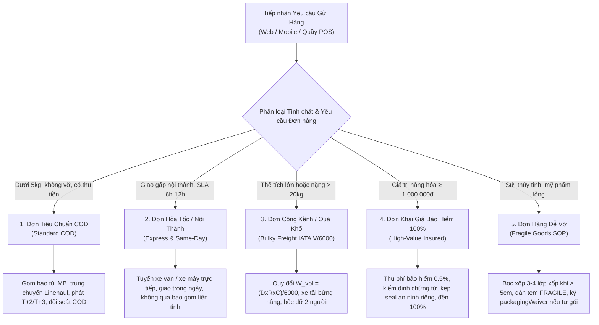
```mermaid
flowchart TD
    START_ORDER["Tiếp nhận Yêu cầu Gửi Hàng<br/>(Web / Mobile / Quầy POS)"] --> CLASSIFY{"Phân loại Tính chất & Yêu cầu Đơn hàng"}

    CLASSIFY -->|"Dưới 5kg, không vỡ, có thu tiền"| TYPE_STD["1. Đơn Tiêu Chuẩn COD<br/>(Standard COD)"]
    CLASSIFY -->|"Giao gấp nội thành, SLA 6h-12h"| TYPE_EXP["2. Đơn Hỏa Tốc / Nội Thành<br/>(Express & Same-Day)"]
    CLASSIFY -->|"Thể tích lớn hoặc nặng > 20kg"| TYPE_BULK["3. Đơn Cồng Kềnh / Quá Khổ<br/>(Bulky Freight IATA V/6000)"]
    CLASSIFY -->|"Giá trị hàng hóa &ge; 1.000.000đ"| TYPE_INS["4. Đơn Khai Giá Bảo Hiểm 100%<br/>(High-Value Insured)"]
    CLASSIFY -->|"Sứ, thủy tinh, mỹ phẩm lỏng"| TYPE_FRAG["5. Đơn Hàng Dễ Vỡ<br/>(Fragile Goods SOP)"]

    TYPE_STD --> PROC_STD["Gom bao túi MB, trung chuyển Linehaul, phát T+2/T+3, đối soát COD"]
    TYPE_EXP --> PROC_EXP["Tuyến xe van / xe máy trực tiếp, giao trong ngày, không qua bao gom liên tỉnh"]
    TYPE_BULK --> PROC_BULK["Quy đổi W_vol = (DxRxC)/6000, xe tải bửng nâng, bốc dỡ 2 người"]
    TYPE_INS --> PROC_INS["Thu phí bảo hiểm 0.5%, kiểm định chứng từ, kẹp seal an ninh riêng, đền 100%"]
    TYPE_FRAG --> PROC_FRAG["Bọc xốp 3-4 lớp xốp khí &ge; 5cm, dán tem FRAGILE, ký packagingWaiver nếu tự gói"]
```

---

### 4.1. Đơn Tiêu Chuẩn Thu Hộ COD (Standard COD Shipment)

Đơn hàng thương mại điện tử phổ biến nhất, chiếm trên 70% tổng sản lượng bưu chính. Đặc trưng bởi luồng tiền thu hộ COD hai chiều và chu kỳ đối soát tài chính định kỳ.

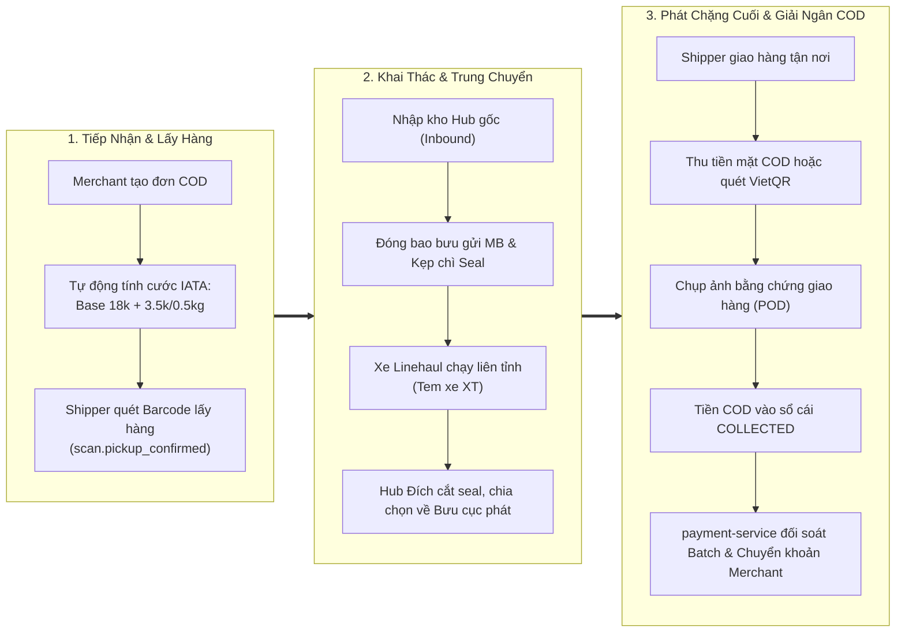
```mermaid
flowchart LR
    subgraph S1 ["1. Tiếp Nhận & Lấy Hàng"]
        A1["Merchant tạo đơn COD"] --> A2["Tự động tính cước IATA:<br/>Base 18k + 3.5k/0.5kg"]
        A2 --> A3["Shipper quét Barcode lấy hàng<br/>(scan.pickup_confirmed)"]
    end

    subgraph S2 ["2. Khai Thác & Trung Chuyển"]
        B1["Nhập kho Hub gốc (Inbound)"] --> B2["Đóng bao bưu gửi MB & Kẹp chì Seal"]
        B2 --> B3["Xe Linehaul chạy liên tỉnh<br/>(Tem xe XT)"]
        B3 --> B4["Hub Đích cắt seal, chia chọn về Bưu cục phát"]
    end

    subgraph S3 ["3. Phát Chặng Cuối & Giải Ngân COD"]
        C1["Shipper giao hàng tận nơi"] --> C2["Thu tiền mặt COD hoặc quét VietQR"]
        C2 --> C3["Chụp ảnh bằng chứng giao hàng (POD)"]
        C3 --> C4["Tiền COD vào sổ cái COLLECTED"]
        C4 --> C5["payment-service đối soát Batch & Chuyển khoản Merchant"]
    end

    S1 ==> S2 ==> S3
```

- **Công thức tính cước:** $\text{Cước gửi} = \text{Cước cơ bản (18.000đ cho 2kg đầu)} + \sum (\text{Nấc vượt } 0.5kg \times 3.500đ) + \text{Phụ phí vùng cước}$.
- **Cơ chế quản lý tiền COD:** Tiền thu hộ được phong tỏa trong tài khoản trung gian của `payment-service` và tự động giải ngân theo chu kỳ đối soát thứ 2 - thứ 4 - thứ 6 hàng tuần qua cổng thanh toán SePay / VietQR.

---

### 4.2. Đơn Hỏa Tốc / Nội Thành 6h - 12h (Express & Same-Day Service)

Phục vụ các bưu phẩm tài liệu mật, thuốc men y tế, thực phẩm tươi sống hoặc nhu cầu nhận hàng gấp trong cùng một khu vực đô thị (Hà Nội, TP.HCM, Đà Nẵng).

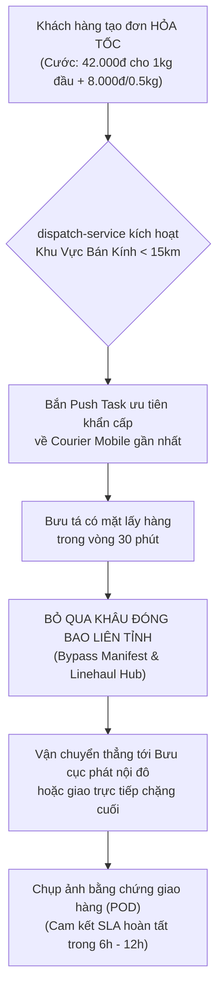
```mermaid
flowchart TD
    CREAT["Khách hàng tạo đơn HỎA TỐC<br/>(Cước: 42.000đ cho 1kg đầu + 8.000đ/0.5kg)"] --> DISP{"dispatch-service kích hoạt<br/>Khu Vực Bán Kính < 15km"}

    DISP --> PUSH_TASK["Bắn Push Task ưu tiên khẩn cấp<br/>về Courier Mobile gần nhất"]
    PUSH_TASK --> PICK["Bưu tá có mặt lấy hàng<br/>trong vòng 30 phút"]
    PICK --> BYPASS["BỎ QUA KHÂU ĐÓNG BAO LIÊN TỈNH<br/>(Bypass Manifest & Linehaul Hub)"]
    BYPASS --> DIRECT_ROUTE["Vận chuyển thẳng tới Bưu cục phát nội đô<br/>hoặc giao trực tiếp chặng cuối"]
    DIRECT_ROUTE --> POD_URGENT["Chụp ảnh bằng chứng giao hàng (POD)<br/>(Cam kết SLA hoàn tất trong 6h - 12h)"]
```

- **Đặc điểm kỹ thuật:** Đơn hàng được gắn cờ `isExpress: true`, hệ thống tự động gán độ ưu tiên cao nhất (`priority: URGENT`) trong hàng đợi Dispatch. Bỏ qua hoàn toàn công đoạn đóng bao bưu gửi đường dài để rút ngắn thời gian xử lý.

---

### 4.3. Đơn Hàng Cồng Kềnh / Quá Khổ Quy Đổi IATA V/6000 (Bulky Freight)

Áp dụng cho các mặt hàng chiếm diện tích thể tích lớn (ghế sofa, nệm cao su, xe đạp điện, thùng carton máy móc).

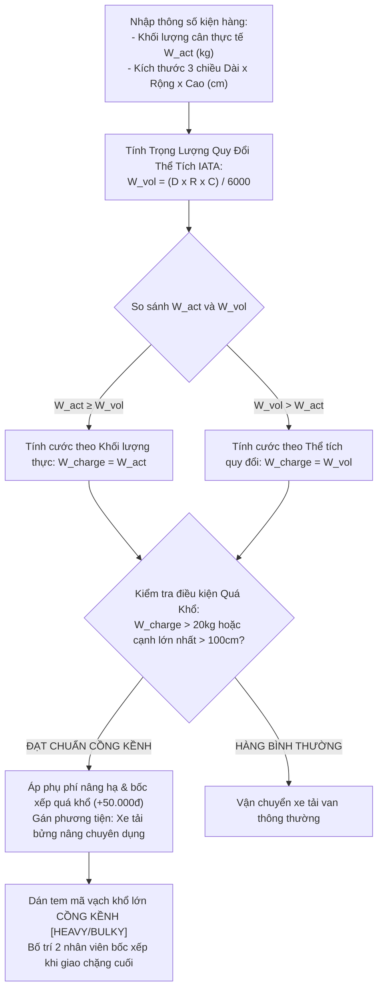
```mermaid
flowchart TD
    DIM_INPUT["Nhập thông số kiện hàng:<br/>- Khối lượng cân thực tế W_act (kg)<br/>- Kích thước 3 chiều Dài x Rộng x Cao (cm)"] --> IATA_CALC["Tính Trọng Lượng Quy Đổi Thể Tích IATA:<br/>W_vol = (D x R x C) / 6000"]

    IATA_CALC --> COMPARE{"So sánh W_act và W_vol"}
    COMPARE -->|"W_act &ge; W_vol"| CHARGE_ACT["Tính cước theo Khối lượng thực: W_charge = W_act"]
    COMPARE -->|"W_vol > W_act"| CHARGE_VOL["Tính cước theo Thể tích quy đổi: W_charge = W_vol"]

    CHARGE_ACT --> BULK_CHECK{"Kiểm tra điều kiện Quá Khổ:<br/>W_charge > 20kg hoặc cạnh lớn nhất > 100cm?"}
    CHARGE_VOL --> BULK_CHECK

    BULK_CHECK -- "ĐẠT CHUẨN CỒNG KỀNH" --> SURCHARGE["Áp phụ phí nâng hạ & bốc xếp quá khổ (+50.000đ)<br/>Gán phương tiện: Xe tải bửng nâng chuyên dụng"]
    BULK_CHECK -- "HÀNG BÌNH THƯỜNG" --> NORMAL_TRUCK["Vận chuyển xe tải van thông thường"]

    SURCHARGE --> SCAN_BULK["Dán tem mã vạch khổ lớn CỒNG KỀNH [HEAVY/BULKY]<br/>Bố trí 2 nhân viên bốc xếp khi giao chặng cuối"]
```

- **Quy chuẩn IATA $V/6000$:** Tiêu chuẩn quốc tế của Hiệp hội Vận tải Hàng không Quốc tế (IATA) được áp dụng thống nhất trên toàn hệ thống Nexus, ngăn ngừa việc chủ hàng gửi đồ nhẹ nhưng chiếm trọn diện tích thùng xe tải.

---

### 4.4. Đơn Khai Giá Bảo Hiểm 100% (High-Value & Insured Shipment)

Dành cho các bưu kiện giá trị cao từ 1.000.000đ trở lên (điện thoại iPhone, máy tính xách tay, trang sức, đồng hồ xa xỉ).

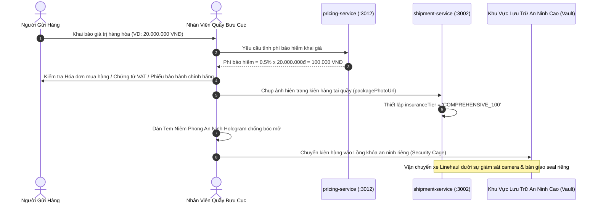
```mermaid
sequenceDiagram
    autonumber
    actor Sender as Người Gửi Hàng
    actor Staff as Nhân Viên Quầy Bưu Cục
    participant Pricing as pricing-service (:3012)
    participant CoreSys as shipment-service (:3002)
    participant Vault as Khu Vực Lưu Trữ An Ninh Cao (Vault)

    Sender->>Staff: Khai báo giá trị hàng hóa (VD: 20.000.000 VNĐ)
    Staff->>Pricing: Yêu cầu tính phí bảo hiểm khai giá
    Pricing-->>Staff: Phí bảo hiểm = 0.5% x 20.000.000đ = 100.000 VNĐ
    Staff->>Sender: Kiểm tra Hóa đơn mua hàng / Chứng từ VAT / Phiếu bảo hành chính hãng
    Staff->>CoreSys: Chụp ảnh hiện trạng kiện hàng tại quầy (packagePhotoUrl)
    CoreSys->>CoreSys: Thiết lập insuranceTier = 'COMPREHENSIVE_100'
    Staff->>Staff: Dán Tem Niêm Phong An Ninh Hologram chống bóc mở
    Staff->>Vault: Chuyển kiện hàng vào Lồng khóa an ninh riêng (Security Cage)
    Note over Vault,CoreSys: Vận chuyển xe Linehaul dưới sự giám sát camera & bàn giao seal riêng
```

- **Quy tắc trích lập Quỹ rủi ro:** 100% khoản thu phí bảo hiểm 0.5% được hạch toán vào Quỹ dự phòng rủi ro bảo hiểm (Risk Reserve Fund) để thực hiện cam kết bồi thường 100% giá trị thực tế trong vòng 03 ngày làm việc khi xảy ra mất mát.

---

### 4.5. Đơn Hàng Dễ Vỡ & Quy Chuẩn Đóng Gói SOP (Fragile Goods)

Mô hình thiết giáp tinh gọn kiểm soát 100% hàng hóa có tính chất nứt vỡ (đồ gốm sứ, chai lọ thủy tinh, màn hình LCD, mỹ phẩm lỏng).

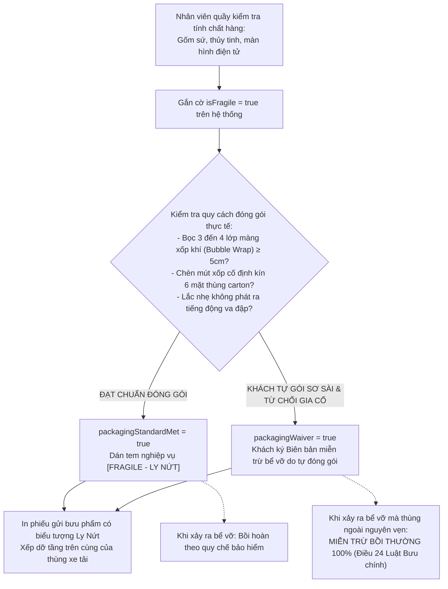
```mermaid
flowchart TD
    INSPECT["Nhân viên quầy kiểm tra tính chất hàng:<br/>Gốm sứ, thủy tinh, màn hình điện tử"] --> FLAG["Gắn cờ isFragile = true trên hệ thống"]
    FLAG --> CHECK_PACK{"Kiểm tra quy cách đóng gói thực tế:<br/>- Bọc 3 đến 4 lớp màng xốp khí (Bubble Wrap) &ge; 5cm?<br/>- Chèn mút xốp cố định kín 6 mặt thùng carton?<br/>- Lắc nhẹ không phát ra tiếng động va đập?"}

    CHECK_PACK -- "ĐẠT CHUẨN ĐÓNG GÓI" --> MET_TRUE["packagingStandardMet = true<br/>Dán tem nghiệp vụ [FRAGILE - LY NỨT]"]
    CHECK_PACK -- "KHÁCH TỰ GÓI SƠ SÀI & TỪ CHỐI GIA CỐ" --> WAIVER_TRUE["packagingWaiver = true<br/>Khách ký Biên bản miễn trừ bể vỡ do tự đóng gói"]

    MET_TRUE --> PRINT_LABEL["In phiếu gửi bưu phẩm có biểu tượng Ly Nứt<br/>Xếp dỡ tầng trên cùng của thùng xe tải"]
    WAIVER_TRUE --> PRINT_LABEL
    
    MET_TRUE -.-> RULE_1["Khi xảy ra bể vỡ: Bồi hoàn theo quy chế bảo hiểm"]
    WAIVER_TRUE -.-> RULE_2["Khi xảy ra bể vỡ mà thùng ngoài nguyên vẹn:<br/>MIỄN TRỪ BỒI THƯỜNG 100% (Điều 24 Luật Bưu chính)"]
```

---

## 5. MÔ HÌNH THIẾT GIÁP BỊT KÍN 8 NHÓM LỖ HỔNG VẬN HÀNH & SỰ CỐ BƯU CHÍNH

Xử lý ngoại lệ là thước đo tính chuyên nghiệp và tính hoàn thiện của một đồ án công nghệ logistics thực chiến. Nexus thiết kế mô hình thiết giáp tinh gọn bịt kín 8 nhóm lỗ hổng vận hành khép kín:

---

### 5.1. Khách từ chối nhận hàng (NDR) & Tự động Tái điều phối

Quy trình quản lý giao hàng thất bại (Non-Delivery Report - NDR) theo quy tắc chuẩn ngành bưu chính: **Tối đa 3 lần phát trong 5 ngày lưu kho**.

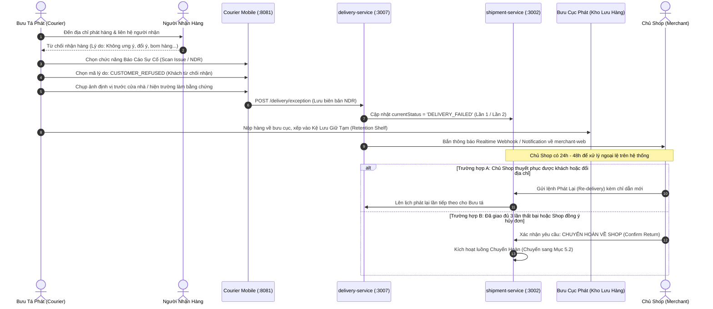
```mermaid
sequenceDiagram
    autonumber
    actor Courier as Bưu Tá Phát (Courier)
    actor Receiver as Người Nhận Hàng
    participant MobileApp as Courier Mobile (:8081)
    participant DeliverySvc as delivery-service (:3007)
    participant ShipSvc as shipment-service (:3002)
    participant HubStorage as Bưu Cục Phát (Kho Lưu Hàng)
    actor Merchant as Chủ Shop (Merchant)

    Courier->>Receiver: Đến địa chỉ phát hàng & liên hệ người nhận
    Receiver-->>Courier: Từ chối nhận hàng (Lý do: Không ưng ý, đổi ý, bom hàng...)
    Courier->>MobileApp: Chọn chức năng Báo Cáo Sự Cố (Scan Issue / NDR)
    Courier->>MobileApp: Chọn mã lý do: CUSTOMER_REFUSED (Khách từ chối nhận)
    Courier->>MobileApp: Chụp ảnh định vị trước cửa nhà / hiện trường làm bằng chứng
    MobileApp->>DeliverySvc: POST /delivery/exception (Lưu biên bản NDR)
    DeliverySvc->>ShipSvc: Cập nhật currentStatus = 'DELIVERY_FAILED' (Lần 1 / Lần 2)
    Courier->>HubStorage: Nộp hàng về bưu cục, xếp vào Kệ Lưu Giữ Tạm (Retention Shelf)

    DeliverySvc->>Merchant: Bắn thông báo Realtime Webhook / Notification về merchant-web
    Note over Merchant,ShipSvc: Chủ Shop có 24h - 48h để xử lý ngoại lệ trên hệ thống

    alt Trường hợp A: Chủ Shop thuyết phục được khách hoặc đổi địa chỉ
        Merchant->>ShipSvc: Gửi lệnh Phát Lại (Re-delivery) kèm chỉ dẫn mới
        ShipSvc->>DeliverySvc: Lên lịch phát lại lần tiếp theo cho Bưu tá
    else Trường hợp B: Đã giao đủ 3 lần thất bại hoặc Shop đồng ý hủy đơn
        Merchant->>ShipSvc: Xác nhận yêu cầu: CHUYỂN HOÀN VỀ SHOP (Confirm Return)
        ShipSvc->>ShipSvc: Kích hoạt luồng Chuyển Hoàn (Chuyển sang Mục 5.2)
    end
```

#### Quy trình Tái điều phối tự động khi khách hẹn lại ngày giao:
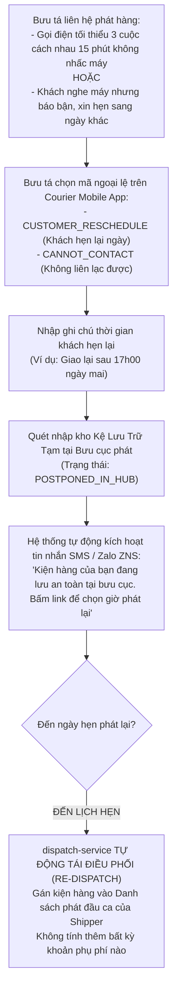
```mermaid
flowchart TD
    ATTEMPT["Bưu tá liên hệ phát hàng:<br/>- Gọi điện tối thiểu 3 cuộc cách nhau 15 phút không nhấc máy<br/>HOẶC<br/>- Khách nghe máy nhưng báo bận, xin hẹn sang ngày khác"] --> SELECT_REASON["Bưu tá chọn mã ngoại lệ trên Courier Mobile App:<br/>- CUSTOMER_RESCHEDULE (Khách hẹn lại ngày)<br/>- CANNOT_CONTACT (Không liên lạc được)"]

    SELECT_REASON --> INPUT_TIME["Nhập ghi chú thời gian khách hẹn lại<br/>(Ví dụ: Giao lại sau 17h00 ngày mai)"]
    INPUT_TIME --> HOLD_SCAN["Quét nhập kho Kệ Lưu Trữ Tạm tại Bưu cục phát<br/>(Trạng thái: POSTPONED_IN_HUB)"]

    HOLD_SCAN --> AUTO_SMS["Hệ thống tự động kích hoạt tin nhắn SMS / Zalo ZNS:<br/>'Kiện hàng của bạn đang lưu an toàn tại bưu cục. Bấm link để chọn giờ phát lại'"]

    AUTO_SMS --> NEXT_DAY{"Đến ngày hẹn phát lại?"}
    NEXT_DAY -- "ĐẾN LỊCH HẸN" --> REDISPATCH["dispatch-service TỰ ĐỘNG TÁI ĐIỀU PHỐI (RE-DISPATCH)<br/>Gán kiện hàng vào Danh sách phát đầu ca của Shipper<br/>Không tính thêm bất kỳ khoản phụ phí nào"]
```

#### Bảng danh mục mã lý do giao thất bại (NDR Codes) chuẩn hóa:
| Mã Lý Do NDR | Tên Gọi Nghiệp Vụ | Giải Pháp Kỹ Thuật & Hành Động Tiếp Theo |
| :--- | :--- | :--- |
| `CUSTOMER_REFUSED` | Khách từ chối nhận hàng | Gửi thông báo cho Shop; lưu kho chờ quyết định chuyển hoàn. |
| `COD_REFUSED` | Không đồng ý thanh toán tiền COD | Bưu tá giải thích số tiền theo phiếu; nếu không nhận thì báo NDR. |
| `CANNOT_CONTACT` | Thuê bao không nhấc máy (gọi $\ge 3$ cuộc) | Gửi SMS tự động kèm link hẹn giờ; lưu bưu cục phát lại ngày hôm sau. |
| `ADDRESS_NOT_FOUND`| Sai hoặc thiếu thông tin địa chỉ | Bắn thông báo lên Merchant Web yêu cầu cập nhật lại tọa độ/địa chỉ. |
| `CUSTOMER_RESCHEDULE`| Khách bận, hẹn giao ngày khác | Hệ thống tự động chuyển ngày phát theo lịch hẹn mà không tính phạt. |

---

### 5.2. Chuyển hoàn 3 tầng, Chống tráo hàng & Bưu phẩm vô chủ (Điều 19 Luật Bưu chính)

Bịt kín lỗ hổng thất thoát chi phí xe tải chiều về và xóa tan vấn nạn nợ xấu cước hoàn thông qua **Cơ chế phân tầng tự động (3-Tier Reverse Pricing Engine)**:

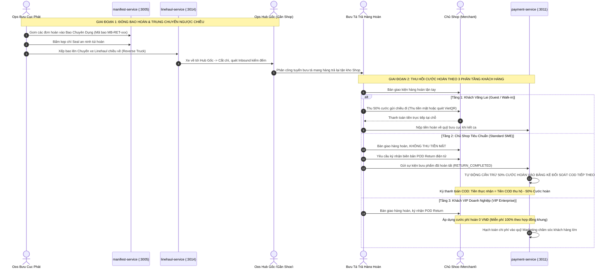
```mermaid
sequenceDiagram
    autonumber
    actor HubStaff as Ops Bưu Cục Phát
    participant ManifestSvc as manifest-service (:3005)
    participant Linehaul as linehaul-service (:3014)
    actor OriginHub as Ops Hub Gốc (Gần Shop)
    actor ReturnCourier as Bưu Tá Trả Hàng Hoàn
    actor Merchant as Chủ Shop (Merchant)
    participant PaySvc as payment-service (:3011)

    Note over HubStaff,OriginHub: GIAI ĐOẠN 1: ĐÓNG BAO HOÀN & TRUNG CHUYỂN NGƯỢC CHIỀU
    HubStaff->>ManifestSvc: Gom các đơn hoàn vào Bao Chuyên Dụng (Mã bao MB-RET-xxx)
    HubStaff->>ManifestSvc: Bấm kẹp chì Seal an ninh túi hoàn
    HubStaff->>Linehaul: Xếp bao lên Chuyến xe Linehaul chiều về (Reverse Truck)
    Linehaul->>OriginHub: Xe về tới Hub Gốc -> Cắt chì, quét Inbound kiểm đếm
    OriginHub->>ReturnCourier: Phân công tuyến bưu tá mang hàng trả lại tận kho Shop

    Note over ReturnCourier,PaySvc: GIAI ĐOẠN 2: THU HỒI CƯỚC HOÀN THEO 3 PHÂN TẦNG KHÁCH HÀNG
    ReturnCourier->>Merchant: Bàn giao kiện hàng hoàn tận tay

    alt Tầng 1: Khách Vãng Lai (Guest / Walk-in)
        ReturnCourier->>Merchant: Thu 50% cước gửi chiều đi (Thu tiền mặt hoặc quét VietQR)
        Merchant-->>ReturnCourier: Thanh toán tiền trực tiếp tại chỗ
        ReturnCourier->>PaySvc: Nộp tiền hoàn về quỹ bưu cục khi kết ca
    else Tầng 2: Chủ Shop Tiêu Chuẩn (Standard SME)
        ReturnCourier->>Merchant: Bàn giao hàng hoàn, KHÔNG THU TIỀN MẶT
        ReturnCourier->>Merchant: Yêu cầu ký nhận biên bản POD Return điện tử
        ReturnCourier->>PaySvc: Gửi sự kiện bưu phẩm đã hoàn tất (RETURN_COMPLETED)
        PaySvc->>PaySvc: TỰ ĐỘNG CẤN TRỪ 50% CƯỚC HOÀN VÀO BẢNG KÊ ĐỐI SOÁT COD TIẾP THEO
        Note over PaySvc,Merchant: Kỳ thanh toán COD: Tiền thực nhận = Tiền COD thu hộ - 50% Cước hoàn
    else Tầng 3: Khách VIP Doanh Nghiệp (VIP Enterprise)
        ReturnCourier->>Merchant: Bàn giao hàng hoàn, ký nhận POD Return
        Note over PaySvc,Merchant: Áp dụng cước phí hoàn 0 VNĐ (Miễn phí 100% theo hợp đồng khung)
        PaySvc->>PaySvc: Hạch toán chi phí vào quỹ Marketing chăm sóc khách hàng lớn
    end
```

#### Quy trình Xử lý Bưu phẩm hoàn vô chủ / Bị bỏ rơi (Căn cứ Điều 19 Luật Bưu chính):
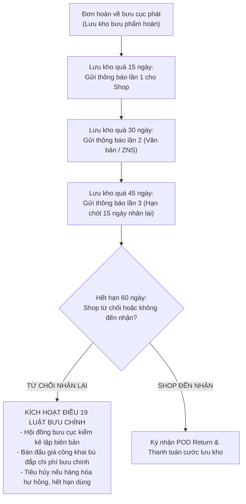
```mermaid
flowchart TD
    START_RET["Đơn hoàn về bưu cục phát<br/>(Lưu kho bưu phẩm hoàn)"] --> NOTICE_1["Lưu kho quá 15 ngày:<br/>Gửi thông báo lần 1 cho Shop"]
    NOTICE_1 --> NOTICE_2["Lưu kho quá 30 ngày:<br/>Gửi thông báo lần 2 (Văn bản / ZNS)"]
    NOTICE_2 --> NOTICE_3["Lưu kho quá 45 ngày:<br/>Gửi thông báo lần 3 (Hạn chót 15 ngày nhận lại)"]
    NOTICE_3 --> AUCTION{"Hết hạn 60 ngày:<br/>Shop từ chối hoặc không đến nhận?"}
    AUCTION -- "TỪ CHỐI NHẬN LẠI" --> DISPOSE["KÍCH HOẠT ĐIỀU 19 LUẬT BƯU CHÍNH<br/>- Hội đồng bưu cục kiểm kê lập biên bản<br/>- Bán đấu giá công khai bù đắp chi phí bưu chính<br/>- Tiêu hủy nếu hàng hóa hư hỏng, hết hạn dùng"]
    AUCTION -- "SHOP ĐẾN NHẬN" --> POD_RET["Ký nhận POD Return & Thanh toán cước lưu kho"]
```

- **Chốt chặn chống tráo ruột hàng hoàn (Reverse Handover Inspection):** Khi bưu tá trả hàng hoàn, Shop và bưu tá bắt buộc đồng kiểm hiện trạng niêm phong hộp và chụp ảnh POD Return. Nếu Shop đã ký nhận mà không khiếu nại tại chỗ, Nexus miễn trừ trách nhiệm tranh chấp sau bàn giao.

---

### 5.3. Hàng hỏng / Bể vỡ / Mất mát & Thẩm định bồi thường (Điều 24 & Điều 25 Luật Bưu chính)

Quy trình giải quyết sự cố hư hại, phân định trách nhiệm khách quan và tự động trích lập bồi hoàn dựa trên căn cứ pháp lý của **Luật Bưu chính Việt Nam số 49/2010/QH12**:

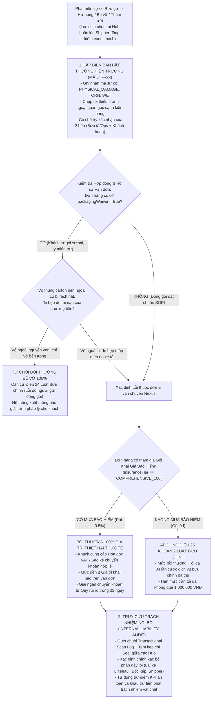
```mermaid
flowchart TD
    DISCOVER["Phát hiện sự cố Bưu gửi bị Hư hỏng / Bể vỡ / Thấm ướt<br/>(Lúc chia chọn tại Hub hoặc lúc Shipper đồng kiểm cùng khách)"] --> REPORT_DIR["1. LẬP BIÊN BẢN BẤT THƯỜNG HIỆN TRƯỜNG (MÃ DIR-xxx)<br/>- Ghi nhận mã sự cố: PHYSICAL_DAMAGE, TORN, WET<br/>- Chụp tối thiểu 4 ảnh ngoại quan góc cạnh kiện hàng<br/>- Có chữ ký xác nhận của 2 bên (Bưu tá/Ops + Khách hàng)"]

    REPORT_DIR --> AUDIT_WAIVER{"Kiểm tra Hợp đồng & Hồ sơ Vận đơn:<br/>Đơn hàng có cờ packagingWaiver = true?"}

    AUDIT_WAIVER -- "CÓ (Khách tự gói sơ sài, ký miễn trừ)" --> CHECK_OUTER{"Vỏ thùng carton bên ngoài có bị rách nát,<br/>đè bẹp do tai nạn của phương tiện?"}
    
    CHECK_OUTER -- "Vỏ ngoài nguyên vẹn, chỉ vỡ bên trong" --> REJECT_CLAIM["TỪ CHỐI BỒI THƯỜNG BỂ VỠ 100%<br/>Căn cứ Điều 24 Luật Bưu chính (Lỗi do người gửi đóng gói)<br/>Hệ thống xuất thông báo giải trình pháp lý cho khách"]
    CHECK_OUTER -- "Vỏ ngoài bị đè bẹp móp méo do xe tải" --> LIABILITY_CARRIER["Xác định Lỗi thuộc đơn vị vận chuyển Nexus"]

    AUDIT_WAIVER -- "KHÔNG (Đóng gói đạt chuẩn SOP)" --> LIABILITY_CARRIER

    LIABILITY_CARRIER --> CHECK_INSURANCE{"Đơn hàng có tham gia Gói Khai Giá Bảo Hiểm?<br/>(insuranceTier == 'COMPREHENSIVE_100')"}

    CHECK_INSURANCE -- "CÓ MUA BẢO HIỂM (Phí 0.5%)" --> CLAIM_100["BỒI THƯỜNG 100% GIÁ TRỊ THIỆT HẠI THỰC TẾ<br/>- Khách cung cấp Hóa đơn VAT / Sao kê chuyển khoản hợp lệ<br/>- Mức đền &le; Giá trị khai báo trên vận đơn<br/>- Giải ngân chuyển khoản từ Quỹ rủi ro trong 03 ngày"]

    CHECK_INSURANCE -- "KHÔNG MUA BẢO HIỂM (Gói 0đ)" --> CLAIM_LAW["ÁP DỤNG ĐIỀU 25 KHOẢN 2 LUẬT BƯU CHÍNH<br/>- Mức bồi thường: Tối đa 04 lần cước dịch vụ bưu chính đã thu<br/>- Hạn mức trần tối đa không quá 1.000.000 VNĐ"]

    CLAIM_100 --> INTERNAL_AUDIT["2. TRUY CỨU TRÁCH NHIỆM NỘI BỘ (INTERNAL LIABILITY AUDIT)<br/>- Quét chuỗi Transactional Scan Log + Tem kẹp chì Seal giữa các Hub<br/>- Xác định chính xác bộ phận gây lỗi (Lái xe Linehaul, Bốc xếp, Shipper)<br/>- Tự động trừ điểm KPI an toàn và khấu trừ tiền phạt trách nhiệm vật chất"]
    CLAIM_LAW --> INTERNAL_AUDIT
```

#### Ma trận phân định trách nhiệm bồi thường 4 ô (2x2 Decision Matrix):
| Tình Huống Sự Cố Phát Sinh | Đơn Có Mua Bảo Hiểm 100% (Phí 0.5%) | Đơn Không Mua Bảo Hiểm (Phí 0đ) |
| :--- | :--- | :--- |
| **Thất lạc / Mất nguyên kiện** *(Lỗi do Hub hoặc Tài xế)* | **Đền đúng 100% giá trị thực tế** *(Căn cứ Hóa đơn hợp lệ)* | **Đền 04 lần cước gửi** *(Trần tối đa 1.000.000đ)* |
| **Bể vỡ khi đóng gói đạt chuẩn SOP** *(Xốp 3 lớp)* | **Đền 100% giá trị thực tế** *(Hoặc theo tỷ lệ nứt vỡ)* | **Đền 04 lần cước gửi** *(Theo tỷ lệ hư hại)* |
| **Bể vỡ khi có biên bản miễn trừ `packagingWaiver`** | **Từ chối bồi thường bể vỡ** *(Thùng ngoài nguyên)* | **Từ chối bồi thường bể vỡ** *(Điều 24 Luật Bưu chính)* |

---

### 5.4. Quyền đồng kiểm (3 cờ kiểm tra) & Hạn mức trần tiền mặt Shipper

Giải quyết dứt điểm tranh chấp mở hàng xem thử và rủi ro chiếm dụng tiền mặt bưu tá chặng cuối:

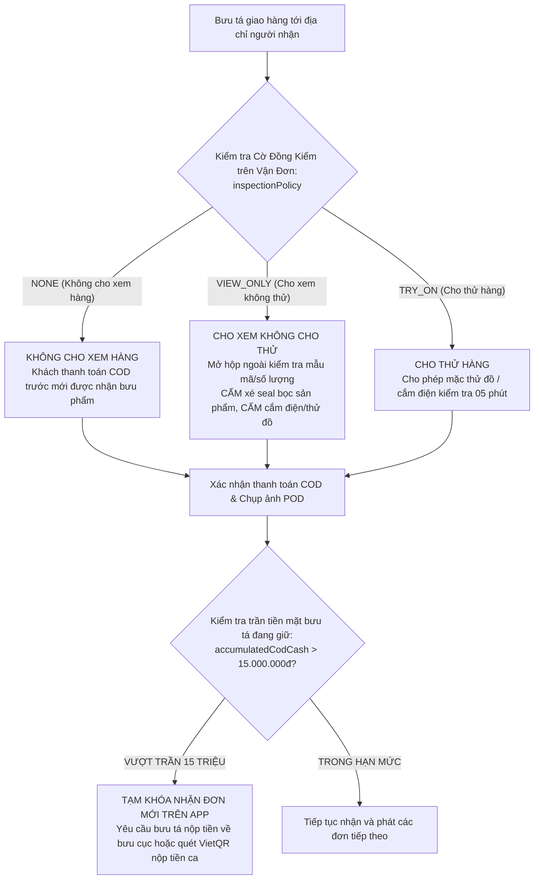
```mermaid
flowchart TD
    ARRIVE["Bưu tá giao hàng tới địa chỉ người nhận"] --> CHECK_FLAG{"Kiểm tra Cờ Đồng Kiểm trên Vận Đơn:<br/>inspectionPolicy"}
    
    CHECK_FLAG -->|"NONE (Không cho xem hàng)"| P_NONE["KHÔNG CHO XEM HÀNG<br/>Khách thanh toán COD trước mới được nhận bưu phẩm"]
    CHECK_FLAG -->|"VIEW_ONLY (Cho xem không thử)"| P_VIEW["CHO XEM KHÔNG CHO THỬ<br/>Mở hộp ngoài kiểm tra mẫu mã/số lượng<br/>CẤM xé seal bọc sản phẩm, CẤM cắm điện/thử đồ"]
    CHECK_FLAG -->|"TRY_ON (Cho thử hàng)"| P_TRY["CHO THỬ HÀNG<br/>Cho phép mặc thử đồ / cắm điện kiểm tra 05 phút"]

    P_NONE --> COLLECT_PAY["Xác nhận thanh toán COD & Chụp ảnh POD"]
    P_VIEW --> COLLECT_PAY
    P_TRY --> COLLECT_PAY

    COLLECT_PAY --> CHECK_CASH{"Kiểm tra trần tiền mặt bưu tá đang giữ:<br/>accumulatedCodCash > 15.000.000đ?"}
    CHECK_CASH -- "VƯỢT TRẦN 15 TRIỆU" --> LOCK_TASK["TẠM KHÓA NHẬN ĐƠN MỚI TRÊN APP<br/>Yêu cầu bưu tá nộp tiền về bưu cục hoặc quét VietQR nộp tiền ca"]
    CHECK_CASH -- "TRONG HẠN MỨC" --> CONTINUE_TASK["Tiếp tục nhận và phát các đơn tiếp theo"]
```

- **Quy chế bưu tá:** Nếu bưu tá tự ý cho người nhận bóc seal sản phẩm khi đơn hàng có cờ `NONE` hoặc `VIEW_ONLY` dẫn đến khách từ chối nhận, bưu tá chịu trách nhiệm mua lại đơn hàng.
- **Trần giữ tiền mặt (Cash Limit):** Khi bưu tá giữ trên 15.000.000đ tiền mặt COD chưa nộp về quỹ, hệ thống `dispatch-service` tự động chặn gán thêm nhiệm vụ phát mới để ngăn ngừa rủi ro tài chính.

---

### 5.5. Đổi địa chỉ liên tỉnh (Re-routing Fee) & Khóa in lại tem nhiệt

Bảo vệ chi phí xe tải Linehaul và loại bỏ nguy cơ bưu tá giao nhầm địa chỉ cũ:

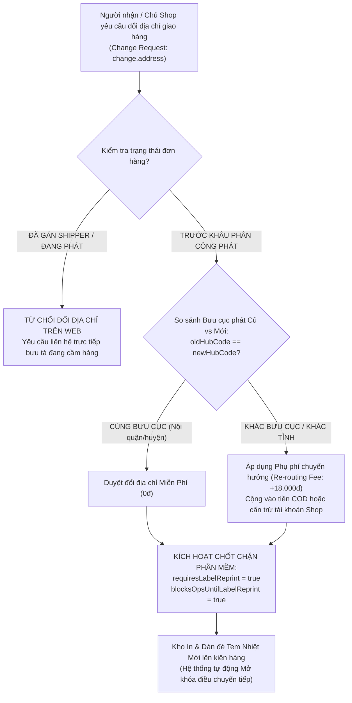
```mermaid
flowchart TD
    REQ["Người nhận / Chủ Shop yêu cầu đổi địa chỉ giao hàng<br/>(Change Request: change.address)"] --> CHECK_STATUS{"Kiểm tra trạng thái đơn hàng?"}
    
    CHECK_STATUS -- "ĐÃ GÁN SHIPPER / ĐANG PHÁT" --> REJECT_CHANGE["TỪ CHỐI ĐỔI ĐỊA CHỈ TRÊN WEB<br/>Yêu cầu liên hệ trực tiếp bưu tá đang cầm hàng"]
    CHECK_STATUS -- "TRƯỚC KHÂU PHÂN CÔNG PHÁT" --> CHECK_HUB{"So sánh Bưu cục phát Cũ vs Mới:<br/>oldHubCode == newHubCode?"}

    CHECK_HUB -- "CÙNG BƯU CỤC (Nội quận/huyện)" --> FREE_CHANGE["Duyệt đổi địa chỉ Miễn Phí (0đ)"]
    CHECK_HUB -- "KHÁC BƯU CỤC / KHÁC TỈNH" --> FEE_CHANGE["Áp dụng Phụ phí chuyển hướng (Re-routing Fee: +18.000đ)<br/>Cộng vào tiền COD hoặc cấn trừ tài khoản Shop"]

    FREE_CHANGE --> LOCK_REPRINT["KÍCH HOẠT CHỐT CHẶN PHẦN MỀM:<br/>requiresLabelReprint = true<br/>blocksOpsUntilLabelReprint = true"]
    FEE_CHANGE --> LOCK_REPRINT

    LOCK_REPRINT --> REPRINT["Kho In & Dán đè Tem Nhiệt Mới lên kiện hàng<br/>(Hệ thống tự động Mở khóa điều chuyển tiếp)"]
```

- **Chốt chặn phần mềm:** Đã tích hợp trực tiếp trong `change-requests.service.ts`: Toàn bộ hoạt động xuất kho bị đóng băng (`blocksOpsUntilLabelReprint = true`) cho đến khi nhân viên kho hoàn tất việc in và dán đè nhãn nhiệt mang địa chỉ mới.

---

### 5.6. Chênh lệch kiểm đếm mở bao (Manifest Discrepancy) & Cảnh báo sai luồng Hub

Quy trình quản lý hàng thừa/hàng thiếu khi cắt chì seal túi gom `MB` và cảnh báo bốc xếp sai tuyến:

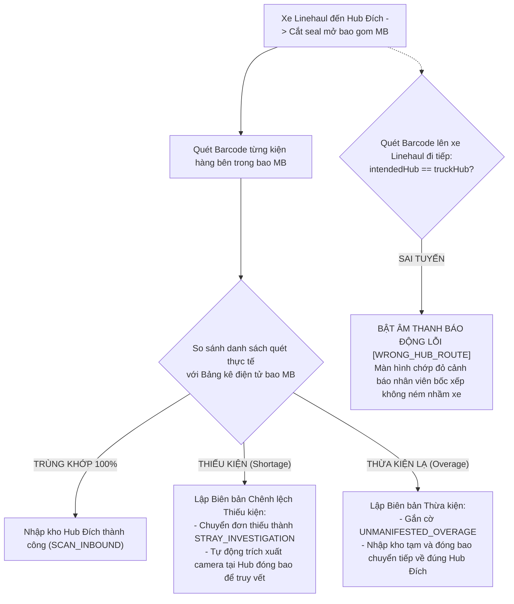
```mermaid
flowchart TD
    OPEN_BAG["Xe Linehaul đến Hub Đích -> Cắt seal mở bao gom MB"] --> SCAN_ITEMS["Quét Barcode từng kiện hàng bên trong bao MB"]
    SCAN_ITEMS --> COMPARE_COUNT{"So sánh danh sách quét thực tế<br/>với Bảng kê điện tử bao MB"}

    COMPARE_COUNT -- "TRÙNG KHỚP 100%" --> INBOUND_OK["Nhập kho Hub Đích thành công (SCAN_INBOUND)"]
    
    COMPARE_COUNT -- "THIẾU KIỆN (Shortage)" --> SHORTAGE["Lập Biên bản Chênh lệch Thiếu kiện:<br/>- Chuyển đơn thiếu thành STRAY_INVESTIGATION<br/>- Tự động trích xuất camera tại Hub đóng bao để truy vết"]

    COMPARE_COUNT -- "THỪA KIỆN LẠ (Overage)" --> OVERAGE["Lập Biên bản Thừa kiện:<br/>- Gắn cờ UNMANIFESTED_OVERAGE<br/>- Nhập kho tạm và đóng bao chuyển tiếp về đúng Hub Đích"]

    OPEN_BAG -.-> CHECK_ROUTE{"Quét Barcode lên xe Linehaul đi tiếp:<br/>intendedHub == truckHub?"}
    CHECK_ROUTE -- "SAI TUYẾN" --> ALARM["BẬT ÂM THANH BÁO ĐỘNG LỖI [WRONG_HUB_ROUTE]<br/>Màn hình chớp đỏ cảnh báo nhân viên bốc xếp không ném nhầm xe"]
```

---

### 5.7. Khóa van tài chính khi Dư nợ âm & Ghi nợ thiếu tiền COD

Xóa tan rủi ro nợ xấu cước vận chuyển và triệt tiêu sai lệch tiền mặt thực tế:

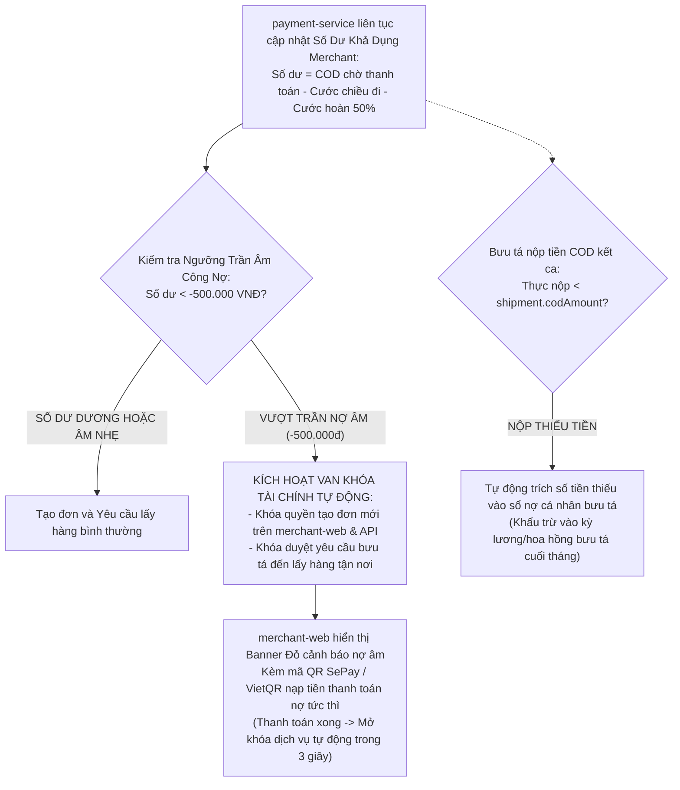
```mermaid
flowchart TD
    CALC_BAL["payment-service liên tục cập nhật Số Dư Khả Dụng Merchant:<br/>Số dư = COD chờ thanh toán - Cước chiều đi - Cước hoàn 50%"] --> CHECK_BAL{"Kiểm tra Ngưỡng Trần Âm Công Nợ:<br/>Số dư < -500.000 VNĐ?"}

    CHECK_BAL -- "SỐ DƯ DƯƠNG HOẶC ÂM NHẸ" --> ALLOW_CREATE["Tạo đơn và Yêu cầu lấy hàng bình thường"]
    
    CHECK_BAL -- "VƯỢT TRẦN NỢ ÂM (-500.000đ)" --> LOCK_MERCHANT["KÍCH HOẠT VAN KHÓA TÀI CHÍNH TỰ ĐỘNG:<br/>- Khóa quyền tạo đơn mới trên merchant-web & API<br/>- Khóa duyệt yêu cầu bưu tá đến lấy hàng tận nơi"]

    LOCK_MERCHANT --> PAY_QR["merchant-web hiển thị Banner Đỏ cảnh báo nợ âm<br/>Kèm mã QR SePay / VietQR nạp tiền thanh toán nợ tức thì<br/>(Thanh toán xong -> Mở khóa dịch vụ tự động trong 3 giây)"]

    CALC_BAL -.-> COD_COLLECT{"Bưu tá nộp tiền COD kết ca:<br/>Thực nộp < shipment.codAmount?"}
    COD_COLLECT -- "NỘP THIẾU TIỀN" --> RECORD_DEBT["Tự động trích số tiền thiếu vào sổ nợ cá nhân bưu tá<br/>(Khấu trừ vào kỳ lương/hoa hồng bưu tá cuối tháng)"]
```

---

### 5.8. Cảnh báo vùng xa ngoài phục vụ (ODA) & Chuyển tiếp CSKH AI sang người thật

Tối ưu phạm vi địa lý phục vụ và đảm bảo trải nghiệm khách hàng ở các ca sự cố phức tạp:

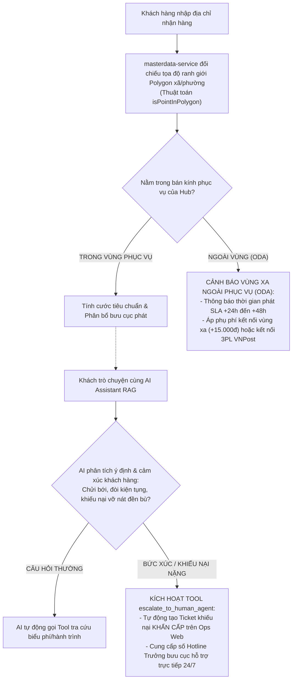
```mermaid
flowchart TD
    INPUT_ADDR["Khách hàng nhập địa chỉ nhận hàng"] --> GEO_CHECK["masterdata-service đối chiếu tọa độ ranh giới Polygon xã/phường<br/>(Thuật toán isPointInPolygon)"]
    
    GEO_CHECK --> IN_RANGE{"Nằm trong bán kính phục vụ của Hub?"}
    IN_RANGE -- "TRONG VÙNG PHỤC VỤ" --> NORM_ORDER["Tính cước tiêu chuẩn & Phân bổ bưu cục phát"]
    IN_RANGE -- "NGOÀI VÙNG (ODA)" --> ODA_ALERT["CẢNH BÁO VÙNG XA NGOÀI PHỤC VỤ (ODA):<br/>- Thông báo thời gian phát SLA +24h đến +48h<br/>- Áp phụ phí kết nối vùng xa (+15.000đ) hoặc kết nối 3PL VNPost"]

    NORM_ORDER -.-> AI_CHAT["Khách trò chuyện cùng AI Assistant RAG"]
    AI_CHAT --> SENTIMENT{"AI phân tích ý định & cảm xúc khách hàng:<br/>Chửi bới, đòi kiện tụng, khiếu nại vỡ nát đền bù?"}
    SENTIMENT -- "CÂU HỎI THƯỜNG" --> AI_ANS["AI tự động gọi Tool tra cứu biểu phí/hành trình"]
    SENTIMENT -- "BỨC XÚC / KHIẾU NẠI NẶNG" --> ESCALATE["KÍCH HOẠT TOOL escalate_to_human_agent:<br/>- Tự động tạo Ticket khiếu nại KHẨN CẤP trên Ops Web<br/>- Cung cấp số Hotline Trưởng bưu cục hỗ trợ trực tiếp 24/7"]
```

---

## 6. MẠNG LƯỚI HUB 4 CẤP & CHUYẾN XE TRUNG CHUYỂN LINEHAUL

Nexus Express tổ chức hạ tầng mạng lưới kho bãi theo cấu trúc hình cây 4 cấp tiêu chuẩn quốc tế:

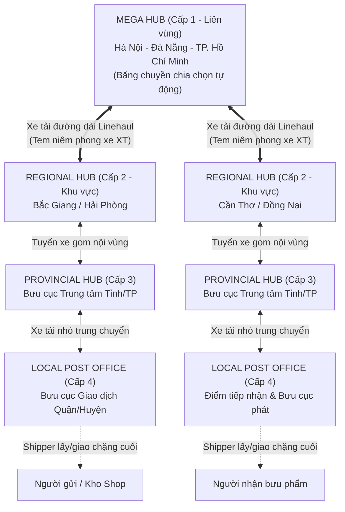
```mermaid
graph TD
    MEGA["MEGA HUB (Cấp 1 - Liên vùng)<br/>Hà Nội - Đà Nẵng - TP. Hồ Chí Minh<br/>(Băng chuyền chia chọn tự động)"]
    
    REGIONAL_1["REGIONAL HUB (Cấp 2 - Khu vực)<br/>Bắc Giang / Hải Phòng"]
    REGIONAL_2["REGIONAL HUB (Cấp 2 - Khu vực)<br/>Cần Thơ / Đồng Nai"]

    PROV_1["PROVINCIAL HUB (Cấp 3)<br/>Bưu cục Trung tâm Tỉnh/TP"]
    PROV_2["PROVINCIAL HUB (Cấp 3)<br/>Bưu cục Trung tâm Tỉnh/TP"]

    POST_1["LOCAL POST OFFICE (Cấp 4)<br/>Bưu cục Giao dịch Quận/Huyện"]
    POST_2["LOCAL POST OFFICE (Cấp 4)<br/>Điểm tiếp nhận & Bưu cục phát"]

    MEGA <==>|"Xe tải đường dài Linehaul<br/>(Tem niêm phong xe XT)"| REGIONAL_1
    MEGA <==>|"Xe tải đường dài Linehaul<br/>(Tem niêm phong xe XT)"| REGIONAL_2
    
    REGIONAL_1 <-->|"Tuyến xe gom nội vùng"| PROV_1
    REGIONAL_2 <-->|"Tuyến xe gom nội vùng"| PROV_2

    PROV_1 <-->|"Xe tải nhỏ trung chuyển"| POST_1
    PROV_2 <-->|"Xe tải nhỏ trung chuyển"| POST_2

    POST_1 -.->|"Shipper lấy/giao chặng cuối"| CUSTOMER_SENDER["Người gửi / Kho Shop"]
    POST_2 -.->|"Shipper lấy/giao chặng cuối"| CUSTOMER_RECEIVER["Người nhận bưu phẩm"]
```

- **Mega Hub (Cấp 1):** Trung tâm khai thác lớn tại Hà Nội, Đà Nẵng, TP.HCM, trang bị băng chuyền chia chọn tự động.
- **Regional Hub (Cấp 2):** Tiếp nhận bưu gửi các tỉnh lân cận, đóng bao bưu gửi (mã `MB`), kẹp chì seal an ninh.
- **Provincial Hub (Cấp 3):** Phân luồng đơn hàng về các quận/huyện trực thuộc.
- **Local Post Office (Cấp 4):** Bưu cục phát chặng cuối, quản lý đội ngũ shipper giao/lấy hàng.
- **Chuyến xe Linehaul:** Tuyến xe tải trung chuyển liên tỉnh đường dài kết nối các Hub, được cấp mã tem niêm phong thùng xe `XT`.

---

## 7. PHÂN HỆ TRỢ LÝ TRÍ TUỆ NHÂN TẠO (AI LOGISTICS ASSISTANT RAG)

Phân hệ `@NEXUS/chatbot-service` (Port 3013) là điểm đột phá ứng dụng AI tạo sinh vào vận hành thực tế:

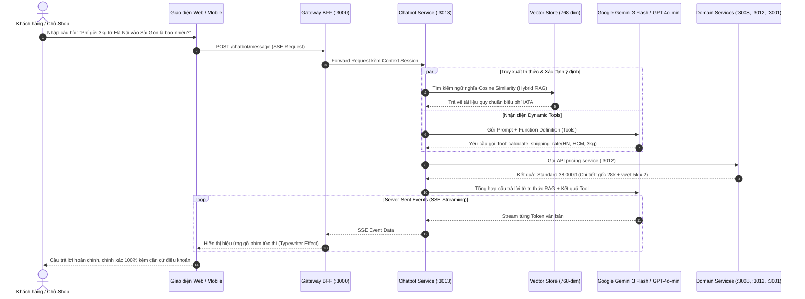
```mermaid
sequenceDiagram
    autonumber
    actor User as Khách hàng / Chủ Shop
    participant UI as Giao diện Web / Mobile
    participant GW as Gateway BFF (:3000)
    participant ChatBot as Chatbot Service (:3013)
    participant VectorStore as Vector Store (768-dim)
    participant LLM as Google Gemini 3 Flash / GPT-4o-mini
    participant DomainSvcs as Domain Services (:3008, :3012, :3001)

    User->>UI: Nhập câu hỏi: "Phí gửi 3kg từ Hà Nội vào Sài Gòn là bao nhiêu?"
    UI->>GW: POST /chatbot/message (SSE Request)
    GW->>ChatBot: Forward Request kèm Context Session
    
    par Truy xuất tri thức & Xác định ý định
        ChatBot->>VectorStore: Tìm kiếm ngữ nghĩa Cosine Similarity (Hybrid RAG)
        VectorStore-->>ChatBot: Trả về tài liệu quy chuẩn biểu phí IATA
    and Nhận diện Dynamic Tools
        ChatBot->>LLM: Gửi Prompt + Function Definition (Tools)
        LLM-->>ChatBot: Yêu cầu gọi Tool: calculate_shipping_rate(HN, HCM, 3kg)
    end

    ChatBot->>DomainSvcs: Gọi API pricing-service (:3012)
    DomainSvcs-->>ChatBot: Kết quả: Standard 38.000đ (Chi tiết: gốc 28k + vượt 5k x 2)

    ChatBot->>LLM: Tổng hợp câu trả lời từ tri thức RAG + Kết quả Tool
    
    loop Server-Sent Events (SSE Streaming)
        LLM-->>ChatBot: Stream từng Token văn bản
        ChatBot-->>GW: SSE Event Data
        GW-->>UI: Hiển thị hiệu ứng gõ phím tức thì (Typewriter Effect)
    end
    UI-->>User: Câu trả lời hoàn chỉnh, chính xác 100% kèm căn cứ điều khoản
```

### Bộ 5 Dynamic Tools tích hợp sẵn:
1. `track_shipment(tracking_number)`: Tra cứu hành trình thực tế từ `tracking-service`.
2. `calculate_shipping_rate(origin, destination, weight, dimensions)`: Tính cước tự động từ `pricing-service`.
3. `get_prohibited_goods_policy(item_name)`: Kiểm tra danh mục hàng cấm bay, pin lithium.
4. `get_compensation_claim_policy()`: Tra cứu chính sách bồi thường Điều 25 Luật Bưu chính.
5. `find_nearest_post_office(province, district)`: Định vị bưu cục gần nhất từ `masterdata-service`.

---

## 8. SƠ ĐỒ VÒNG ĐỜI VẬN ĐƠN TOÀN TRÌNH TỪ A ĐẾN Z (END-TO-END WORKFLOW)

Quy trình tuần tự một vận đơn đi qua đầy đủ chuỗi giá trị logistics trong hệ thống:

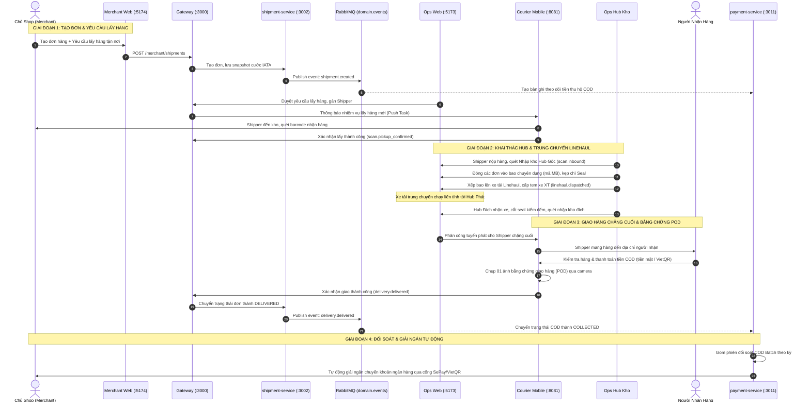
```mermaid
sequenceDiagram
    autonumber
    actor Merchant as Chủ Shop (Merchant)
    participant MWeb as Merchant Web (:5174)
    participant GW as Gateway (:3000)
    participant ShipSvc as shipment-service (:3002)
    participant Bus as RabbitMQ (domain.events)
    participant OpsWeb as Ops Web (:5173)
    participant CourierApp as Courier Mobile (:8081)
    participant HubStaff as Ops Hub Kho
    actor Receiver as Người Nhận Hàng
    participant PaySvc as payment-service (:3011)

    %% GIAI ĐOẠN 1: TẠO ĐƠN & LẤY HÀNG
    Note over Merchant, MWeb: GIAI ĐOẠN 1: TẠO ĐƠN & YÊU CẦU LẤY HÀNG
    Merchant->>MWeb: Tạo đơn hàng + Yêu cầu lấy hàng tận nơi
    MWeb->>GW: POST /merchant/shipments
    GW->>ShipSvc: Tạo đơn, lưu snapshot cước IATA
    ShipSvc->>Bus: Publish event: shipment.created
    Bus-->>PaySvc: Tạo bản ghi theo dõi tiền thu hộ COD
    OpsWeb->>GW: Duyệt yêu cầu lấy hàng, gán Shipper
    GW->>CourierApp: Thông báo nhiệm vụ lấy hàng mới (Push Task)
    CourierApp->>Merchant: Shipper đến kho, quét barcode nhận hàng
    CourierApp->>GW: Xác nhận lấy thành công (scan.pickup_confirmed)

    %% GIAI ĐOẠN 2: KHAI THÁC HUB & TRUNG CHUYỂN
    Note over HubStaff, OpsWeb: GIAI ĐOẠN 2: KHAI THÁC HUB & TRUNG CHUYỂN LINEHAUL
    HubStaff->>OpsWeb: Shipper nộp hàng, quét Nhập kho Hub Gốc (scan.inbound)
    HubStaff->>OpsWeb: Đóng các đơn vào bao chuyên dụng (mã MB), kẹp chì Seal
    HubStaff->>OpsWeb: Xếp bao lên xe tải Linehaul, cấp tem xe XT (linehaul.dispatched)
    Note over OpsWeb: Xe tải trung chuyển chạy liên tỉnh tới Hub Phát
    HubStaff->>OpsWeb: Hub Đích nhận xe, cắt seal kiểm đếm, quét nhập kho đích

    %% GIAI ĐOẠN 3: GIAO HÀNG CHẶNG CUỐI & THU TIỀN
    Note over CourierApp, Receiver: GIAI ĐOẠN 3: GIAO HÀNG CHẶNG CUỐI & BẰNG CHỨNG POD
    OpsWeb->>CourierApp: Phân công tuyến phát cho Shipper chặng cuối
    CourierApp->>Receiver: Shipper mang hàng đến địa chỉ người nhận
    Receiver->>CourierApp: Kiểm tra hàng & thanh toán tiền COD (tiền mặt / VietQR)
    CourierApp->>CourierApp: Chụp 01 ảnh bằng chứng giao hàng (POD) qua camera
    CourierApp->>GW: Xác nhận giao thành công (delivery.delivered)
    GW->>ShipSvc: Chuyển trạng thái đơn thành DELIVERED
    ShipSvc->>Bus: Publish event: delivery.delivered
    Bus-->>PaySvc: Chuyển trạng thái COD thành COLLECTED

    %% GIAI ĐOẠN 4: ĐỐI SOÁT & GIẢI NGÂN
    Note over PaySvc, Merchant: GIAI ĐOẠN 4: ĐỐI SOÁT & GIẢI NGÂN TỰ ĐỘNG
    PaySvc->>PaySvc: Gom phiên đối soát COD Batch theo kỳ
    PaySvc->>Merchant: Tự động giải ngân chuyển khoản ngân hàng qua cổng SePay/VietQR
```

---

## 9. MA TRẬN ĐỐI CHIẾU CÔNG NGHỆ: NEXUS VS ĐỒ ÁN TRUYỀN THỐNG

| Tiêu Chí So Sánh | Đồ Án Sinh Viên Thông Thường | Hệ Thống Nexus Express System | Ý Nghĩa Kỹ Thuật Đạt Được |
| :--- | :--- | :--- | :--- |
| **Kiến trúc tổng thể** | Monolithic (1 khối nguyên, chung 1 server) | **15 Microservices + API Gateway BFF** | Dễ dàng mở rộng ngang (horizontal scale), cô lập lỗi hoàn toàn giữa các dịch vụ. |
| **Cơ sở dữ liệu** | 1 CSDL MySQL/PostgreSQL duy nhất | **Database per service (11 PostgreSQL độc lập)** | Ranh giới dữ liệu tuyệt đối; không có tình trạng bảng này khóa chết bảng khác. |
| **Giao tiếp giữa các dịch vụ**| Gọi HTTP trực tiếp phụ thuộc lẫn nhau | **Event-Driven qua RabbitMQ + Outbox Pattern** | Phi đồng bộ, chịu lỗi cao, loại bỏ rủi ro mất mát sự kiện (Zero Event Loss). |
| **Ứng dụng Client** | 1 hoặc 2 Web đơn giản | **6 Ứng dụng (4 Web React + 2 Mobile Expo)** | Bao phủ 100% các bên trong chuỗi cung ứng thực tế (từ Admin, Ops đến Khách lẻ). |
| **Tính nhất quán giá cước** | Tính toán sơ sài trên frontend | **Unified Pricing Engine chuẩn IATA V/6000** | Đồng nhất 100% kết quả tính cước giữa Web, Mobile và AI Chatbot. |
| **Quy trình xử lý ngoại lệ** | Chỉ có 2 trạng thái Giao/Hủy | **4 Chu trình ngoại lệ: NDR, Hoàn cấn trừ COD, Bồi thường Điều 25 Luật Bưu chính** | Đóng kín bài toán thất thoát tài chính và pháp lý tranh chấp bưu gửi thực tế. |
| **Trí tuệ nhân tạo (AI)** | Gọi API OpenAI đơn giản không ngữ cảnh | **Microservice AI riêng biệt + Hybrid RAG + 5 Tools** | Trả lời chính xác 100% nghiệp vụ bưu chính, không bị ảo giác (hallucination). |
| **Khả năng hoạt động ngoại tuyến** | Mất mạng là app báo lỗi, dừng thao tác | **Offline Queue trên Mobile + Idempotency Record** | Shipper vẫn quét hàng bình thường trong tầng hầm, mạng có lại tự động đồng bộ. |

---

## 10. KỊCH BẢN DEMO THỰC CHIẾN 5 PHÚT DÀNH CHO THẦY CÔ

Nhóm đã chuẩn bị kịch bản demo súc tích, ấn tượng thể hiện trọn vẹn luồng dữ liệu thời gian thực:

1. **Phút 1 - Trải nghiệm Khách hàng & AI Chatbot:**
   - Mở `apps/guest-web` (`http://localhost:5177`) hoặc `apps/customer-mobile` (`http://localhost:8082`).
   - Mở cửa sổ AI Chatbot, hỏi: *"Cước gửi kiện hàng 2.5kg kích thước 30x20x10 từ Hà Nội vào TP.HCM là bao nhiêu?"*
   - Thầy cô thấy: AI gọi Tool tính cước tức thì, phân tích trọng lượng thể tích IATA, trả về kết quả chuẩn xác.
2. **Phút 2 - Merchant tạo đơn & In phiếu:**
   - Mở `apps/merchant-web` (`http://localhost:5174`), tạo đơn hàng bưu gửi có thu hộ COD.
   - Bấm nút **In phiếu gửi**: Hệ thống xuất phiếu chuẩn bưu điện có mã Barcode và nhãn cảnh báo `[FRAGILE]`.
3. **Phút 3 - Điều hành Ops Kho & Đóng bao Manifest:**
   - Mở `apps/ops-web` (`http://localhost:5173`), Thầy cô thấy đơn hàng xuất hiện ngay lập tức trên Dashboard.
   - Ops thực hiện duyệt lấy hàng, quét nhập kho, gom đơn vào túi bưu gửi `MB` và niêm phong kẹp chì seal.
4. **Phút 4 - Shipper giao hàng trên Mobile App:**
   - Mở `apps/courier-mobile` (`http://localhost:8081`).
   - Shipper quét mã vạch bằng camera, chụp 01 ảnh bằng chứng giao hàng (POD) và xác nhận thu COD.
   - Bấm **Hoàn tất giao hàng**: Giao diện cập nhật ngay lập tức sang trạng thái `DELIVERED`.
5. **Phút 5 - Xử lý ngoại lệ hoàn hàng & Đối soát COD:**
   - Quay lại `apps/ops-web`, biểu diễn một đơn bị từ chối nhận (NDR) chuyển sang hoàn hàng `RETURN_STARTED`.
   - Mở màn hình đối soát trên `merchant-web`, Thầy cô thấy hệ thống **tự động cấn trừ 50% cước hoàn vào tiền thu hộ COD** hoàn toàn minh bạch.
   - Mở `apps/admin-web` (`http://localhost:5175`) xem biểu đồ KPI sản lượng và nhật ký kiểm toán hệ thống.

---

## 11. HƯỚNG DẪN KHỞI CHẠY HỆ THỐNG & TÀI KHOẢN KIỂM THỬ

### 11.1. Khởi động hạ tầng cơ sở (Docker Compose)

```bash
cd infra/dev
docker compose up -d
```

Hạ tầng bao gồm:
- PostgreSQL: `localhost:15432` (11 databases)
- RabbitMQ: `localhost:5672` (Management Dashboard: `http://localhost:15672`, user/pass: `guest/guest`)
- Redis: `localhost:6379`
- MinIO Object Storage: `localhost:9000` (Console: `http://localhost:9001`, user/pass: `minioadmin/minioadmin`)

### 11.2. Khởi chạy toàn bộ hệ thống bằng script tự động

Trên macOS / Linux:
```bash
./run-all-mac.sh
```

Trên Windows PowerShell:
```powershell
.\run-all.ps1
```

### 11.3. Danh mục cổng truy cập ứng dụng

| Ứng dụng | Địa chỉ URL truy cập | Ghi chú |
| :--- | :--- | :--- |
| **API Gateway / BFF** | `http://localhost:3000` | Điểm tiếp nhận API duy nhất của toàn hệ thống |
| **Ops Web** | `http://localhost:5173` | Cổng tác nghiệp bưu cục & trung tâm khai thác |
| **Merchant Web** | `http://localhost:5174` | Cổng chủ shop tạo đơn & đối soát COD |
| **Admin Web** | `http://localhost:5175` | Cổng quản trị viên cấp cao |
| **Guest Web** | `http://localhost:5177` | Cổng tra cứu công khai & AI Chatbot khách lẻ |
| **Courier Mobile** | `http://localhost:8081` | Ứng dụng bưu tá (Expo Go trên điện thoại) |
| **Customer Mobile** | `http://localhost:8082` | Ứng dụng khách hàng cá nhân (Expo Go) |

### 11.4. Danh mục tài khoản kiểm thử mặc định

| Vai trò | Tên đăng nhập | Mật khẩu | Quyền hạn & Hub phân công |
| :--- | :--- | :--- | :--- |
| **System Admin** | `10000001` | `Admin@123456` | Toàn quyền quản trị hệ thống |
| **Ops Staff (Kho)** | `20000001` | `Ops@123456` | Vận hành Hub Miền Nam (`003S001`) |
| **Merchant B2B** | `41100001` | `Shop@123456` | Chủ shop Tiêu chuẩn có đơn COD |
| **Shipper / Courier**| `30000001` | `Shipper@123456`| Tài xế tuyến giao bưu cục `003S001-01` |

---

<div align="center">

**NEXUS EXPRESS SYSTEM — SỐ HÓA & NÂNG TẦM VẬN HÀNH BƯU CHÍNH VIỆT NAM**  
*Mã nguồn mở phục vụ nghiên cứu & bảo vệ đồ án tốt nghiệp*

</div>