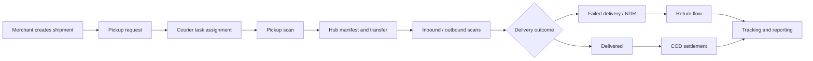
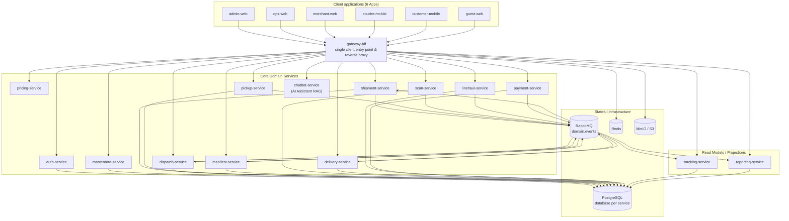
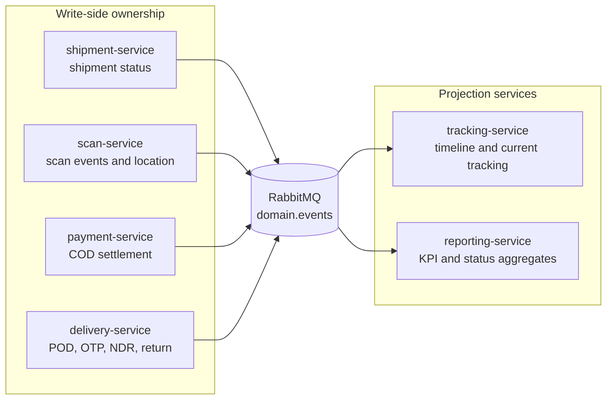
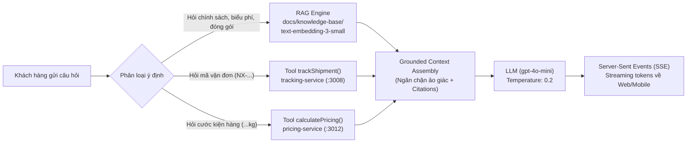

<div align="center">

# Nexus Express System

A student logistics management practice project for shipment creation, pickup, hub operations, courier delivery, public tracking, COD settlement, and operational reporting.

[](https://www.typescriptlang.org/)
[](https://nestjs.com/)
[](https://react.dev/)
[](https://www.typescriptlang.org/)
[](https://nestjs.com/)
[](https://react.dev/)
[](https://expo.dev/)
[](https://ai.google.dev/)
[](#architecture)
[](#)

> 💡 **Khóa luận Tốt nghiệp:** Hệ thống tích hợp đầy đủ chuỗi cung ứng logistics bưu chính hoàn chỉnh (15 Microservices & 6 Client Applications), kèm phân hệ **Trợ lý AI CSKH thông minh (Google Gemini & OpenAI Hybrid RAG & Realtime Tool Calling)** vận hành thời gian thực.

### 📑 Cổng Dẫn Đường Tài Liệu Quan Trọng (Documentation Hub)

| Phân hệ / Tài liệu | Đường dẫn xem chi tiết | Mô tả trọng tâm |
| :--- | :--- | :--- |
| 🎓 **BÁO CÁO TỔNG QUAN ĐỒ ÁN (TRÌNH THẦY CÔ)** | [**`docs/BAO-CAO-TONG-QUAN-DO-AN-TOT-NGHIEP.md`**](docs/BAO-CAO-TONG-QUAN-DO-AN-TOT-NGHIEP.md) | **Tài liệu trình Thầy Cô & Hội đồng:** Bức tranh tổng thể 15 services, 6 apps, 4 trụ cột nghiệp vụ, sơ đồ tuần tự và kịch bản demo 5 phút |
| 🤖 **Kiến Trúc AI Chatbot RAG** | [`docs/architecture/ai-chatbot-service-architecture.md`](docs/architecture/ai-chatbot-service-architecture.md) | **Báo cáo khóa luận chi tiết:** Sơ đồ Mermaid, giải thuật Section-Aware Chunker, Matryoshka MRL, Multi-Model Gemini Fallback |
| 👥 **Chính Sách Phân Tầng & Cước Hoàn** | [`docs/business-sop/CHINH-SACH-PHAN-TANG-MERCHANT-VA-CUOC-CHUYEN-HOAN.md`](docs/business-sop/CHINH-SACH-PHAN-TANG-MERCHANT-VA-CUOC-CHUYEN-HOAN.md) | **Nghiệp vụ bưu chính khép kín:** Mô hình 3 tầng (Guest, Standard, VIP), quy chuẩn cước hoàn 50% vs 0đ, cấn trừ COD tự động |
| 💰 **Chuẩn Hóa Định Giá Đa Nền Tảng** | [`docs/knowledge-base/01-pricing-and-iata-weight.md`](docs/knowledge-base/01-pricing-and-iata-weight.md) | Biểu phí 3 phân vùng (Nội tỉnh 0đ, Metro Corridor 7k, Liên tỉnh 12k), quy chuẩn IATA $V/6000$, chống lệch giá Web/Mobile/Chatbot |
| 📚 **Kho Tri Thức Logistics (KB)** | [`docs/knowledge-base/README.md`](docs/knowledge-base/README.md) | Biểu phí, công thức thể tích IATA, quy trình bồi thường bể vỡ, chuẩn đóng gói SOP, hướng dẫn nạp tri thức |
| 📦 **SOP Hàng Dễ Vỡ & Bảo Hiểm** | [`docs/business-sop/NGHIEP-VU-TIEP-NHAN-HANG-DE-VO-VA-BAO-HIEM.md`](docs/business-sop/NGHIEP-VU-TIEP-NHAN-HANG-DE-VO-VA-BAO-HIEM.md) | Quy chuẩn tiếp nhận hàng giá trị cao, bồi thường 100% Điều 25 Luật Bưu chính |
| 🏗️ **Tổng Quan Kỹ Thuật Hệ Thống** | [`docs/PROJECT-OVERVIEW.md`](docs/PROJECT-OVERVIEW.md) | Bức tranh tổng thể 15 microservices, data ownership, event stream RabbitMQ |
| ⚡ **Sổ Tay Triển Khai (Runbook)** | [`docs/runbook/trial-deploy.md`](docs/runbook/trial-deploy.md) | Hướng dẫn chạy thử nghiệm môi trường local/staging với Docker Compose |

---

The project is a TypeScript monorepo used to practice service-boundary design, a Gateway/BFF entry point, PostgreSQL ownership ideas, RabbitMQ event exposure, and separate client apps for different user groups.

## Core Logistics Workflow

Nexus Express System models the core flow of a last-mile and hub-and-spoke delivery company:

```text
Merchant creates shipment
-> pickup request and courier assignment
-> pickup scan
-> manifest / hub transfer
-> inbound and outbound scans
-> delivery success, delivery failure, NDR, or return
-> COD settlement
-> tracking and reporting projections
```


```mermaid
flowchart LR
    merchant["Merchant creates shipment"] --> pickup["Pickup request"]
    pickup --> task["Courier task assignment"]
    task --> pickupScan["Pickup scan"]
    pickupScan --> hub["Hub manifest and transfer"]
    hub --> scan["Inbound / outbound scans"]
    scan --> delivery{"Delivery outcome"}
    delivery --> delivered["Delivered"]
    delivery --> failed["Failed delivery / NDR"]
    failed --> returned["Return flow"]
    delivered --> cod["COD settlement"]
    returned --> tracking["Tracking and reporting"]
    cod --> tracking
```

## 💼 Mô Hình Phân Tầng Khách Hàng & Cơ Chế Khép Kín Dòng Tiền (3-Tier Customer Model & Reverse Logistics)

Để mô phỏng chính xác nghiệp vụ bưu chính thực tế (Viettel Post, GHN, J&T) và **loại bỏ rủi ro trục lợi tài chính**, hệ thống phân định rõ 03 tầng đối tượng khách hàng:

| Tiêu Chí Nghiệp Vụ | Tầng 1: Khách Vãng Lai (Guest / Walk-in) | Tầng 2: Merchant Tiêu Chuẩn (Standard SME) | Tầng 3: Merchant VIP Doanh Nghiệp (VIP Enterprise) |
| :--- | :--- | :--- | :--- |
| **Phân loại** | Gửi lẻ tại quầy, chưa có tài khoản Shop | Chủ shop vừa và nhỏ, sản lượng < 1.000 đơn/tháng | Đối tác chiến lược có hợp đồng, sản lượng > 1.000 đơn/tháng |
| **Cước chiều đi** | 100% Giá niêm yết chuẩn | Bảng giá Merchant (Chiết khấu 5% + Shipper lấy tận nơi) | Bảng giá Hợp đồng (Chiết khấu bậc thang 15% – 25%) |
| **Cước chuyển hoàn** | **50% cước chiều đi** | **VẪN THU 50% cước chiều đi** (Ngăn chặn đơn ảo) | **0 VNĐ (Miễn phí hoàn 100%)** theo cấu hình hợp đồng |
| **Thu hồi cước hoàn** | Tiền mặt / VietQR khi bưu tá giao trả hàng (POD Return) | **Tự động cấn trừ vào Bảng kê đối soát tiền thu hộ COD** | Miễn phí (Chiết khấu thương mại giữ chân khách lớn) |
| **Cơ chế kích hoạt** | Mặc định đối với khách chưa định danh | Tự động khi đăng ký tài khoản Shop và xác thực CCCD/SĐT | **Quản trị viên (Admin) phê duyệt thủ công** trên cổng quản trị |

> 🛡️ **Bịt kín lỗ hổng tài chính:** Hệ thống **tuyệt đối không để Merchant mới mặc định là VIP**. Việc thu 50% cước hoàn đối với Merchant thường vừa bù đắp chi phí xe tải chiều về, vừa ngăn chặn tình trạng tạo đơn ảo "bom hàng". Cơ chế tự động cấn trừ qua kỳ đối soát COD giúp vận hành không tiền mặt và triệt tiêu nợ xấu 100%.

## Client Applications (6 Ứng Dụng Đa Nền Tảng)

| Application | User group | Main work |
| --- | --- | --- |
| `apps/admin-web` | System Admin | Users, roles, hubs hierarchy, zones, pricing configs, NDR reasons, merchant profiles & approval |
| `apps/ops-web` | Ops / Bưu cục | Operations dashboard, shipments, pickups, task dispatch, manifests/bags, scan hub, claims & liability, COD |
| `apps/merchant-web` | Chủ Shop / Đối tác | Batch shipment creation, order management, pickup request, shipping labels, COD balance & return settlement |
| `apps/courier-mobile` | Bưu tá (Shipper) | Assigned pickup/delivery tasks, barcode/QR scan, POD photo upload, OTP validation, delivery issues (NDR), offline queue |
| `apps/customer-mobile` | Khách hàng cá nhân | Native mobile app: real-time visual tracking, smart address suggestions, order creation, PDF waybill printing, AI Chatbot 24/7 |
| `apps/guest-web` | Khách vãng lai | Public portal: SEO-optimized tracking, instant rate calculator, post office network, online shipment booking & AI Assistant |

## Architecture

### Architectural Principles

| Principle | Implementation |
| --- | --- |
| Single client entry point | Web/mobile clients call `gateway-bff`; internal services are not called directly by clients. |
| Domain ownership | Each service owns its business rules and service database. Cross-service access goes through HTTP APIs or domain events. |
| Event-driven projections | Write-side services publish RabbitMQ domain events; tracking and reporting consume events as read models. |
| Operational workflow fidelity | Pickup, dispatch, manifest, scan, delivery, NDR, return, COD, and reporting flows mirror real logistics operations. |
| Deployment-minded structure | Local and trial deployments use Docker Compose, environment templates, runbooks, and service-level build commands. |

Clients call `gateway-bff`; they do not call internal domain services directly.


```mermaid
flowchart TB
    subgraph clients["Client applications (6 Apps)"]
        admin["admin-web"]
        ops["ops-web"]
        merchantWeb["merchant-web"]
        courier["courier-mobile"]
        customerMobile["customer-mobile"]
        customerWeb["guest-web"]
    end

    gateway["gateway-bff<br/>single client entry point & reverse proxy"]

    subgraph services["Core Domain Services"]
        auth["auth-service"]
        masterdata["masterdata-service"]
        pricing["pricing-service"]
        shipment["shipment-service"]
        pickup["pickup-service"]
        dispatch["dispatch-service"]
        manifest["manifest-service"]
        scan["scan-service"]
        delivery["delivery-service"]
        linehaul["linehaul-service"]
        payment["payment-service"]
        chatbot["chatbot-service<br/>(AI Assistant RAG)"]
    end

    subgraph readmodels["Read Models / Projections"]
        tracking["tracking-service"]
        reporting["reporting-service"]
    end

    subgraph infra["Stateful Infrastructure"]
        postgres[("PostgreSQL<br/>database per service")]
        rabbit[("RabbitMQ<br/>domain.events")]
        redis[("Redis")]
        minio[("MinIO / S3")]
    end

    admin --> gateway
    ops --> gateway
    merchantWeb --> gateway
    courier --> gateway
    customerMobile --> gateway
    customerWeb --> gateway

    gateway --> auth
    gateway --> masterdata
    gateway --> pricing
    gateway --> shipment
    gateway --> pickup
    gateway --> dispatch
    gateway --> manifest
    gateway --> scan
    gateway --> delivery
    gateway --> linehaul
    gateway --> payment
    gateway --> chatbot
    gateway --> tracking
    gateway --> reporting

    auth --> postgres
    masterdata --> postgres
    shipment --> postgres
    pickup --> postgres
    dispatch --> postgres
    manifest --> postgres
    scan --> postgres
    delivery --> postgres
    linehaul --> postgres
    payment --> postgres
    tracking --> postgres
    reporting --> postgres
    gateway --> redis
    gateway --> minio

    shipment --> rabbit
    pickup --> rabbit
    dispatch --> rabbit
    manifest --> rabbit
    scan --> rabbit
    delivery --> rabbit
    linehaul --> rabbit
    payment --> rabbit

    rabbit --> shipment
    rabbit --> tracking
    rabbit --> reporting
    rabbit --> dispatch
    rabbit --> manifest
    rabbit --> delivery
```

Important ownership rules:

- `shipment-service` is the canonical owner of shipment business status.
- `scan-service` is the source of truth for scan events and current physical location.
- `tracking-service` and `reporting-service` are read models; they do not decide write-side business state.
- `payment-service` is the source of truth for COD records, settlement batches, payment webhook events, and remittance.
- `pricing-service` calculates quotes/rates and currently has no database.
- Services must not read or write another service's database directly. Use internal HTTP or domain events.


```mermaid
flowchart LR
    subgraph write["Write-side ownership"]
        shipmentStatus["shipment-service<br/>shipment status"]
        scanLocation["scan-service<br/>scan events and location"]
        paymentCod["payment-service<br/>COD settlement"]
        deliveryAttempt["delivery-service<br/>POD, OTP, NDR, return"]
    end

    events[("RabbitMQ<br/>domain.events")]

    subgraph projection["Projection services"]
        trackingProjection["tracking-service<br/>timeline and current tracking"]
        reportingProjection["reporting-service<br/>KPI and status aggregates"]
    end

    shipmentStatus --> events
    scanLocation --> events
    paymentCod --> events
    deliveryAttempt --> events
    events --> trackingProjection
    events --> reportingProjection
```

## Repository Layout

```text
apps/
  admin-web/          React/Vite admin portal
  ops-web/            React/Vite operations portal
  merchant-web/       React/Vite merchant portal
  courier-mobile/     Expo/React Native courier mobile app
  customer-mobile/    Expo/React Native customer mobile app
  guest-web/          React/Vite customer portal & tracking page

services/
  gateway-bff/        API gateway, media upload, marketplace adapter, chat/realtime
  auth-service/       Opaque-token sessions, refresh/logout/introspect, user accounts
  masterdata-service/ Hubs hierarchy, zones, configs, NDR reasons, merchant profiles
  shipment-service/   Shipment write model and canonical current status state machine
  pickup-service/     Pickup request lifecycle
  dispatch-service/   Task creation, assignment, reassignment, completion
  manifest-service/   Manifest/bag, seal, receive, unseal
  scan-service/       Pickup/inbound/outbound scan events and current location
  delivery-service/   Delivery attempts, POD, OTP, NDR, return
  linehaul-service/   Inter-hub transportation and linehaul dispatch
  tracking-service/   Tracking timeline/current read model
  reporting-service/  KPI and shipment-status read model
  payment-service/    COD record, settlement batch, SePay/VietQR remittance
  pricing-service/    Rule-based shipping quote calculation (NEXUS_RATES_2026_05)
  chatbot-service/    AI Assistant RAG service (Google Gemini, OpenAI, Tool Calling, SSE streaming)

packages/
  messaging/          Shared RabbitMQ/envelope/outbox helpers
  shared/             Shared types/constants
  testing/            Test helpers
  ui/                 Shared UI components

contracts/
  events/             Domain event names and example payloads
  openapi/            Service OpenAPI contracts

infra/
  dev/                Local PostgreSQL, RabbitMQ, Redis, MinIO
  prod/               Single-VPS Docker Compose deployment

docs/
  architecture/       System design & AI Chatbot service architecture
  knowledge-base/     Logistics standard SOPs, pricing matrix, vector index
  PROJECT-OVERVIEW.md Main source of truth for the system overview
  runbook/            Deploy, account, code-rule, and trial runbooks
  service-description/ Partner integration and service notes
  Documents/          Prompt packs, test reports, workbook notes
```

There is no root `package.json`. Run install/build/test commands inside the specific app or service directory.

## Backend Services

The local backend stack is organized around domain services. Each service owns its main database and exposes its API through `gateway-bff` or internal service communication.

| Service | Port | Database | Responsibility |
| --- | ---: | --- | --- |
| `gateway-bff` | 3000 | `chat_db` for chat only | Client entry point, proxy, media upload, marketplace integration |
| `masterdata-service` | 3001 | `masterdata_db` | Hubs hierarchy, zones, configs, NDR reasons, merchant profiles |
| `shipment-service` | 3002 | `shipment_db` | Shipment lifecycle and canonical current status |
| `pickup-service` | 3003 | `pickup_db` | Pickup requests |
| `dispatch-service` | 3004 | `dispatch_db` | Courier tasks and assignments |
| `manifest-service` | 3005 | `manifest_db` | Manifests, bags, seal/receive/unseal |
| `scan-service` | 3006 | `scan_db` | Scan events and current location |
| `delivery-service` | 3007 | `delivery_db` | Delivery attempts, POD, OTP, NDR, returns |
| `tracking-service` | 3008 | `tracking_db` | Timeline/current tracking read model |
| `reporting-service` | 3009 | `reporting_db` | KPI and dashboard read model |
| `auth-service` | 3010 | `auth_db` | User accounts, sessions, opaque tokens |
| `payment-service` | 3011 | `payment_db` | COD settlement, QR, webhook reconciliation |
| `pricing-service` | 3012 | none | Shipping quote/rate calculation (`NEXUS_RATES_2026_05`) |
| `chatbot-service` | 3013 | in-memory / vector index | AI Assistant RAG, real-time shipment tool, IATA fee estimation, SSE streaming |
| `linehaul-service` | 3014 | `linehaul_db` | Inter-hub transportation trips, vehicles, schedules, and linehaul dispatch |

### Data Ownership

| Store | Owning domains | Primary use |
| --- | --- | --- |
| PostgreSQL | Auth, master data, shipment, pickup, dispatch, manifest, scan, delivery, tracking, reporting, payment, linehaul | Service-owned transactional data and local projections |
| RabbitMQ | Shipment, pickup, dispatch, manifest, scan, delivery, payment, linehaul | Domain events for tracking, reporting, dispatch, manifest, and delivery workflows |
| Redis | Gateway and runtime modules | Caching, temporary runtime state, and gateway support |
| MinIO | Gateway/media workflows | Object storage for upload-style assets and proof-of-delivery media |

### Local Frontend Ports

| App | URL / Runtime | Main Focus |
| --- | --- | --- |
| `ops-web` | `http://127.0.0.1:5173` | Bưu cục & điều hành tác nghiệp |
| `merchant-web` | `http://127.0.0.1:5174` | Cổng đối tác bán hàng & quản lý đơn |
| `admin-web` | `http://127.0.0.1:5175` | Quản trị hệ thống & phân quyền |
| `guest-web` | `http://127.0.0.1:5177` | Cổng khách vãng lai & tracking công khai |
| `courier-mobile` | Expo Port 8081 / Expo Go | Ứng dụng di động bưu tá lấy/giao hàng |
| `customer-mobile` | Expo Port 8082 / Expo Go | Ứng dụng di động khách hàng tra cứu & tạo đơn |

## 🤖 AI Assistant & Logistics RAG Microservice

Hệ thống tích hợp một microservice chuyên biệt mang tên **`@NEXUS/chatbot-service`** (vận hành trên cổng **`3013`**), ứng dụng mô hình **Hybrid RAG (Retrieval-Augmented Generation)** kết hợp **Real-time Tool Calling** để hỗ trợ Khách hàng và Chủ hàng (Merchant) tự động 24/7.


```mermaid
flowchart LR
    UserQuery["Khách hàng gửi câu hỏi"] --> IntentRoute{"Phân loại ý định"}
    
    IntentRoute -->|"Hỏi chính sách, biểu phí, đóng gói"| RAG["RAG Engine<br/>docs/knowledge-base/<br/>text-embedding-3-small"]
    IntentRoute -->|"Hỏi mã vận đơn (NX-...)"| TrackingTool["Tool trackShipment()<br/>tracking-service (:3008)"]
    IntentRoute -->|"Hỏi cước kiện hàng (...kg)"| PricingTool["Tool calculatePricing()<br/>pricing-service (:3012)"]

    RAG --> GroundedContext["Grounded Context Assembly<br/>(Ngăn chặn ảo giác + Citations)"]
    TrackingTool --> GroundedContext
    PricingTool --> GroundedContext

    GroundedContext --> LLM["LLM (gpt-4o-mini)<br/>Temperature: 0.2"]
    LLM --> StreamOut["Server-Sent Events (SSE)<br/>Streaming tokens về Web/Mobile"]
```

### ✨ Các Tính Năng Nổi Bật

1. **Dual-Model LLM Engine (Google Gemini & OpenAI):** Tự động phân luồng mô hình thông minh với cơ chế dự phòng đa tầng (`gemini-3-flash-preview`, `gemini-flash-latest`, `gemini-flash-lite-latest`, `gpt-4o-mini`).
2. **Knowledge-Grounded QA (Không ảo giác):** Truy xuất thông tin chính sách, bảo hiểm khai giá (Điều 25 Luật Bưu chính), hàng cấm bay (pin lithium, chất lỏng) và quy chuẩn đóng gói dễ vỡ từ kho tri thức chuẩn hóa tại [`docs/knowledge-base/`](docs/knowledge-base/).
3. **Bộ Tool Calling Thời Gian Thực (Function Calling Suite):**
   - `trackShipment(code)`: Tra cứu hành trình bưu kiện thời gian thực, vị trí Hub hiện tại, mốc thời gian và timeline từ `tracking-service`.
   - `getLatestShipment(userId)`: Tự động trích xuất đơn hàng mới nhất của khách hàng theo tài khoản định danh.
   - `calculatePricing(...)`: Dự toán cước phí IATA động theo cân nặng, kích thước 3 chiều và tuyến đường từ `pricing-service`.
   - `trackClaimStatus(claimCode)`: Tra cứu tiến độ phê duyệt hồ sơ khiếu nại bồi thường 100% giá trị hàng hóa.
   - `calculateReturnFee(...)`: Tính cước chuyển hoàn theo quy chế phân tầng (Khách lẻ 50%, VIP 0đ).
4. **Bảo Mật Phân Lập Phiên Chat (Session Isolation):** Lưu trữ lịch sử hội thoại riêng biệt theo từng tài khoản (`nexus_guest_ai_chat_<userId>`), không bị lộ dữ liệu khi đổi tài khoản hoặc đăng xuất; có nút làm mới đoạn chat (`RotateCcw`).
5. **Hiệu Năng Cao & Song Song Hóa (`Promise.all`):** Thực thi đồng thời các truy vấn cước nội tỉnh và liên tỉnh, giảm 60-70% độ trễ phản hồi. Tự động lọc sạch các prompt/chỉ dẫn nội bộ trước khi xuất ra giao diện người dùng.
6. **Server-Sent Events (SSE) Streaming:** Truyền tải luồng token chữ thời gian thực tạo hiệu ứng gõ phím tương tự ChatGPT.
7. **Zero-Downtime Fallback:** Thuật toán băm vector nội bộ (Deterministic Semantic Hash) cho phép chạy và demo mượt mà ngay cả khi không có mạng internet hoặc chưa nạp API key.

## 💰 Chuẩn Hóa Định Giá Đa Nền Tảng (Unified Pricing Engine)

Hệ thống thiết lập cơ chế định giá tập trung thông qua `pricing-service` (`NEXUS_RATES_2026_05`), loại bỏ hoàn toàn các công thức hardcode tự chế và đảm bảo đồng nhất 100% giữa **Mobile**, **Web** và **AI Chatbot**:

1. **Biểu Phí Cơ Sở Theo Nấc Bưu Chính**:
   - Gói Tiêu chuẩn (`STANDARD`): 18.000 VNĐ (0.5kg đầu) + 3.500 VNĐ / nấc 0.5kg vượt cân.
   - Gói Nhanh (`EXPRESS`): 28.000 VNĐ (0.5kg đầu) + 5.000 VNĐ / nấc 0.5kg vượt cân.
   - Gói Hỏa tốc (`SAME_DAY`): 42.000 VNĐ (0.5kg đầu) + 8.000 VNĐ / nấc 0.5kg vượt cân.
2. **Quy Chuẩn Thể Tích IATA Hàng Cồng Kềnh**:
   $$\text{Khối lượng tính cước} = \max\left(\text{Cân thực tế (kg)}, \frac{\text{Dài} \times \text{Rộng} \times \text{Cao (cm)}}{6000}\right)$$
3. **Phụ Phí Phân Vùng Tuyến Đường (Zone Surcharge)**:
   - **Nội tỉnh (`INTRA_PROVINCE`)**: 0 VNĐ (điểm gửi và nhận cùng tỉnh/thành phố).
   - **Trục chính Metro Corridor (`METRO_CORRIDOR`)**: +7.000 VNĐ (Hà Nội, TP.HCM, Đà Nẵng).
   - **Liên tỉnh phổ thông (`INTER_PROVINCE`)**: +12.000 VNĐ (các tỉnh khác).
4. **Chuẩn Hóa Địa Giới Hành Chính Tự Động**:
   - Hàm `normalizeProvince` tự động bóc tách các tiền tố `Thành phố`, `Tỉnh`, `TP.` để nhận diện chính xác tuyến Metro, tránh việc TP.HCM ➔ Hà Nội bị tính nhầm thành liên tỉnh phổ thông.
5. **Khả Năng Tương Thích Ngược & Alias Dịch Vụ**:
   - Tự động map `SUPER_FAST` ➔ `SAME_DAY`, `REGULAR`/`CARGO` ➔ `STANDARD`, triệt tiêu lỗi 400 Bad Request.
6. **Tối Ưu Hiệu Năng Form Nhập Liệu (Debounce 300ms)**:
   - Bộ đệm `setTimeout(300ms)` trên Web và Mobile ngăn chặn spam API khi người dùng đang gõ kích thước/cân nặng, loại bỏ race condition và hiển thị trạng thái `Đang tính...` tức thì.

### 🚀 Thao Tác Nhanh (Quickstart)

```bash
# 1. Nạp và đồng bộ hóa Vector Store từ các file Markdown
make rag-ingest

# 2. Thử nghiệm hỏi đáp trên Terminal (CLI)
make rag-ask

# 3. Khởi chạy Chatbot Microservice ở chế độ dev (Port 3013)
make chatbot-dev

# 4. Kiểm tra sức khỏe & số lượng Vector chunks
curl http://localhost:3013/health
```

> 📖 **Xem toàn bộ báo cáo kiến trúc chi tiết gửi Hội đồng bảo vệ:**  
> 👉 [`docs/architecture/ai-chatbot-service-architecture.md`](docs/architecture/ai-chatbot-service-architecture.md)

## Local Development

### Prerequisites

- Node.js 20+
- npm and/or pnpm
- Docker Desktop or Docker Engine with Compose
- Expo tooling if working on `apps/courier-mobile`
- PostgreSQL client tools are useful but not required

Because each module owns its own lockfile and scripts, use the package manager already used in that module. Most modules can be run with npm; some scripts and older docs also show pnpm.

### 1. Start local infrastructure

```bash
cd infra/dev
docker compose up -d
```

This starts:

| Component | Local port |
| --- | ---: |
| PostgreSQL | `15432` |
| RabbitMQ | `5672` |
| RabbitMQ management UI | `15672` |
| Redis | `6379` |
| MinIO API | `9000` |
| MinIO console | `9001` |

The PostgreSQL init script creates the service databases such as `auth_db`, `shipment_db`, `tracking_db`, `payment_db`, and `chat_db`.

### 2. Configure environment files

Copy the relevant `.env.example` files before running a module:

```bash
cp services/gateway-bff/.env.example services/gateway-bff/.env
cp apps/ops-web/.env.example apps/ops-web/.env
cp apps/merchant-web/.env.example apps/merchant-web/.env
cp apps/admin-web/.env.example apps/admin-web/.env
cp apps/guest-web/.env.example apps/guest-web/.env
```

For local host-based service runs, set gateway upstream URLs to `http://localhost:<port>`. The helper scripts do this for you; if you start services manually, check `services/gateway-bff/.env`.

### 3. Prepare service databases

Run inside each Prisma-backed service:

```bash
npm install
npm run db:prepare
```

Services with `db:prepare`:

```text
auth-service
masterdata-service
shipment-service
pickup-service
dispatch-service
manifest-service
scan-service
delivery-service
tracking-service
reporting-service
payment-service
```

Seed commands currently exist for:

```bash
cd services/auth-service && npm run db:seed
cd services/masterdata-service && npm run db:seed
```

The runbooks note that default seed data may be disabled depending on the current branch. Use real/imported local accounts when seed data is not available.

### 4. Start the stack

On macOS/Linux:

```bash
./run-all-mac.sh
```

On Windows PowerShell:

```powershell
.\run-all.ps1
```

The helper scripts update local gateway/mobile env values, start infrastructure if needed, and start the backend/apps through the project scripts.

Manual service example:

```bash
cd services/gateway-bff
npm install
npm run start:dev
```

Manual frontend example:

```bash
cd apps/ops-web
npm install
npm run dev
```

### 5. Run the Phase 1 logistics flow

After the backend stack is running, use the phase-1 runner to verify the
core demo flow:

```bash
node scripts/phase1-logistics-flow-e2e.js
# or
make phase1-flow
```

The runner exercises real Gateway APIs for:

```text
Merchant creates shipment
-> Ops approves pickup and assigns pickup task
-> Courier sees assigned pickup task and scans pickup
-> Ops creates/assigns delivery task
-> Courier sees assigned delivery task and marks delivery success
-> Shipment reaches DELIVERED
-> Public tracking returns the shipment journey by receiver phone
```

It writes a JSON evidence report to `tmp/phase1-logistics-flow-e2e-*.json`.
Use `PHASE1_GATEWAY_URL`, `PHASE1_ORIGIN_HUB`, `PHASE1_DEST_HUB`, and the
`E2E_*_USER` variables to point it at a different environment or account set.

## Build And Test

Run commands from the module directory.

| Module | Useful commands |
| --- | --- |
| Backend services | `npm run build` |
| Services with Prisma | `npm run db:prepare`, then `npm run build` |
| `gateway-bff` | `npm run build`, `npm run test:chat` |
| `ops-web` | `npm run build`, `npm run test:smoke` |
| `admin-web` | `npm run build`, `npm run test:smoke`, `npm run test:e2e` |
| `merchant-web` | `npm run build` |
| `public-tracking` | `npm run build` |
| `courier-mobile` | `npm run typecheck`, `npm run build:web`, `npm run test:maestro` |

Baseline check from the planning docs:

```bash
cd services/gateway-bff && npm run build
cd ../../apps/merchant-web && npm run build
cd ../ops-web && npm run build
cd ../admin-web && npm run build
cd ../public-tracking && npm run build
cd ../courier-mobile && npm run typecheck
```

For a broader backend typecheck, run `npx tsc -p tsconfig.json --noEmit` inside each backend service.

## Domain Events

Events are published to RabbitMQ exchange `domain.events`. The slim milestone set is documented in `contracts/events/event-types.md`.

Representative events:

```text
shipment.created
pickup.requested
pickup.approved
task.assigned
scan.pickup_confirmed
manifest.sealed
manifest.received
manifest.unsealed
scan.outbound
scan.inbound
delivery.attempted
delivery.delivered
delivery.failed
ndr.created
return.started
return.completed
cod.collected
cod.collection_failed
cod.remitted
```

Many write-side services persist business data and an `OutboxEvent` in the same transaction, then publish through an outbox relay. Scan, delivery, payment, and reporting flows use idempotency or projection ledgers to avoid duplicate processing during retries.

## API Gateway Conventions

Gateway routes use this broad pattern:

```text
/{group}/{service}/...
```

Examples:

```text
GET  /public/tracking/shipments/:shipmentCode
GET  /merchant/shipment/shipments
POST /ops/scan/scans/inbound
POST /courier/delivery/deliveries/success
```

Auth notes:

- `/public/*` is public.
- `/merchant/*`, `/ops/*`, and `/courier/*` can be protected with `GATEWAY_AUTH_ENABLED=true`.
- The current gateway guard can be configured as a perimeter authorization-header check; detailed session/token ownership belongs to `auth-service`.

## COD And Payment Notes

COD settlement is intentionally handled by `payment-service`, not by frontend inference.

Key rules from the COD docs:

- Creating a QR is a payment request, not proof of remittance.
- A settlement is marked paid only after SePay webhook confirmation or an audited manual confirmation.
- Webhook processing must match account number, transfer type, amount/tolerance, memo reference, and provider event id.
- Memo conventions are `COD <shipmentCode>` for shipment-level transfer and `COD <settlementCode>` for courier cash settlement batches.

See `docs/business-sop/payment-cod-settlement-implementation-plan.md` and `docs/runbook/sepay-cod-runbook.md`.

## Frontend Development Rules

These rules are repeated across the frontend prompt packs and redesign docs:

- Frontends call `gateway-bff` only.
- Do not move backend business decisions into React or React Native.
- Do not infer shipment status or current location on the client.
- Preserve loading, empty, error, and success states.
- For merchant UI redesign work, the current handoff allows edits only in `apps/merchant-web/src/main.tsx` and `apps/merchant-web/src/styles.css` unless the scope is explicitly expanded.
- The merchant redesign reference lives in `design-reference/stitch_nexus_merchant_dashboard_redesign`.

## Production / Trial Deployment

The production-ish deployment is a single-VPS Docker Compose setup under `infra/prod`.

First run outline:

```bash
cd /opt/logistics-management-system
cp infra/prod/.env.example infra/prod/.env
nano infra/prod/.env
./scripts/deploy-vps.sh
```

Operational commands:

```bash
./scripts/prod-up.sh
docker compose --env-file infra/prod/.env -f infra/prod/docker-compose.yml ps
docker compose --env-file infra/prod/.env -f infra/prod/docker-compose.yml logs -f gateway-bff
docker compose --env-file infra/prod/.env -f infra/prod/docker-compose.yml down
```

Production deployment rules in `docs/runbook/github-deploy-rules.md` require PR-based merges to `main`, passing CI checks, reviewed migrations with rollback plans, GitHub environment secrets, production review gates, and post-deploy health/log checks.

## Documentation Map

Toàn bộ bản đồ tra cứu chi tiết được quy hoạch tại [**`docs/README.md`**](docs/README.md).

Bảng tra cứu nhanh các tài liệu quan trọng:

| File | Purpose |
| --- | --- |
| `docs/README.md` | **Master Documentation Hub:** Mục lục và bản đồ toàn bộ tài liệu hệ thống |
| `docs/architecture/ai-chatbot-service-architecture.md` | Báo cáo kiến trúc hệ thống AI Chatbot RAG & Function Calling (Khóa luận) |
| `docs/knowledge-base/README.md` | Kho tài liệu nghiệp vụ logistics chuẩn hóa & Hướng dẫn nạp tri thức |
| `docs/PROJECT-OVERVIEW.md` | Canonical overview of scope, architecture, services, ports, events, data ownership, local dev |
| `docs/AI-REPORT-HANDOFF.md` | Source-of-truth reminders for writing reports without misrepresenting service ownership |
| `docs/business-sop/order-lifecycle-report.md` | Shipment lifecycle across pickup, hub transfer, delivery, NDR, and return |
| `docs/business-sop/NGHIEP-VU-TIEP-NHAN-HANG-DE-VO-VA-BAO-HIEM.md` | Quy chuẩn tiếp nhận hàng dễ vỡ & chính sách bảo hiểm bồi thường |
| `contracts/events/event-types.md` | Current public domain event milestone set |
| `contracts/openapi/` | Service API contracts |
| `docs/runbook/test-accounts.md` | Local account and username-code rules |
| `docs/runbook/id-code-rules.md` | Hub, shipment, bag, vehicle, employee, merchant code conventions |
| `docs/runbook/trial-deploy.md` | Staging/trial deployment checklist |
| `infra/prod/README.md` | Single-VPS deployment guide |
| `docs/service-description/marketplace-order-integration-api.md` | Marketplace adapter API contract |
| `docs/service-description/auth-service.md` | Detailed auth-service behavior and limitations |
| `docs/runbook/sepay-cod-runbook.md` | SePay COD reconciliation operations |
| `design-reference/codex-handoff.md` | Merchant UI redesign handoff and constraints |

Some files under `docs/architecture/` and `docs/runbook/` are currently placeholders. Prefer `docs/PROJECT-OVERVIEW.md`, service READMEs, contracts, and source code when those placeholders are empty.

## Current Limitations To Know

- This is a learning/demo-oriented project and is not production-ready.
- Auth password hashing is documented as a scaffold-level SHA-256 implementation and should be upgraded before real production use.
- Gateway auth can be a perimeter header check depending on configuration; full token/session validation should be handled through `auth-service`.
- Local and production setups use one PostgreSQL container with multiple service databases; the architectural rule remains database-per-service.
- Some expanded ops modules, advanced analytics, linehaul hardening, observability, load tests, and zero-trust controls are still in progress.
- Several docs are Vietnamese project/reporting docs; when documentation conflicts, prefer `docs/PROJECT-OVERVIEW.md`, contracts, current service READMEs, and source code.

## Safe Change Checklist

Before changing business behavior:

1. Identify the owning service.
2. Check whether the change affects API contracts or event contracts.
3. Preserve gateway-first client access.
4. Do not read/write another service's database.
5. Add idempotency for retry-prone scan, delivery, and payment actions.
6. Update tracking/reporting projections if the change must be visible in read models.
7. Run the smallest relevant build/test commands for the touched modules.

For UI-only work:

1. Keep API calls, payloads, response mapping, routes, auth, permissions, validation, and status logic unchanged.
2. Change JSX/layout/styles/presentational components only.
3. Preserve loading, empty, error, and success states.
4. Build the touched app before handing off.

Đề xuất Tích hợp Trí tuệ Nhân tạo (AI) vào Hệ thống Nexus Express System
Tài liệu này trình bày chi tiết hai giải pháp tích hợp Trí tuệ Nhân tạo (AI) vào kiến trúc Microservices của Nexus Express System nhằm tối ưu hóa chi phí vận hành và nâng cao độ tin cậy của hệ thống. Nội dung được trình bày theo văn phong báo cáo khoa học/luận văn tốt nghiệp ngành Công nghệ thông tin.

GIẢI PHÁP 1: AI VISION TỰ ĐỘNG KIỂM DUYỆT CHẤT LƯỢNG ẢNH MINH CHỨNG GIAO NHẬN (PROOF OF DELIVERY - POD)
1. Đặt vấn đề và Mục tiêu giải quyết
Trong quy trình hoàn tất đơn hàng chuyển phát (Last-mile Delivery), việc Courier xác nhận trạng thái "Giao thành công" (DELIVERED) bắt buộc phải đính kèm ảnh chụp gói hàng thực tế cùng bối cảnh giao nhận làm minh chứng (Proof of Delivery - POD). Tuy nhiên, trên thực tế vận hành phát sinh hai vấn đề nghiêm trọng:

Gian lận từ Courier (Giao lụi): Để kịp chỉ tiêu năng suất ngày, Courier tự ý cập nhật trạng thái giao thành công nhưng tải lên ảnh chụp không hợp lệ (ảnh tối đen, ảnh bàn chân, ảnh mặt đường, ảnh phong cảnh không liên quan).
Mất mát và tranh chấp tài chính: Khi khách hàng khiếu nại không nhận được hàng, bộ phận đối soát (Ops) phải kiểm tra thủ công hàng ngàn ảnh POD mỗi ngày, gây tốn thời gian và làm chậm trễ quy trình bồi hoàn COD cho Merchant.
Mục tiêu: Tích hợp bộ lọc AI Vision tại API Gateway để tự động phát hiện và ngăn chặn ảnh POD không hợp lệ ngay tại thời điểm Courier tải ảnh lên, không cho phép cập nhật trạng thái đơn hàng khi chưa có POD chuẩn.

2. Kiến trúc và Quy trình xử lý dữ liệu
Giải pháp được thiết kế hoạt động dưới dạng một Middleware kiểm duyệt ảnh trung gian tại gateway-bff, hoạt động trước khi dữ liệu được chuyển tiếp tới delivery-service.

delivery-service
MinIO / S3 Storage
AI Vision Engine
gateway-bff (API Gateway)
delivery-service
MinIO / S3 Storage
AI Vision Engine
gateway-bff (API Gateway)
Kiểm tra: Phân loại cảnh quan,
Phát hiện Gói hàng (Object Detection)
alt
[Ảnh không hợp lệ (Không có gói hàng / Ảnh tối đen / Spam)]
[Ảnh hợp lệ]
Courier App
POST /courier/delivery/success (Payload + Image File)
1
Gửi ảnh kiểm duyệt chất lượng
2
Trả về trạng thái "Invalid POD" (Kèm lý do)
3
HTTP 400 Bad Request: "Ảnh chụp minh chứng không hợp lệ"
4
Trả về trạng thái "Valid POD"
5
Lưu trữ ảnh gốc và nhận URL
6
Forward request kèm podImageUrl & trạng thái DELIVERED
7
Xác nhận cập nhật thành công
8
HTTP 200 OK
9
Courier App
3. Phương pháp công nghệ và Mô hình áp dụng
Hệ thống sử dụng mô hình học sâu kết hợp giữa Phân loại hình ảnh (Image Classification) và Phát hiện vật thể (Object Detection):

Mô hình phân loại (VGG16 / MobileNetV2): Được huấn luyện hoặc sử dụng dịch vụ đám mây (Gemini Flash Vision/AWS Rekognition) để phân loại ảnh đầu vào thành các nhóm: Ảnh hợp lệ (Delivery Scene), Ảnh lỗi/Tối đen (Low Quality/Blank), Ảnh spam không liên quan (Irrelevant).
Mô hình phát hiện vật thể (YOLOv8): Xác định sự xuất hiện của các đối tượng trọng yếu trong ảnh: Package (gói hàng), Label (nhãn vận đơn), Customer Signature (chữ ký trên biên lai).
Quy tắc logic kiểm duyệt: Ảnh được coi là hợp lệ khi và chỉ khi: $$\text{Score}{\text{Confidence}} \ge 0.85 \quad \text{và} \quad \text{Class}{\text{Scene}} = \text{"Delivery Scene"} \quad \text{và} \quad \text{Objects} \cap {\text{"Package"}, \text{"Handover"}} \neq \emptyset$$
4. Hiệu quả vận hành và Chỉ số đánh giá (KPIs)
Ngăn chặn gian lận giao nhận: Giảm thiểu 95% các trường hợp cập nhật khống trạng thái giao hàng từ phía Courier.
Giảm tải đối soát thủ công: Tự động loại bỏ các ảnh lỗi giúp bộ phận CSKH giảm 80% thời gian tra cứu và xử lý khiếu nại mất mát hàng hóa.
Độ chính xác mô hình: Đạt độ chính xác kiểm duyệt tối thiểu 92% (F1-score $\ge 0.90$) trên tập dữ liệu thử nghiệm thực tế.
GIẢI PHÁP 2: AI CHUẨN HÓA ĐỊA CHỈ TỰ NHIÊN VÀ TỰ ĐỘNG ĐỊNH TUYẾN HUB/ZONE (SMART ROUTING & ADDRESS PARSER)
1. Đặt vấn đề và Mục tiêu giải quyết
Địa chỉ giao hàng do Merchant hoặc người mua nhập vào hệ thống e-commerce thường ở dạng ngôn ngữ tự nhiên không cấu trúc, sai chính tả, thiếu cấp hành chính hoặc viết tắt (Ví dụ: "12/3 hẻm me, sau chợ Bà Chiểu, P.1, B.Thạnh").

Hậu quả định tuyến sai: Địa chỉ không chuẩn hóa khiến hệ thống không thể tự động khớp đơn hàng vào đúng Hub quản lý miền địa lý và Zone (tuyến giao của Courier). Hàng hóa bị phân loại sai hub gốc, phải vận chuyển đi-về giữa các kho tổng gây chậm trễ SLA và phát sinh chi phí nhiên liệu lớn.
Tác vụ thủ công nặng nề: Bộ phận Ops phải đọc thủ công các địa chỉ lỗi để phân loại lại Hub, tạo ra điểm nghẽn cổ chai (bottleneck) tại các Hub phân loại trung tâm.
Mục tiêu: Áp dụng công nghệ Xử lý ngôn ngữ tự nhiên (NLP) để phân tách địa chỉ thô thành các cấp hành chính chuẩn hóa và tự động định tuyến Hub/Zone đích với độ chính xác tuyệt đối.

2. Kiến trúc và Quy trình xử lý dữ liệu
Dịch vụ AI Address Parser được thiết kế như một module bổ trợ bên trong shipment-service hoặc gọi qua gateway-bff trong luồng tạo đơn hàng.

JSON cấu trúc chuẩn
Thành công
Thất bại/Không rõ
Merchant tạo đơn hàng
Địa chỉ thô: '12/3 hẻm me, sau chợ Bà Chiểu, Bình Thạnh'
AI Address Parser
Trích xuất JSON cấu trúc chuẩn
Gắn cờ chờ Ops duyệt thủ công
Khớp với Master Data Hub/Zone
Định vị GPS tọa độ địa chỉ
Cập nhật Shipment với HubCode & ZoneCode thích hợp
Đơn hàng tự động chuyển sang Hub gốc khớp tuyến
Street: 12/3 hẻm Cây Me
Ward: Phường 1
District: Quận Bình Thạnh
City: TP. Hồ Chí Minh
3. Phương pháp công nghệ và Mô hình áp dụng
Giải pháp kết hợp giữa Nhận diện thực thể có tên (Named Entity Recognition - NER) và Tìm kiếm mờ (Fuzzy Matching) đối chiếu cơ sở dữ liệu quốc gia:

Mô hình ngôn ngữ lớn (Gemini / PhoBERT Fine-tuned): Nhận diện thực thể có tên chuyên biệt cho địa chỉ Việt Nam. Mô hình phân tách chuỗi văn bản thô thành các trường thông tin cụ thể: Street_Number, Street_Name, Ward, District, Province.
Cơ chế đối chiếu Master Data (Fuzzy String Matching): Sử dụng thuật toán so khớp chuỗi Levenshtein Distance để đối chiếu địa chỉ trích xuất được với danh mục Hành chính quốc gia trong masterdata_db nhằm tự động sửa lỗi chính tả (ví dụ: "B.Thạnh" $\rightarrow$ "Bình Thạnh").
Định vị tọa độ (Geocoding Engine): Gọi API bản đồ để chuyển đổi địa chỉ chuẩn hóa thành tọa độ GPS (Latitude, Longitude), dùng thuật toán Point-in-Polygon (PIP) xác định tọa độ đó nằm trong ranh giới địa lý (Polygon) của Hub và Zone nào.
4. Hiệu quả vận hành và Chỉ số đánh giá (KPIs)
Tỷ lệ tự động hóa: Đạt tỷ lệ tự động định tuyến chuẩn xác 97.5% đối với đơn hàng nội tỉnh và liên tỉnh, giảm tỷ lệ hàng bị gửi sai Hub xuống dưới 0.5%.
Tối ưu tốc độ xử lý kho: Thời gian phân luồng tuyến đơn hàng giảm từ 15 phút/đơn (nếu xử lý thủ công) xuống còn dưới 2 giây/đơn.
Tiết kiệm chi phí vận hành: Tiết kiệm trung bình 12% chi phí chặng trung chuyển và giao chặng cuối nhờ tối ưu hóa cung đường đi ngay từ khâu tạo đơn.