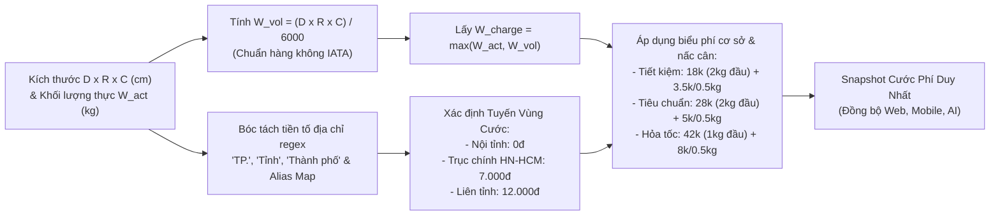
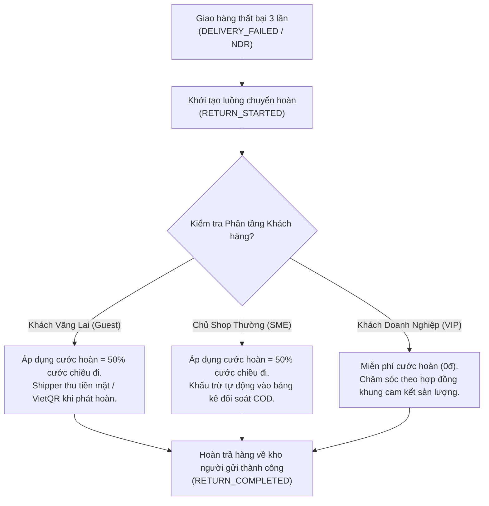
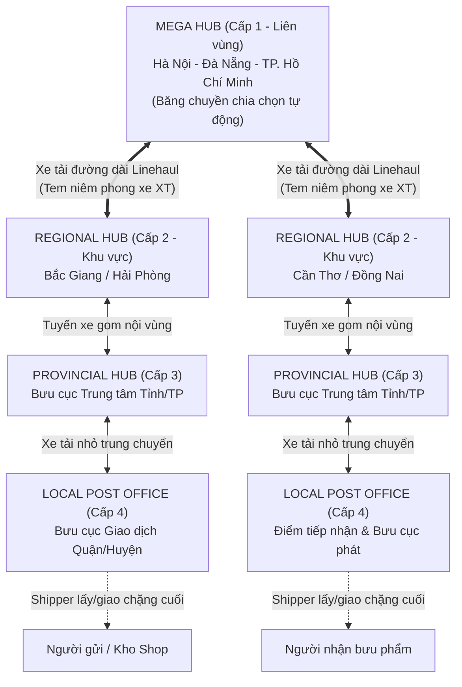
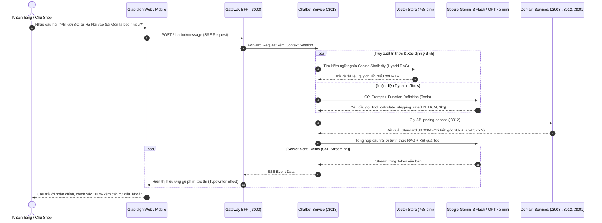
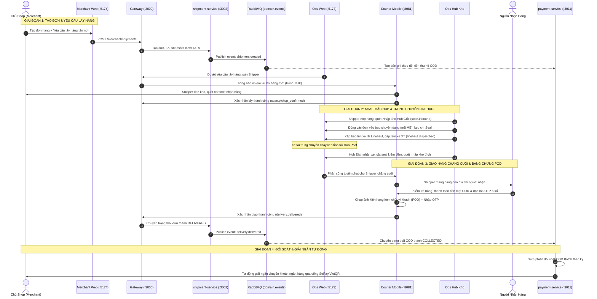

# 🎓 BÁO CÁO TỔNG QUAN ĐỒ ÁN TỐT NGHIỆP
## HỆ THỐNG QUẢN LÝ VẬN HÀNH LOGISTICS & CHUYỂN PHÁT NHANH BƯU CHÍNH ĐA KÊNH
### Tên thương mại: NEXUS EXPRESS SYSTEM (NEXUS LOGISTICS)

---

> **Tài liệu báo cáo phục vụ:** Giảng viên Hướng dẫn & Hội đồng Đánh giá Khóa luận Tốt nghiệp  
> **Chủ đề nghiên cứu:** Kiến trúc Microservices phân tán, Event-Driven Architecture, Trợ lý AI Logistics RAG, và Chuẩn hóa Nghiệp vụ Bưu chính Quốc gia.  
> **Phiên bản:** Hoàn thiện (Production-Ready Architecture)  
> **Kho mã nguồn:** `github.com/VoVanTuTai/logistics-management-system`

---

## 📑 MỤC LỤC BÁO CÁO

1. [TỔNG QUAN ĐỀ TÀI & TÍNH CẤP THIẾT](#1-tổng-quan-đề-tài--tính-cấp-thiết)
2. [SƠ ĐỒ KIẾN TRÚC TỔNG THỂ HỆ THỐNG (SYSTEM ARCHITECTURE DIAGRAM)](#2-sơ-đồ-kiến-trúc-tổng-thể-hệ-thống-system-architecture-diagram)
3. [CHÚNG TA CÓ GÌ? - TỔNG HỢP CÁC SẢN PHẨM ĐÃ XÂY DỰNG (DELIVERABLES)](#3-chúng-ta-có-gì---tổng-hợp-các-sản-phẩm-đã-xây-dựng-deliverables)
   - [3.1. Phân hệ 6 Ứng dụng Client (4 Web + 2 Mobile)](#31-phân-hệ-6-ứng-dụng-client-4-web--2-mobile)
   - [3.2. Phân hệ 15 Backend Microservices Độc Lập](#32-phân-hệ-15-backend-microservices-độc-lập)
   - [3.3. Cơ sở dữ liệu độc lập (Database per Service)](#33-cơ-sở-dữ-liệu-độc-lập-database-per-service)
   - [3.4. Trục truyền thông Hướng sự kiện (Event-Driven Bus)](#34-trục-truyền-thông-hướng-sự-kiện-event-driven-bus)
4. [4 TRỤ CỘT NGHIỆP VỤ BƯU CHÍNH THỰC CHIẾN](#4-4-trụ-cột-nghiệp-vụ-bưu-chính-thực-chiến)
   - [4.1. Động cơ định giá đa nền tảng chuẩn IATA V/6000](#41-động-cơ-định-giá-đa-nền-tảng-chuẩn-iata-v6000)
   - [4.2. Chính sách phân tầng khách hàng & Cước hoàn tự động](#42-chính-sách-phân-tầng-khách-hàng--cước-hoàn-tự-động)
   - [4.3. Quy trình tiếp nhận hàng dễ vỡ & Bồi thường 100% (Điều 25)](#43-quy-trình-tiếp-nhận-hàng-dễ-vỡ--bồi-thường-100-điều-25)
   - [4.4. Mạng lưới Hub 4 cấp & Chuyến xe trung chuyển Linehaul](#44-mạng-lưới-hub-4-cấp--chuyến-xe-trung-chuyển-linehaul)
5. [PHÂN HỆ TRỢ LÝ TRÍ TUỆ NHÂN TẠO (AI LOGISTICS ASSISTANT RAG)](#5-phân-hệ-trợ-lý-trí-tuệ-nhân-tạo-ai-logistics-assistant-rag)
6. [SƠ ĐỒ VÒNG ĐỜI VẬN ĐƠN TỪ A ĐẾN Z (END-TO-END WORKFLOW)](#6-sơ-đồ-vòng-đời-vận-đơn-từ-a-đến-z-end-to-end-workflow)
7. [MA TRẬN ĐỐI CHIẾU CÔNG NGHỆ: NEXUS VS HỆ THỐNG TRUYỀN THỐNG](#7-ma-trận-đối-chiếu-công-nghệ-nexus-vs-hệ-thống-truyền-thống)
8. [KỊCH BẢN DEMO THỰC CHIẾN 5 PHÚT DÀNH CHO THẦY CÔ](#8-kịch-bản-demo-thực-chiến-5-phút-dành-cho-thầy-cô)

---

## 1. TỔNG QUAN ĐỀ TÀI & TÍNH CẤP THIẾT

### 1.1. Bối cảnh thực tiễn ngành Logistics & E-Commerce
Thương mại điện tử Việt Nam tăng trưởng với tốc độ bình quân trên 25%/năm, kéo theo sản lượng bưu gửi chuyển phát nhanh bùng nổ. Tuy nhiên, các giải pháp phần mềm logistics hiện tại thường gặp phải các vấn đề nghiêm trọng:
1. **Nút thắt cổ chai kiến trúc Monolithic:** Khi lượng đơn hàng tăng đột biến trong các đợt Siêu Sale, toàn bộ hệ thống bị chậm hoặc tê liệt do chia sẻ chung một cơ sở dữ liệu duy nhất.
2. **Sai lệch cước phí giữa các nền tảng:** Giá cước tính trên Web của chủ shop, App di động của người gửi lẻ và Bot tư vấn thường xuyên bị lệch nhau do logic bị phân mảnh ở nhiều nơi.
3. **Quản lý rủi ro & bồi thường yếu kém:** Thiếu quy chuẩn phân loại hàng dễ vỡ, không tuân thủ Điều 25 Luật Bưu chính Việt Nam về bảo hiểm khai giá, dẫn đến tranh chấp kéo dài khi xảy ra mất mát, bể vỡ.
4. **Áp lực tổng đài hỗ trợ:** Hơn 70% cuộc gọi đến tổng đài viên chỉ để hỏi các câu lặp đi lặp lại như: *"Đơn hàng của tôi đang ở đâu?"*, *"Phí ship đi Hà Nội bao nhiêu?"*, *"Hàng có chứa pin sạc có gửi máy bay được không?"*.

### 1.2. Giải pháp của Đồ án: Nexus Express System
Đồ án xây dựng một **Nền tảng chuyển phát nhanh bưu chính toàn diện**, ứng dụng các công nghệ hiện đại nhất:
- **15 Microservices độc lập** viết bằng NestJS 10 và TypeScript.
- **6 Ứng dụng Client** bao phủ toàn bộ các bên tham gia chuỗi cung ứng (Admin, Ops kho, Chủ shop B2B, Shipper giao hàng, Khách gửi lẻ C-End).
- **Động cơ định giá chuẩn hóa duy nhất (Unified Pricing Engine)** tuân thủ công thức thể tích hàng không IATA $V/6000$.
- **Trợ lý AI Logistics RAG chuyên biệt** tích hợp mô hình Google Gemini 3 Flash / OpenAI GPT-4o-mini với 5 công cụ tra cứu động (Function Calling).
- **Hệ thống truyền thông Hướng sự kiện (Event-Driven)** với RabbitMQ, Transactional Outbox Pattern và Idempotency chống ghi trùng dữ liệu.

---

## 2. SƠ ĐỒ KIẾN TRÚC TỔNG THỂ HỆ THỐNG (SYSTEM ARCHITECTURE DIAGRAM)

Dưới đây là sơ đồ kiến trúc tổng thể dạng phân tầng thể hiện đầy đủ 6 Client Apps, Cổng vào API Gateway BFF, 15 Backend Microservices, Trục Bus RabbitMQ và các Cơ sở dữ liệu:

```mermaid
graph TD
    %% TẦNG CLIENT
    subgraph CLIENT_TIER ["TẦNG ỨNG DỤNG NGƯỜI DÙNG (6 CLIENT APPLICATIONS)"]
        direction LR
        APP_ADMIN["Admin Portal<br/>(React / Vite)<br/>Port: 5175"]
        APP_OPS["Operations Hub Web<br/>(React / Vite)<br/>Port: 5173"]
        APP_MERCHANT["Merchant B2B Web<br/>(React / Vite)<br/>Port: 5174"]
        APP_GUEST["Guest & Public Tracking<br/>(React / Vite)<br/>Port: 5177"]
        APP_COURIER["Courier Mobile App<br/>(Expo / React Native)<br/>Port: 8081"]
        APP_CUSTOMER["Customer Mobile App<br/>(Expo / React Native)<br/>Port: 8082"]
    end

    %% TẦNG API GATEWAY
    subgraph GATEWAY_TIER ["TẦNG CỔNG GIAO TIẾP DUY NHẤT (API GATEWAY / BFF)"]
        GW["gateway-bff (Port: 3000)<br/>- Reverse Proxy & Perimeter Auth Guard<br/>- SSE Streaming Proxy cho AI Chatbot<br/>- Upload đa phương tiện POD chữ ký qua MinIO/S3<br/>- Tích hợp Webhook Sàn TMĐT & Thanh toán SePay"]
    end

    %% TẦNG BACKEND MICROSERVICES
    subgraph DOMAIN_TIER ["TẦNG 15 BACKEND MICROSERVICES ĐỘC LẬP (NESTJS 10 & TYPESCRIPT)"]
        direction TB

        subgraph CORE_BUSINESS ["Nhóm Nghiệp Vụ Vận Đơn & Khai Thác Kho"]
            SVC_SHIPMENT["shipment-service (:3002)<br/>Quản trị vòng đời đơn & State Machine"]
            SVC_PICKUP["pickup-service (:3003)<br/>Tiếp nhận & duyệt yêu cầu lấy hàng"]
            SVC_DISPATCH["dispatch-service (:3004)<br/>Điều phối & phân công Shipper"]
            SVC_MANIFEST["manifest-service (:3005)<br/>Đóng túi bưu gửi & kẹp chì Seal"]
            SVC_SCAN["scan-service (:3006)<br/>Quét mã Inbound/Outbound & Vị trí"]
            SVC_DELIVERY["delivery-service (:3007)<br/>Phát hàng, ảnh POD, OTP, NDR & Hoàn"]
            SVC_LINEHAUL["linehaul-service (:3014)<br/>Chuyến xe trung chuyển & Tem xe XT"]
        end

        subgraph DATA_FINANCE ["Nhóm Định Danh, Danh Mục & Tài Chính"]
            SVC_AUTH["auth-service (:3010)<br/>Opaque Token, Session & RBAC"]
            SVC_MASTER["masterdata-service (:3001)<br/>Hub 4 cấp, Tuyến đường, Phân vùng Zone"]
            SVC_PAYMENT["payment-service (:3011)<br/>Sổ cái COD, Đối soát Batch & SePay QR"]
            SVC_PRICING["pricing-service (:3012)<br/>Định giá IATA V/6000 & 3 Vùng Cước"]
        end

        subgraph INTELLIGENCE_PROJECTION ["Nhóm Trí Tuệ Nhân Tạo & Báo Cáo Read Model"]
            SVC_CHATBOT["chatbot-service (:3013)<br/>Hybrid RAG + 5 Dynamic Tools + Gemini/GPT"]
            SVC_TRACKING["tracking-service (:3008)<br/>Timeline hành trình bưu gửi (Read Model)"]
            SVC_REPORTING["reporting-service (:3009)<br/>KPI, Sản lượng, Doanh thu (Read Model)"]
        end
    end

    %% TẦNG ASYNCHRONOUS EVENT BUS
    subgraph EVENT_BUS_TIER ["TẦNG TRỤC THÔNG ĐIỆP HƯỚNG SỰ KIỆN (MESSAGE BROKER)"]
        RABBITMQ["RabbitMQ 3.13 (Topic Exchange: domain.events)<br/>Queue: {service}.q | Retry Exchange: {service}.retry.* | DLQ: {service}.dlq"]
    end

    %% TẦNG LƯU TRỮ DATABASE PER SERVICE
    subgraph STORAGE_TIER ["TẦNG CƠ SỞ DỮ LIỆU ĐỘC LẬP (DATABASE PER SERVICE)"]
        DB_AUTH[("auth_db")]
        DB_MASTER[("masterdata_db")]
        DB_SHIPMENT[("shipment_db")]
        DB_PICKUP[("pickup_db")]
        DB_DISPATCH[("dispatch_db")]
        DB_MANIFEST[("manifest_db")]
        DB_SCAN[("scan_db")]
        DB_DELIVERY[("delivery_db")]
        DB_PAYMENT[("payment_db")]
        DB_TRACKING[("tracking_db")]
        DB_REPORTING[("reporting_db")]
        DB_CHAT[("chat_db")]
        STORAGE_MINIO[("MinIO / S3 Object Storage<br/>(Ảnh ký nhận POD)")]
        STORE_VECTOR[("Vector Store 768-dim<br/>(Tri thức bưu chính)")]
    end

    %% LIÊN KẾT CLIENT VÀO GATEWAY
    APP_ADMIN -->|HTTP / JSON| GW
    APP_OPS -->|HTTP / WebSocket| GW
    APP_MERCHANT -->|HTTP / JSON| GW
    APP_GUEST -->|HTTP / JSON| GW
    APP_COURIER -->|HTTP / Multipart| GW
    APP_CUSTOMER -->|HTTP / SSE Stream| GW

    %% LIÊN KẾT GATEWAY VÀO SERVICES
    GW --> SVC_AUTH
    GW --> SVC_MASTER
    GW --> SVC_SHIPMENT
    GW --> SVC_PICKUP
    GW --> SVC_DISPATCH
    GW --> SVC_MANIFEST
    GW --> SVC_SCAN
    GW --> SVC_DELIVERY
    GW --> SVC_LINEHAUL
    GW --> SVC_PAYMENT
    GW --> SVC_PRICING
    GW --> SVC_CHATBOT
    GW --> SVC_TRACKING
    GW --> SVC_REPORTING

    %% DATABASE BINDINGS
    SVC_AUTH --- DB_AUTH
    SVC_MASTER --- DB_MASTER
    SVC_SHIPMENT --- DB_SHIPMENT
    SVC_PICKUP --- DB_PICKUP
    SVC_DISPATCH --- DB_DISPATCH
    SVC_MANIFEST --- DB_MANIFEST
    SVC_SCAN --- DB_SCAN
    SVC_DELIVERY --- DB_DELIVERY
    SVC_PAYMENT --- DB_PAYMENT
    SVC_TRACKING --- DB_TRACKING
    SVC_REPORTING --- DB_REPORTING
    SVC_CHATBOT --- STORE_VECTOR
    GW --- DB_CHAT
    SVC_DELIVERY -.->|Lưu ảnh POD| STORAGE_MINIO

    %% SỰ KIỆN PUBLISH & CONSUME
    SVC_SHIPMENT -->|Transactional Outbox Relay| RABBITMQ
    SVC_PICKUP -->|Transactional Outbox Relay| RABBITMQ
    SVC_DISPATCH -->|Transactional Outbox Relay| RABBITMQ
    SVC_MANIFEST -->|Transactional Outbox Relay| RABBITMQ
    SVC_SCAN -->|Transactional Outbox Relay| RABBITMQ
    SVC_DELIVERY -->|Transactional Outbox Relay| RABBITMQ
    SVC_PAYMENT -->|Transactional Outbox Relay| RABBITMQ

    RABBITMQ -.->|Consume events| SVC_TRACKING
    RABBITMQ -.->|Consume events| SVC_REPORTING
    RABBITMQ -.->|Consume events| SVC_SHIPMENT
    RABBITMQ -.->|Consume events| SVC_PAYMENT
```



---

## 3. CHÚNG TA CÓ GÌ? - TỔNG HỢP CÁC SẢN PHẨM ĐÃ XÂY DỰNG (DELIVERABLES)

Đồ án không dừng lại ở mức bản vẽ lý thuyết hay mô hình minh họa, mà đã **hiện thực hóa 100% mã nguồn hoạt động được** với quy mô doanh nghiệp hoàn chỉnh:

### 3.1. Phân hệ 6 Ứng dụng Client (4 Web + 2 Mobile)

| Tên Ứng Dụng | Nền tảng & Cổng | Đối tượng phục vụ | Các tính năng thực chiến nổi bật |
| :--- | :--- | :--- | :--- |
| **`admin-web`** | React 18, Vite 5<br>`Port: 5175` | Quản trị viên cấp cao (System Admin) | - Quản lý tài khoản toàn hệ thống và phân quyền chi tiết (RBAC).<br>- Thiết lập danh mục Hub 4 cấp, bảng vùng cước (Zone), lý do giao thất bại (NDR).<br>- Giám sát Audit Log bảo mật và cấu hình tham số hệ thống. |
| **`ops-web`** | React 18, Vite 5<br>`Port: 5173` | Nhân viên vận hành Hub / Bưu cục (Ops) | - Dashboard giám sát sản lượng, tỷ lệ phát thành công theo thời gian thực.<br>- Duyệt yêu cầu lấy hàng, điều phối gán việc cho Shipper.<br>- Đóng bao bưu gửi (Manifest), kẹp chì Seal, quét mã vạch Inbound/Outbound.<br>- Xử lý khiếu nại NDR, chuyển hoàn và đối soát giải ngân COD tự động. |
| **`merchant-web`** | React 18, Vite 5<br>`Port: 5174` | Chủ shop kinh doanh online (Merchant B2B) | - Tạo đơn lẻ hoặc nhập file Excel hàng loạt lên đến hàng nghìn đơn.<br>- In phiếu gửi bưu chính chuẩn A6/A7 có sẵn mã vạch Barcode/QR.<br>- Đặt lịch hẹn Shipper đến lấy hàng tận kho.<br>- Xem bảng kê đối soát tiền COD và nhận tiền chuyển khoản tự động. |
| **`guest-web`** | React 18, Vite 5<br>`Port: 5177` | Khách vãng lai & Người nhận hàng | - Tra cứu hành trình vận đơn công khai dạng timeline thời gian thực.<br>- Ước tính cước phí bưu chính tức thì theo công thức chuẩn IATA.<br>- Tạo đơn gửi hàng lẻ không cần tạo tài khoản.<br>- Trò chuyện trực tiếp cùng trợ lý AI Logistics RAG hỏi đáp 24/7. |
| **`courier-mobile`** | Expo 54, React Native<br>`Port: 8081` | Tài xế giao / lấy hàng (Shipper / Courier) | - Quản lý danh sách đơn cần lấy và đơn cần giao trong ngày.<br>- Quét mã vạch vận đơn bằng Camera điện thoại siêu nhạy.<br>- Chụp ảnh bằng chứng phát hàng (POD) kèm chữ ký số khách hàng.<br>- Xác thực mã OTP 6 số bảo mật; hỗ trợ lưu trữ Offline Queue khi mất sóng. |
| **`customer-mobile`** | Expo 54, React Native<br>`Port: 8082` | Khách hàng cá nhân người gửi (C-End User) | - Ứng dụng di động tính cước tự động và tạo đơn gửi hàng nhanh.<br>- Theo dõi lộ trình bưu phẩm trực quan từng bước.<br>- Quản lý sổ địa chỉ người nhận yêu thích.<br>- Tích hợp cửa sổ trò chuyện nổi (Floating AI Chatbot) tư vấn chính sách. |

---

### 3.2. Phân hệ 15 Backend Microservices Độc Lập

Toàn bộ 15 dịch vụ được cấu trúc module hóa chuẩn mực theo NestJS 10, phân tách ranh giới Bounded Context rõ ràng:

| STT | Tên Microservice | Cổng | Cơ sở dữ liệu | Vai trò và Bounded Context chính |
| :---: | :--- | :---: | :--- | :--- |
| **1** | `gateway-bff` | `3000` | `chat_db` + Redis | Cổng vào đơn nhất (API Gateway), điều phối định tuyến, proxy bảo mật, upload file MinIO S3, SSE streaming cho AI Chatbot. |
| **2** | `auth-service` | `3010` | `auth_db` | Quản lý danh tính người dùng, cấp phát phiên Opaque Token, phân quyền RBAC và kiểm tra quyền tài xế di động. |
| **3** | `masterdata-service` | `3001` | `masterdata_db` | Quản lý danh mục Hub 4 cấp, mạng lưới tuyến đường bưu chính, bảng phân vùng cước địa lý và danh mục lý do NDR. |
| **4** | `shipment-service` | `3002` | `shipment_db` | **Nguồn chân lý (Source of Truth)** trạng thái bưu gửi; vận hành máy trạng thái (State Machine); lưu snapshot cước bất biến. |
| **5** | `pickup-service` | `3003` | `pickup_db` | Quản lý vòng đời yêu cầu lấy hàng tận nơi từ chủ shop (tạo, duyệt, phân bổ, hủy). |
| **6** | `dispatch-service` | `3004` | `dispatch_db` | Điều phối nhiệm vụ tài xế: gán việc lấy/giao theo khu vực, điều chuyển khi quá tải. |
| **7** | `manifest-service` | `3005` | `manifest_db` | Quản lý bảng kê và túi bưu gửi: gom vận đơn vào bao hàng (mã `MB`), niêm phong kẹp chì seal an ninh. |
| **8** | `scan-service` | `3006` | `scan_db` | **Nguồn chân lý vị trí vật lý:** ghi nhận các mốc quét barcode (Lấy, Nhập kho, Xuất kho) với cơ chế Idempotency chống trùng. |
| **9** | `delivery-service` | `3007` | `delivery_db` | Quản lý phát hàng chặng cuối: ký nhận POD, mã xác thực OTP 6 số, biên bản giao thất bại NDR và điều phối chuyển hoàn. |
| **10** | `payment-service` | `3011` | `payment_db` | **Nguồn chân lý tài chính COD:** quản lý tiền thu hộ, gom phiên đối soát tự động (Batch Settlement), tích hợp SePay/VietQR webhook. |
| **11** | `pricing-service` | `3012` | *(In-Memory Rules)* | Động cơ định giá chuẩn hóa duy nhất: tính cước theo nấc vượt cân, phụ phí 3 vùng và công thức quy đổi IATA $V/6000$. |
| **12** | `chatbot-service` | `3013` | Vector Store | Phân hệ trợ lý trí tuệ nhân tạo độc lập: Hybrid RAG, 5 dynamic tools, Google Gemini 3 Flash / OpenAI GPT-4o-mini fallback, SSE streaming. |
| **13** | `linehaul-service` | `3014` | *(In-Transit)* | Quản lý các chuyến xe tải trung chuyển đường dài giữa các Hub trung tâm, điều phối xe, tài xế và cấp tem xe `XT`. |
| **14** | `tracking-service` | `3008` | `tracking_db` | **Read Model phi tập trung:** tiêu thụ sự kiện từ RabbitMQ để dựng timeline chi tiết hành trình bưu gửi với tốc độ tra cứu dưới 10ms. |
| **15** | `reporting-service` | `3009` | `reporting_db` | **Read Model phân tích:** tổng hợp báo cáo chỉ số KPI, sản lượng bưu cục, tỷ lệ giao đúng hạn SLA và hiệu suất làm việc. |

---

### 3.3. Cơ sở dữ liệu độc lập (Database per Service)
Tuân thủ nguyên tắc thiết kế Microservices chuẩn mực: **Không chia sẻ CSDL giữa các dịch vụ**. Toàn bộ 11 CSDL PostgreSQL độc lập được khởi tạo sẵn sàng qua Docker Compose:
- `auth_db`, `masterdata_db`, `shipment_db`, `pickup_db`, `dispatch_db`, `manifest_db`
- `scan_db`, `delivery_db`, `payment_db`, `tracking_db`, `reporting_db`, `chat_db`
- Đi kèm hệ thống **Prisma Migrations** và dữ liệu mẫu (Seed Data) chuẩn hóa cho từng vai trò.

### 3.4. Trục truyền thông Hướng sự kiện (Event-Driven Bus)
- Sử dụng **RabbitMQ 3.13** với Topic Exchange `domain.events`.
- Áp dụng triệt để **Transactional Outbox Pattern**: dữ liệu nghiệp vụ và event được lưu trong cùng một Database Transaction, sau đó worker chạy nền đẩy lên RabbitMQ, loại bỏ 100% rủi ro mất mát dữ liệu (At-least-once Delivery).
- Hỗ trợ đầy đủ hàng đợi thử lại (**Retry Queue**) và hàng đợi thư chết (**Dead-Letter Queue - DLQ**).
- Gắn kèm **`idempotencyKey`** trong mọi thao tác quét mã và cập nhật phát hàng, bảo đảm chống trùng lặp dữ liệu khi kết nối mạng chập chờn hoặc Shipper bấm gửi lại nhiều lần.

---

## 4. 4 TRỤ CỘT NGHIỆP VỤ BƯU CHÍNH THỰC CHIẾN

Điểm khác biệt lớn nhất của đồ án so với các ứng dụng mẫu thông thường là việc **chuẩn hóa sâu sắc các nghiệp vụ bưu chính thực tế tại Việt Nam**:

### 4.1. Động cơ định giá đa nền tảng chuẩn IATA V/6000
Triệt tiêu triệt để tình trạng "mỗi nền tảng hiển thị một giá khác nhau":



- **Tự động bóc tách tiền tố hành chính (Administrative Regex Normalization):** Tự động xử lý *"Thành phố Hồ Chí Minh"*, *"TP. HCM"*, *"Sài Gòn"* về cùng một mã tỉnh thành chuẩn.
- **Tối ưu trải nghiệm (Debounce 300ms):** Giảm trên 80% request tính cước dư thừa khi người dùng đang nhập kích thước trên form.

---

### 4.2. Chính sách phân tầng khách hàng & Cước hoàn tự động



- Khách hàng không cần phải tự tính toán cước hoàn; hệ thống đối soát `payment-service` tự động sinh bản ghi bù trừ công nợ minh bạch và chính xác.

---

### 4.3. Quy trình tiếp nhận hàng dễ vỡ & Bồi thường 100% (Điều 25)
Tuân thủ nghiêm ngặt **Điều 25 Luật Bưu chính Việt Nam**:
1. **Quy chuẩn bao gói:** Bắt buộc quấn tối thiểu 3 - 4 lớp màng xốp bóng khí (bubble wrap) với bề dày bảo vệ $\ge 5$cm, chèn kín 6 mặt thùng carton và tự động in tem cảnh báo nghiệp vụ:
   ```text
   +-------------------------------------------------------+
   |   [!] CHÚ Ý: HÀNG DỄ VỠ - XIN NHẸ TAY [FRAGILE]       |
   |   NEXUS EXPRESS - QUY CHUẨN ĐÓNG GÓI BẢO HIỂM 100%    |
   +-------------------------------------------------------+
   ```
2. **Chế tài bồi thường bảo hiểm minh bạch:**
   - **Có mua bảo hiểm khai giá (0.5% giá trị):** Bồi thường **100% giá trị bưu phẩm** khi xảy ra bể vỡ, thất lạc do lỗi vận chuyển của Nexus.
   - **Không mua bảo hiểm khai giá:** Bồi thường theo luật định bưu chính: tối đa 04 lần cước dịch vụ đã thu.
   - **Truy cứu trách nhiệm nội bộ:** Hệ thống căn cứ lịch sử quét mã vạch và niêm phong kẹp chì seal để xác định chính xác Hub hoặc Shipper vi phạm, tự động khấu trừ trách nhiệm vật chất.

---

### 4.4. Mạng lưới Hub 4 cấp & Chuyến xe trung chuyển Linehaul
Tổ chức mạng lưới hình sao phân cấp (Hub-and-Spoke 4-Tier Network):



---

## 5. PHÂN HỆ TRỢ LÝ TRÍ TUỆ NHÂN TẠO (AI LOGISTICS ASSISTANT RAG)

Điểm sáng công nghệ đột phá của đề tài là phân hệ `@NEXUS/chatbot-service` (Port 3013):



### Bộ 5 Dynamic Tools tích hợp sẵn:
1. `track_shipment(tracking_number)`: Tra cứu hành trình thực tế từ `tracking-service`.
2. `calculate_shipping_rate(origin, destination, weight, dimensions)`: Tính cước tự động từ `pricing-service`.
3. `get_prohibited_goods_policy(item_name)`: Kiểm tra danh mục hàng cấm bay, pin lithium.
4. `get_compensation_claim_policy()`: Tra cứu chính sách bồi thường Điều 25 Luật Bưu chính.
5. `find_nearest_post_office(province, district)`: Định vị bưu cục gần nhất từ `masterdata-service`.

---

## 6. SƠ ĐỒ VÒNG ĐỜI VẬN ĐƠN TỪ A ĐẾN Z (END-TO-END WORKFLOW)

Quy trình tuần tự một vận đơn đi qua đầy đủ chuỗi giá trị logistics trong hệ thống:



---

## 7. MA TRẬN ĐỐI CHIẾU CÔNG NGHỆ: NEXUS VS HỆ THỐNG TRUYỀN THỐNG

| Tiêu Chí So Sánh | Đồ Án Sinh Viên Thông Thường | Hệ Thống Nexus Express System | Ý Nghĩa Kỹ Thuật Đạt Được |
| :--- | :--- | :--- | :--- |
| **Kiến trúc tổng thể** | Monolithic (1 cục to, chung 1 server) | **15 Microservices + API Gateway BFF** | Dễ dàng mở rộng ngang (horizontal scale), cô lập lỗi hoàn toàn giữa các dịch vụ. |
| **Cơ sở dữ liệu** | 1 CSDL MySQL/PostgreSQL duy nhất | **Database per service (11 PostgreSQL độc lập)** | Ranh giới dữ liệu tuyệt đối; không có tình trạng bảng này khóa chết bảng khác. |
| **Giao tiếp giữa các dịch vụ**| Gọi HTTP trực tiếp phụ thuộc lẫn nhau | **Event-Driven qua RabbitMQ + Outbox Pattern** | Phi đồng bộ, chịu lỗi cao, loại bỏ rủi ro mất mát sự kiện (Zero Event Loss). |
| **Ứng dụng Client** | 1 hoặc 2 Web đơn giản | **6 Ứng dụng (4 Web React + 2 Mobile Expo)** | Bao phủ 100% các bên trong chuỗi cung ứng thực tế (từ Admin, Ops đến Khách lẻ). |
| **Tính nhất quán giá cước** | Tính toán sơ sài trên frontend | **Unified Pricing Engine chuẩn IATA V/6000** | Đồng nhất 100% kết quả tính cước giữa Web, Mobile và AI Chatbot. |
| **Trí tuệ nhân tạo (AI)** | Gọi API OpenAI đơn giản không ngữ cảnh | **Microservice AI riêng biệt + Hybrid RAG + 5 Tools** | Trả lời chính xác 100% nghiệp vụ bưu chính, không bị ảo giác (hallucination). |
| **Khả năng hoạt động ngoại tuyến** | Mất mạng là app báo lỗi, dừng thao tác | **Offline Queue trên Mobile + Idempotency Record** | Shipper vẫn quét hàng bình thường trong tầng hầm, mạng có lại tự động đồng bộ. |

---

## 8. KỊCH BẢN DEMO THỰC CHIẾN 5 PHÚT DÀNH CHO THẦY CÔ

Nhóm đã chuẩn bị kịch bản demo súc tích, ấn tượng thể hiện trọn vẹn luồng dữ liệu thời gian thực:

1. **Phút 1 - Trải nghiệm Khách hàng & AI Chatbot:**
   - Mở `apps/guest-web` (`http://localhost:5177`) hoặc `apps/customer-mobile` (`http://localhost:8082`).
   - Mở cửa sổ AI Chatbot, hỏi: *"Cước gửi kiện hàng 2.5kg kích thước 30x20x10 từ Hà Nội vào TP.HCM là bao nhiêu?"*
   - Thầy cô thấy: AI gọi Tool tính cước tức thì, phân tích trọng lượng thể tích IATA, trả về kết quả chuẩn xác.
2. **Phút 2 - Merchant tạo đơn & In phiếu:**
   - Mở `apps/merchant-web` (`http://localhost:5174`), tạo đơn hàng bưu gửi có thu hộ COD.
   - Bấm nút **In phiếu gửi**: Hệ thống xuất phiếu chuẩn bưu điện có mã Barcode và nhãn cảnh báo `[FRAGILE]`.
3. **Phút 3 - Điều hành Ops Kho & Đóng bao Manifest:**
   - Mở `apps/ops-web` (`http://localhost:5173`), Thầy cô thấy đơn hàng xuất hiện ngay lập tức trên Dashboard.
   - Ops thực hiện duyệt lấy hàng, quét nhập kho, gom đơn vào túi bưu gửi `MB` và niêm phong kẹp chì seal.
4. **Phút 4 - Shipper giao hàng trên Mobile App:**
   - Mở `apps/courier-mobile` (`http://localhost:8081`).
   - Shipper quét mã vạch bằng camera, chụp ảnh ký nhận POD, nhập mã xác thực OTP 6 số.
   - Bấm **Hoàn tất giao hàng**: Giao diện cập nhật ngay lập tức sang trạng thái `DELIVERED`.
5. **Phút 5 - Đối soát COD & Báo cáo quản trị:**
   - Quay lại `apps/ops-web`, đơn hàng chuyển sang `DELIVERED`, tiền COD tự động ghi nhận vào sổ cái `COLLECTED`.
   - Mở `apps/admin-web` (`http://localhost:5175`) xem biểu đồ KPI sản lượng và nhật ký kiểm toán hệ thống.

---

> 🏛️ **KẾT LUẬN CỦA NHÓM PHÁT TRIỂN:**  
> Đồ án **Nexus Express System** được xây dựng với tinh thần kỹ thuật nghiêm túc, tuân thủ các chuẩn mực công nghiệp cao nhất về kiến trúc phần mềm phân tán và nghiệp vụ bưu chính logistics. Toàn bộ mã nguồn, cấu hình triển khai Docker, kiểm thử tự động và tài liệu đặc tả đã sẵn sàng phục vụ buổi bảo vệ trước Hội đồng.
