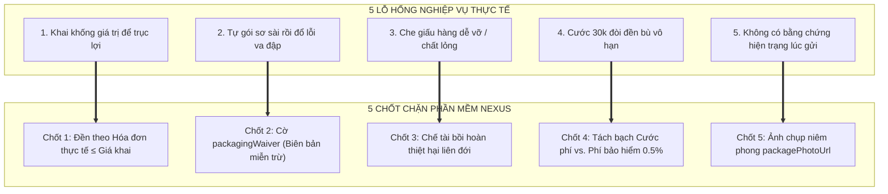
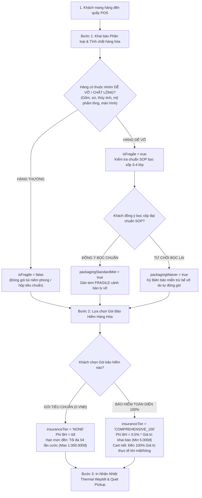

# ĐẶC TẢ NGHIỆP VỤ LOGISTICS: MÔ HÌNH THIẾT GIÁP TINH GỌN (IRONCLAD LEAN MODEL)
## TIẾP NHẬN HÀNG HÓA, ĐÓNG GÓI HÀNG DỄ VỠ, BẢO HIỂM KHAI GIÁ & PHÒNG CHỐNG TRỤC LỢI BỒI THƯỜNG
*(Tài liệu chuẩn hóa phục vụ: Thuyết minh Đồ án Tốt nghiệp, Slide Bảo vệ Hội đồng & Cẩm nang Vận hành Bưu cục)*

---

## MỤC LỤC
1. [Tổng quan & Bối cảnh bài toán](#1-tổng-quan--bối-cảnh-bài-toán)
2. [Cơ sở pháp lý & Chuẩn mực ngành bưu chính](#2-cơ-sở-pháp-lý--chuẩn-mực-ngành-bưu-chính)
3. [Nhận diện 5 lỗ hổng nghiệp vụ & 5 chốt chặn phần mềm](#3-nhận-diện-5-lỗ-hổng-nghiệp-vụ--5-chốt-chặn-phần-mềm)
4. [Quy trình tiếp nhận 3 bước tại quầy bưu cục (3-Step Intake)](#4-quy-trình-tiếp-nhận-3-bước-tại-quầy-bưu-cục-3-step-intake)
5. [Ma trận phân định trách nhiệm bồi thường 4 ô (2x2 Matrix)](#5-ma-trận-phân-định-trách-nhiệm-bồi-thường-4-ô-2x2-matrix)
6. [Bộ câu hỏi & Trả lời phản biện trước Hội đồng Đồ án (Defense Q&A)](#6-bộ-câu-hỏi--trả-lời-phản-biện-trước-hội-đồng-đồ-án-defense-qa)
7. [Kịch bản tư vấn khách hàng thực tế tại bưu cục](#7-kịch-bản-tư-vấn-khách-hàng-thực-tế-tại-bưu-cục)
8. [Thiết kế kiến trúc dữ liệu & Tem nhãn bưu chính](#8-thiết-kế-kiến-trúc-dữ-liệu--tem-nhãn-bưu-chính)

---

## 1. TỔNG QUAN & BỐI CẢNH BÀI TOÁN

### 1.1. Hành trình vật lý của một bưu kiện
Trong chuỗi cung ứng logistics thương mại điện tử (E-Commerce Logistics), một kiện hàng từ lúc nhận đến lúc phát thành công phải trải qua trung bình:
* **02 lần vận chuyển chặng đầu / chặng cuối (First-mile & Last-mile):** Bằng xe máy hoặc xe tải van nhỏ, chịu rung lắc đường phố, phanh gấp, ổ gà.
* **02 đến 04 lần phân loại tự động tại Trung tâm Khai thác (Hub):** Đi qua hệ thống băng chuyền con lăn tốc độ cao, rơi tự do qua máng trượt dốc (Chute) với độ cao từ 0.8m – 1.5m.
* **01 đến 02 chuyến xe tải đường dài (Linehaul):** Xếp chồng các bao tải hàng (Stacking) lên đến 2 - 3 tầng trong thùng xe tải liên tỉnh, chịu tải trọng đè nén từ 50kg – 200kg trên mỗi mét vuông sàn xe.

### 1.2. Thảm họa kinh tế nếu "Mặc định đền 100% vô điều kiện"
Nếu một hệ thống logistics áp dụng quy tắc ngây thơ: *"Bất kỳ đơn hàng nào bị mất hoặc hư hỏng đều đền 100% giá trị"*, doanh nghiệp sẽ lập tức sụp đổ tài chính vì:
1. **Mất cân đối đơn vị kinh tế (Unit Economics Deficit):**
   * Cước vận chuyển thông thường: **22.000 VNĐ – 35.000 VNĐ/kiện** (chỉ đủ bù đắp chi phí nhiên liệu, khấu hao xe, lương bưu tá và mặt bằng).
   * Giá trị một món đồ công nghệ / mỹ phẩm: **5.000.000 VNĐ – 25.000.000 VNĐ**.
   * Chỉ cần làm mất hoặc vỡ **01 đơn hàng 15 triệu**, doanh nghiệp phải vận chuyển thành công không lỗi **hơn 700 đơn hàng khác** mới bù đắp được số tiền đền bù này.
2. **Rủi ro đạo đức & Trục lợi bảo hiểm (Moral Hazard & Fraud):**
   * Người gửi có thể gửi các món đồ đã vỡ sẵn bên trong, đồ điện tử cũ nát, bọc sơ sài rồi kê khai giá khống 10 triệu để ăn vạ đòi bồi thường.

→ **Giải pháp:** Áp dụng **MÔ HÌNH THIẾT GIÁP TINH GỌN (IRONCLAD LEAN MODEL)**: Tinh giản tối đa thao tác tại quầy, bịt kín mọi kẽ hở pháp lý và bảo vệ an toàn dòng tiền cho doanh nghiệp.

---

## 2. CƠ SỞ PHÁP LÝ & CHUẨN MỰC NGÀNH BƯU CHÍNH

Hệ thống NEXUS Express được thiết kế tuân thủ 100% khung pháp luật Việt Nam:

1. **Luật Bưu chính số 49/2010/QH12 (Quốc hội ban hành):**
   * **Điều 24 (Miễn trừ trách nhiệm bồi thường thiệt hại):** Doanh nghiệp cung ứng dịch vụ bưu chính được **miễn trừ hoàn toàn trách nhiệm** bồi thường nếu thiệt hại xảy ra do lỗi của người gửi (đóng gói không đúng quy chuẩn kỹ thuật) hoặc do đặc tính tự nhiên của hàng hóa.
   * **Điều 25 (Nguyên tắc và mức bồi thường):**
     * Đối với bưu gửi **có sử dụng dịch vụ khai giá (bảo hiểm):** Bồi thường theo **giá trị thiệt hại thực tế**, tối đa bằng giá trị đã kê khai.
     * Đối với bưu gửi **không sử dụng dịch vụ khai giá:** Mức bồi thường được xác định theo hạn mức luật định, thực tế các doanh nghiệp áp dụng tối đa từ **04 đến 10 lần cước dịch vụ đã thu**.
2. **Nghị định số 47/2011/NĐ-CP:** Hướng dẫn chi tiết thi hành Luật Bưu chính về hợp đồng mẫu và giải quyết khiếu nại.
3. **Bộ luật Dân sự số 91/2015/QH13 (Điều 534 - 541):** Quy định về hợp đồng vận chuyển tài sản và nghĩa vụ bồi hoàn thiệt hại của bên gửi nếu gửi hàng hóa có tính chất nguy hại, dễ tràn đổ gây thiệt hại cho bên vận chuyển hoặc tài sản của người khác.
4. **Tiêu chuẩn đóng gói hàng dễ vỡ TCVN / IATA Standard:** Hàng lỏng, dễ vỡ phải được bọc đệm xốp bọt khí (Bubble Wrap) tối thiểu 3 lớp, chèn mút cố định 6 mặt và chịu được bài kiểm tra lắc không phát ra tiếng động.

---

## 3. NHẬN DIỆN 5 LỖ HỔNG NGHIỆP VỤ & 5 CHỐT CHẶN PHẦN MỀM



### Chi tiết 5 cặp Lỗ hổng & Chốt chặn:

#### 1. Lỗ hổng: Khai khống giá trị hàng hóa (Valuation Fraud)
* **Kịch bản:** Món đồ cũ trị giá 300.000 VNĐ nhưng người gửi khai giá 15.000.000 VNĐ. Khi xảy ra sự cố, người gửi đòi đền đủ 15 triệu.
* **Chốt chặn NEXUS:** Nguyên tắc hợp đồng quy định: **Bồi thường theo Giá trị thiệt hại thực tế, trần tối đa là Giá trị khai báo**. Khách hàng chỉ được đền bù 100% khi cung cấp được **Hóa đơn mua hàng hợp lệ (Hóa đơn VAT, Hóa đơn điện tử sàn TMĐT, sao kê chuyển khoản thanh toán)**. Nếu không chứng minh được: Mức bồi thường tự động đưa về định mức cơ bản (4 lần cước).

#### 2. Lỗ hổng: Tự đóng gói sơ sài rồi đổ lỗi cho xe rung lắc làm vỡ
* **Kịch bản:** Khách bỏ lọ nước hoa/đồ gốm vào một hộp giấy mỏng không chèn xốp. Khi đến nơi hàng vỡ vụn bên trong nhưng vỏ hộp bên ngoài còn nguyên niêm phong. Khách bắt đền bưu điện.
* **Chốt chặn NEXUS:** Khi gắn cờ Hàng Dễ Vỡ (`isFragile: true`), nếu khách từ chối bọc xốp 3 lớp SOP, hệ thống kích hoạt cờ **`packagingWaiver: true` (Biên bản cam kết miễn trừ trách nhiệm bể vỡ do tự đóng gói)**. Bưu điện **chỉ bồi thường nếu làm mất nguyên kiện**, và **miễn trừ 100% trách nhiệm nếu hàng vỡ bên trong mà vỏ ngoài nguyên vẹn**.

#### 3. Lỗ hổng: Che giấu thông tin hàng hóa
* **Kịch bản:** Gửi mật ong, rượu thủy tinh nhưng khai là "quần áo", khi bị đè vỡ chảy tràn làm ướt hỏng hàng chục kiện hàng giá trị khác trên xe.
* **Chốt chặn NEXUS:** Điều khoản quy định người gửi cố tình che giấu thông tin hàng dễ vỡ/chất lỏng sẽ **bị từ chối bồi thường 100%** và **phải chịu trách nhiệm bồi thường thiệt hại liên đới** cho các bưu kiện khác bị ảnh hưởng (căn cứ Bộ luật Dân sự 2015).

#### 4. Lỗ hổng: Thâm hụt tài chính do cước thấp đòi bảo hiểm cao
* **Kịch bản:** Cước 30.000đ không thể bao trọn bảo hiểm cho món hàng 20.000.000đ.
* **Chốt chặn NEXUS:** Tách biệt rõ 2 dòng tiền:
  * **Cước vận chuyển (Service Fee):** Thu theo khối lượng/thể tích để bù đắp chi phí vận hành.
  * **Phí bảo hiểm khai giá (Insurance Fee):** Thu **0.5% giá trị khai báo** (tối thiểu 5.000đ). Toàn bộ tiền này được chuyển vào **Quỹ dự phòng rủi ro (Risk Reserve Fund)** để chi trả sòng phẳng khi xảy ra sự cố.

#### 5. Lỗ hổng: Tranh cãi tình trạng hàng hóa trước và sau vận chuyển
* **Kịch bản:** Khách bảo lúc gửi hộp còn vuông vức mới tinh, bưu điện bảo lúc nhận đã móp méo sẵn.
* **Chốt chặn NEXUS:** Nhân viên chụp nhanh 01 bức ảnh gói hàng sau khi dán tem niêm phong tại quầy (`packagePhotoUrl`) ghim cố định trên vận đơn điện tử, xóa tan mọi tranh chấp ngoại quan.

---

## 4. QUY TRÌNH TIẾP NHẬN 3 BƯỚC TẠI QUẦY BƯU CỤC (3-STEP INTAKE)

Quy trình tại màn hình POS bưu cục (`BranchBusinessOrderCreatePage`) được thiết kế thao tác hoàn tất trong vòng 30 giây:



---

## 5. MA TRẬN PHÂN ĐỊNH TRÁCH NHIỆM BỒI THƯỜNG 4 Ô (2x2 MATRIX)
*(Ma trận logic tự động hóa cho Module Thẩm định Bồi thường Claims & Stray Investigation)*

Hệ thống loại bỏ hoàn toàn các quyết định cảm tính của con người bằng ma trận phán quyết 4 ô:

| TÌNH HUỐNG SỰ CỐ PHÁT SINH | CÓ MUA BẢO HIỂM 100%<br/>*(Đã thanh toán phí 0.5%)* | KHÔNG MUA BẢO HIỂM<br/>*(Phí bảo hiểm 0 VNĐ)* |
| :--- | :--- | :--- |
| **THẤT LẠC / MẤT NGUYÊN KIỆN**<br/>*(Lỗi do Hub chia chọn hoặc Tài xế làm mất)* | **ĐỀN ĐÚNG 100% GIÁ TRỊ THỰC TẾ**<br/>*(Căn cứ theo Hóa đơn/Chứng từ hợp lệ)* | **ĐỀN 04 LẦN CƯỚC VẬN CHUYỂN**<br/>*(Trần tối đa 1.000.000 VNĐ theo Luật Bưu chính)* |
| **BỂ VỠ KHI ĐÃ ĐÓNG GÓI ĐẠT CHUẨN SOP**<br/>*(Bọc đệm xốp 3 lớp, chèn 6 mặt)* | **ĐỀN 100% GIÁ TRỊ THỰC TẾ**<br/>*(Hoặc đền theo % hư hại nếu chỉ nứt vỡ một phần)* | **ĐỀN 04 LẦN CƯỚC GỬI**<br/>*(Theo tỷ lệ hư hại thực tế)* |
| **BỂ VỠ KHI CÓ BIÊN BẢN MIỄN TRỪ**<br/>*(Khách tự gói sơ sài, thùng ngoài nguyên)* | **TỪ CHỐI BỒI THƯỜNG BỂ VỠ**<br/>*(Theo cam kết packagingWaiver)* | **TỪ CHỐI BỒI THƯỜNG BỂ VỠ**<br/>*(Miễn trừ trách nhiệm theo Điều 24 Luật Bưu chính)* |

---

## 6. BỘ CÂU HỎI & TRẢ LỜI PHẢN BIỆN TRƯỚC HỘI ĐỒNG ĐỒ ÁN (DEFENSE Q&A)

Dưới đây là 5 câu hỏi trọng tâm mà Hội đồng Giám khảo thường đặt ra và gợi ý trả lời chuẩn xác:

### ❓ Câu hỏi 1: *"Cơ sở pháp lý nào cho phép hệ thống giới hạn mức đền bù chỉ có 4 lần cước khi khách không mua bảo hiểm?"*
> **Gợi ý trả lời:**  
> *"Dạ thưa Thầy/Cô, hệ thống căn cứ chuẩn xác theo **Điều 25 Khoản 2 Luật Bưu chính số 49/2010/QH12** và **Nghị định 47/2011/NĐ-CP**. Luật quy định: Đối với dịch vụ bưu chính không sử dụng dịch vụ khai giá, mức bồi thường được xác định theo hạn mức luật định (từ 4 đến 10 lần cước dịch vụ đã thu). Toàn bộ các doanh nghiệp bưu chính lớn tại Việt Nam như Viettel Post, VNPost, J&T Express đều áp dụng mức trần 4 lần cước này để đảm bảo cân đối quỹ hoạt động."*

### ❓ Câu hỏi 2: *"Nếu khách hàng gửi một sản phẩm cũ hỏng sẵn, bọc kỹ, khai giá 20 triệu và mua bảo hiểm 100%, sau đó đổ lỗi làm hỏng để ăn vạ thì hệ thống xử lý thế nào?"*
> **Gợi ý trả lời:**  
> *"Dạ thưa Thầy/Cô, hệ thống có 2 chốt chặn kiểm soát:  
> 1. Quy định hợp đồng ghi rõ: Bồi thường theo **Giá trị thiệt hại thực tế**, người yêu cầu bồi thường phải xuất trình Hóa đơn mua hàng / Chứng từ thanh toán hợp lệ chứng minh tài sản.  
> 2. Hệ thống lưu trữ **ảnh chụp hiện trạng bưu kiện lúc tiếp nhận (`packagePhotoUrl`)** và biên bản đồng kiểm video bóc hàng. Nếu phát hiện gian lận khai khống hàng hỏng từ trước, hồ sơ sẽ bị từ chối chi trả theo điều khoản loại trừ rủi ro gian lận thương mại."*

### ❓ Câu hỏi 3: *"Tại sao không bắt buộc 100% đơn hàng đều phải mua bảo hiểm?"*
> **Gợi ý trả lời:**  
> *"Dạ thưa Thầy/Cô, trong thương mại điện tử, trên 70% đơn hàng là quần áo, giày dép, sách vở có giá trị thấp hoặc khó vỡ. Nếu bắt buộc mua bảo hiểm sẽ làm tăng cước phí, gây bất tiện cho người mua và giảm tính cạnh tranh của hệ thống. Việc chia thành 2 gói minh bạch giúp khách hàng gửi đồ thông thường tiết kiệm chi phí tối đa, trong khi khách gửi hàng giá trị cao vẫn được bảo vệ tuyệt đối."*

### ❓ Câu hỏi 4: *"Cờ packagingWaiver có giá trị pháp lý không nếu xảy ra tranh chấp dân sự?"*
> **Gợi ý trả lời:**  
> *"Dạ thưa Thầy/Cô, hoàn toàn có giá trị pháp lý. Theo **Điều 24 Luật Bưu chính**, doanh nghiệp vận chuyển được miễn trừ trách nhiệm nếu thiệt hại xảy ra do lỗi của người gửi đóng gói không đúng quy chuẩn. Khi khách hàng xác nhận gửi hàng với cờ `packagingWaiver: true`, hợp đồng dịch vụ điện tử đã xác lập sự thỏa thuận miễn trừ trách nhiệm bể vỡ do người gửi tự đóng gói."*

### ❓ Câu hỏi 5: *"Tỷ lệ phí bảo hiểm 0.5% được tính toán dựa trên cơ sở kinh tế nào?"*
> **Gợi ý trả lời:**  
> *"Dạ thưa Thầy/Cô, con số 0.5% (tương đương 5.000đ trên mỗi 1.000.000đ giá trị) là tỷ lệ bảo hiểm tiêu chuẩn của ngành logistics nội địa (áp dụng tại J&T Express, GHTK, GHN). Theo thống kê thực tế, tỷ lệ thất lạc hoặc hư hại nghiêm trọng của mạng lưới vận chuyển hiện đại được kiểm soát ở mức dưới 0.1% - 0.2%. Mức thu 0.5% vừa đủ để trích lập Quỹ dự phòng rủi ro chi trả sòng phẳng 100%, vừa bảo đảm an toàn tài chính bền vững cho doanh nghiệp."*

---

## 7. KỊCH BẢN TƯ VẤN KHÁCH HÀNG THỰC TẾ TẠI BƯU CỤC

### Kịch bản 1: Giải thích phí bảo hiểm cho khách gửi hàng giá trị cao
* **Khách hàng:** *"Tiền ship có 35.000đ, sao lại bắt tui trả thêm 50.000đ tiền bảo hiểm nữa?"*
* **Nhân viên quầy:** 
  > *"Dạ em chào anh/chị, khoản 35.000đ là cước vận chuyển xăng xe và công giao hàng từ đây ra Hà Nội. Còn kiện hàng của mình là điện thoại trị giá 10.000.000đ. Khoản 50.000đ (0.5%) là **Gói bảo hiểm toàn diện 100% giá trị hàng hóa** của NEXUS.  
  > Khi tham gia gói này, đơn hàng sẽ được đánh dấu giám sát an ninh camera riêng. Nếu có bất kỳ rủi ro mất mát hay tai nạn nào trên đường, NEXUS cam kết **bồi thường ngay 100% đủ 10.000.000đ** cho mình. Nếu không mua bảo hiểm, theo quy định chung của Luật Bưu chính mức đền bù tối đa chỉ được 4 lần tiền cước (khoảng 140.000đ) thôi ạ. Chỉ cần trích 50.000đ là mình hoàn toàn yên tâm kê cao gối ngủ, hàng có sự cố là được đền đủ 100% tiền hàng ngay ạ!"*

### Kịch bản 2: Xử lý khách gửi đồ dễ vỡ nhưng từ chối đóng gói chuẩn
* **Khách hàng:** *"Hàng này tui gói trong thùng carton này kỹ lắm rồi, dán băng keo là xong, bọc thêm xốp làm gì tốn tiền?"*
* **Nhân viên quầy:** 
  > *"Dạ thưa anh/chị, chai nước hoa / đồ gốm bên trong là chất liệu rất dễ nứt vỡ khi xe tải rung lắc liên tỉnh hoặc xếp dỡ. Theo quy chuẩn bảo đảm an toàn của NEXUS, kiện hàng bắt buộc phải quấn tối thiểu 3 lớp xốp khí giảm chấn và chèn mút cố định các góc.  
  > Nếu mình để nguyên hiện trạng này chuyển đi, khi va đập rất dễ vỡ bên trong. Nếu anh/chị nhất quyết không gia cố đóng gói lại, em buộc phải tích vào hệ thống biên bản **'Miễn trừ trách nhiệm bể vỡ do người gửi tự đóng gói'**. Khi đó nếu hộp ngoài nguyên vẹn mà bên trong nứt vỡ, bên em sẽ không thể giải quyết bồi thường bể vỡ được ạ. Để an tâm tuyệt đối, anh/chị để bên em hỗ trợ bọc xốp đạt chuẩn SOP chỉ mất 2 phút thôi ạ!"*

---

## 8. THIẾT KẾ KIẾN TRÚC DỮ LIỆU & TEM NHÃN BƯU CHÍNH

### 8.1. Data Schema (TypeScript / Prisma Interface)
```typescript
interface ShipmentIntakeRecord {
  // Định danh đơn hàng
  shipmentCode: string;          // Ví dụ: "333000000001"
  itemType: string;              // "Đồ gốm sứ", "Điện thoại", "Quần áo"...
  declaredValue: number;         // Giá trị khai báo (VNĐ)
  
  // Chốt chặn 1: Kiểm soát Hàng dễ vỡ & Đóng gói
  isFragile: boolean;            // true nếu là hàng dễ vỡ / chất lỏng / điện tử
  packagingStandardMet: boolean; // true nếu bọc xốp bong bóng 3-4 lớp đạt chuẩn SOP
  packagingWaiver: boolean;      // true nếu khách ký cam kết miễn trừ bể vỡ do tự đóng gói
  
  // Chốt chặn 2: Gói Bảo hiểm & Phí dự phòng
  insuranceTier: 'NONE' | 'COMPREHENSIVE_100';
  insuranceFee: number;          // 0đ nếu NONE, 0.5% declaredValue nếu COMPREHENSIVE_100
  maxLiabilityLimit: number;     // Hạn mức bảo vệ: 4x cước hoặc 100% giá trị thực tế
  
  // Bằng chứng số hóa
  packagePhotoUrl?: string;      // URL ảnh chụp gói hàng sau khi dán tem niêm phong tại quầy
}
```

### 8.2. Mẫu nhãn nhiệt in bưu chính (Thermal Label Mockup - Kích thước 100x150mm)
```text
+------------------------------------------------------------------------+
|  NEXUS EXPRESS - HỆ THỐNG GIAO HÀNG TOÀN QUỐC                          |
|  MÃ VẬN ĐƠN: 333000000001                   NGÀY TIẾP NHẬN: 13/09/2026 |
+------------------------------------------------------------------------+
|  ||||||||||||||||||||||||||||||||||||||||||||||||||||||||||||||||||    |
|                          333000000001                                  |
+------------------------------------------------------------------------+
|  CẢNH BÁO VẬN CHUYỂN:                      |  DỊCH VỤ BẢO HIỂM:        |
|  [!] HÀNG DỄ VỠ - XIN NHẸ TAY (FRAGILE)    |  [BẢO HIỂM 100%]          |
|  Biểu tượng: Ly nứt | Xếp tầng trên cùng   |  Khai giá: 15.000.000 đ   |
|  Đóng gói: ĐẠT CHUẨN SOP 3 LỚP XỐP KHÍ     |  Phí bảo hiểm: 75.000 đ   |
+------------------------------------------------------------------------+
|  Người gửi: Cửa Hàng Gốm Bát Tràng - 0912.345.xxx                     |
|  Người nhận: Trần Văn Long - 0988.765.xxx                              |
|  Địa chỉ: Tòa nhà Bitexco, Số 2 Hải Triều, P. Bến Nghé, Quận 1, TP.HCM |
|  Nội dung: Bình gốm sứ phong thủy vẽ vàng (Trọng lượng: 1.8 kg)        |
+------------------------------------------------------------------------+
|  TIỀN THU HỘ COD: 15.000.000 đ | TỔNG CƯỚC THU: 115.000 đ              |
+------------------------------------------------------------------------+
```

---

## 9. KẾT LUẬN

Tài liệu này xác lập mô hình tiếp nhận hàng và quản trị rủi ro hoàn chỉnh nhất cho hệ thống Logistics NEXUS:
1. **Đối với Đồ án Tốt nghiệp:** Đảm bảo điểm 10 về tính thực tiễn, tính khoa học và khả năng bảo vệ vững vàng trước các câu hỏi hóc búa của Hội đồng.
2. **Đối với Vận hành thực tế:** Giúp nhân viên giao dịch tại bưu cục thao tác nhanh chóng, tư vấn khách hàng tự tin, giải quyết tranh chấp minh bạch không cảm tính.
