# Admin Mermaid Sequence Diagrams - Nexus Express System

> File này tách riêng từng thao tác **Thêm / Sửa / Khóa / Vô hiệu hóa** thành từng sequence diagram riêng, theo yêu cầu chỉnh sửa cho nhóm chức năng Admin.

---

## Mermaid theme xanh dương dùng chung

> Mỗi sơ đồ bên dưới đã nhúng sẵn theme này ngay trong block Mermaid.

---

# 0. Tổng quan nhóm chức năng Admin

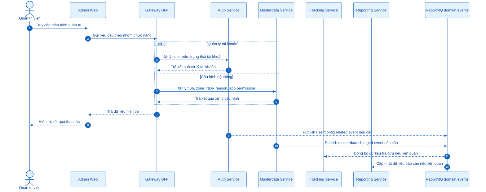

---

# 1. Quản lý tài khoản người gửi Merchant

## 1.1 Thêm tài khoản Merchant

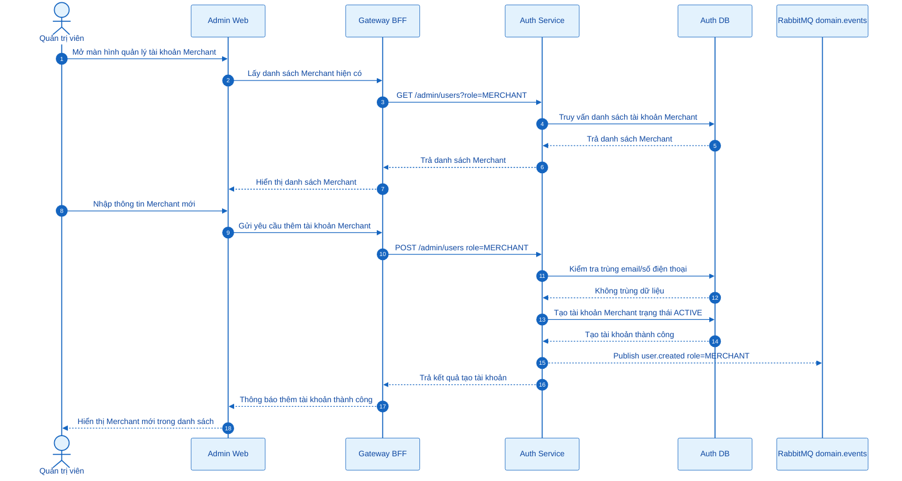

## 1.2 Sửa thông tin tài khoản Merchant

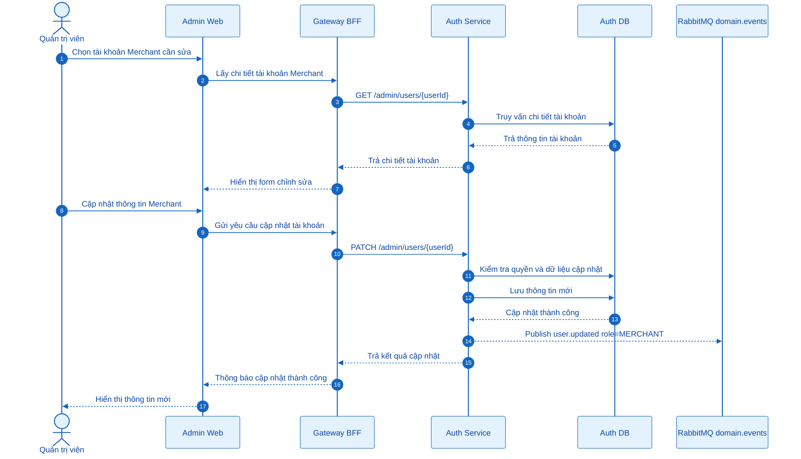

## 1.3 Khóa tài khoản Merchant

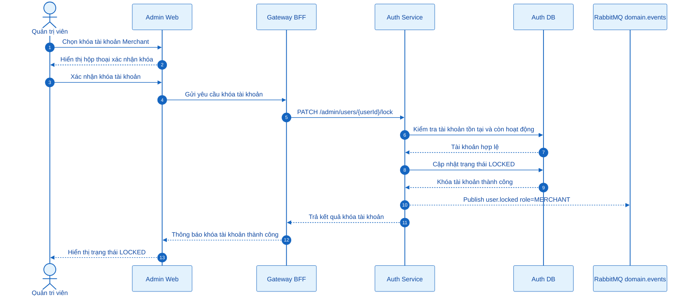

---

# 2. Quản lý tài khoản nhân viên vận hành OPS Staff

## 2.1 Thêm tài khoản OPS Staff

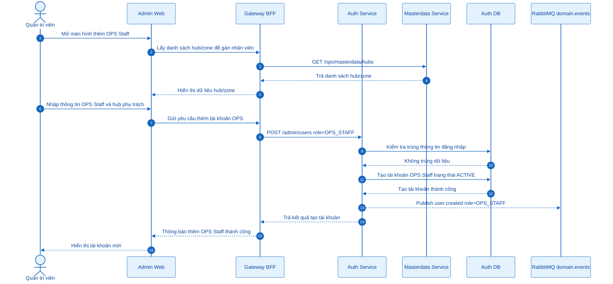

## 2.2 Sửa thông tin tài khoản OPS Staff

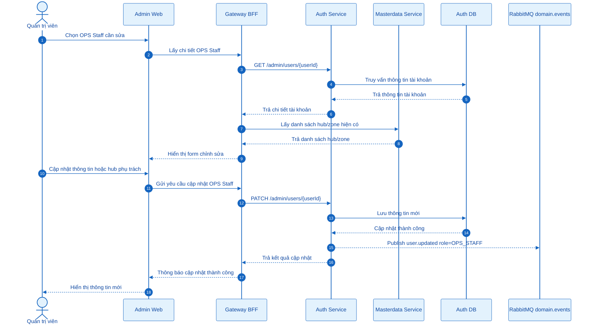

## 2.3 Khóa tài khoản OPS Staff

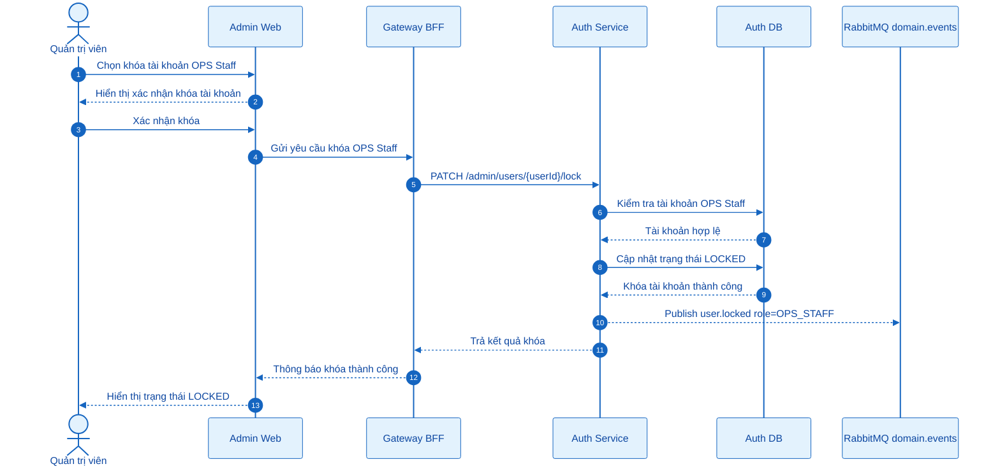

---

# 3. Quản lý tài khoản nhân viên giao nhận Courier

## 3.1 Thêm tài khoản Courier

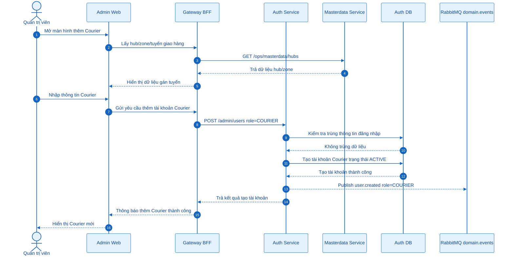

## 3.2 Sửa thông tin tài khoản Courier

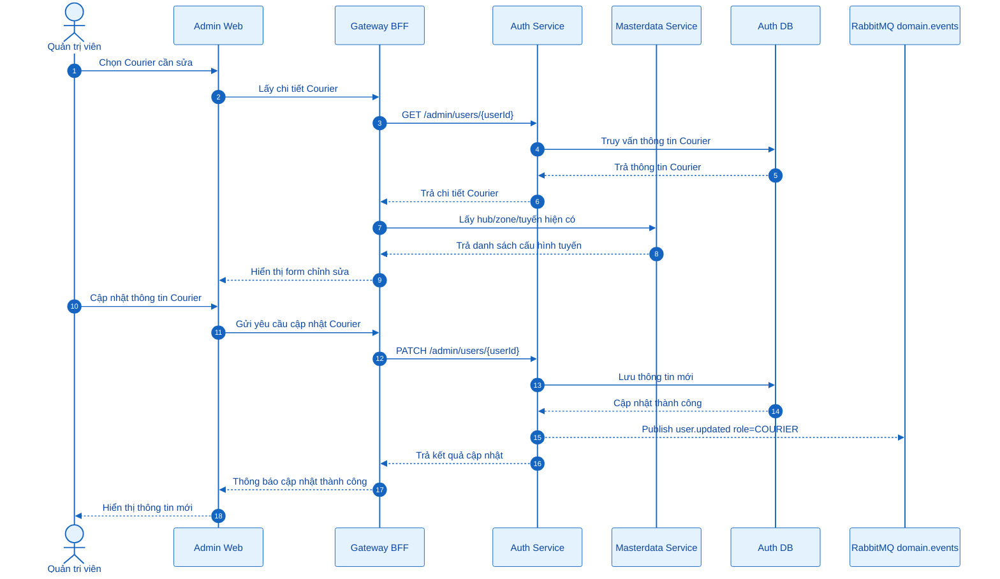

## 3.3 Khóa tài khoản Courier

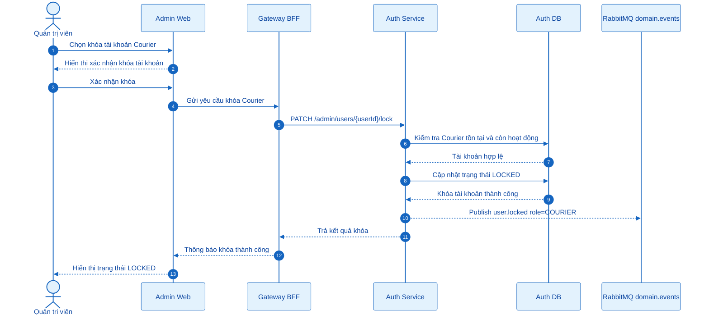

---

# 4. Quản lý Hub

## 4.1 Thêm Hub

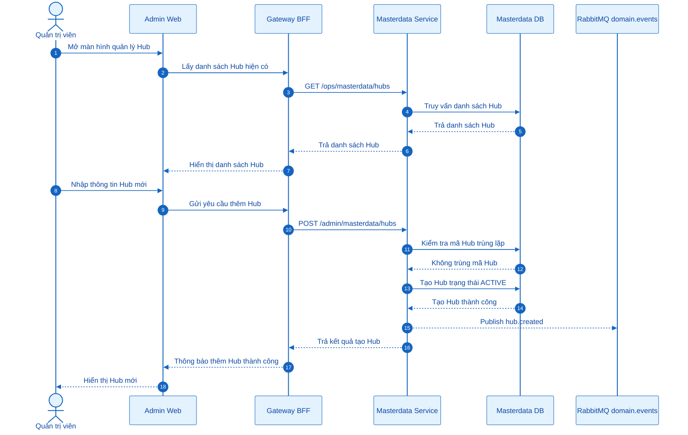

## 4.2 Sửa Hub

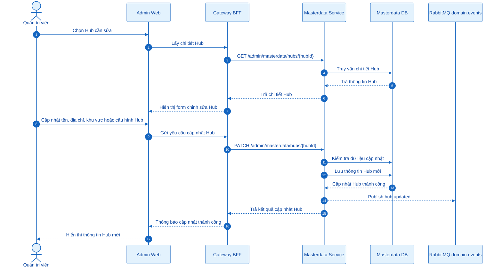

## 4.3 Vô hiệu hóa Hub

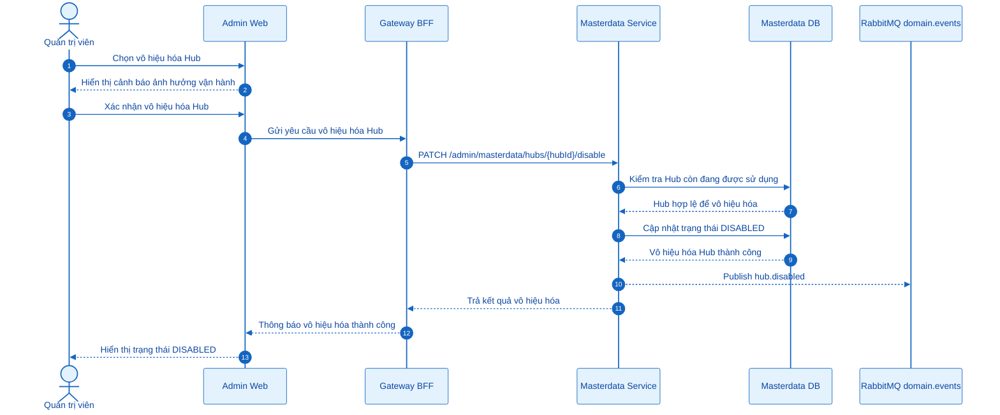

---

# 5. Quản lý Zone

## 5.1 Thêm Zone

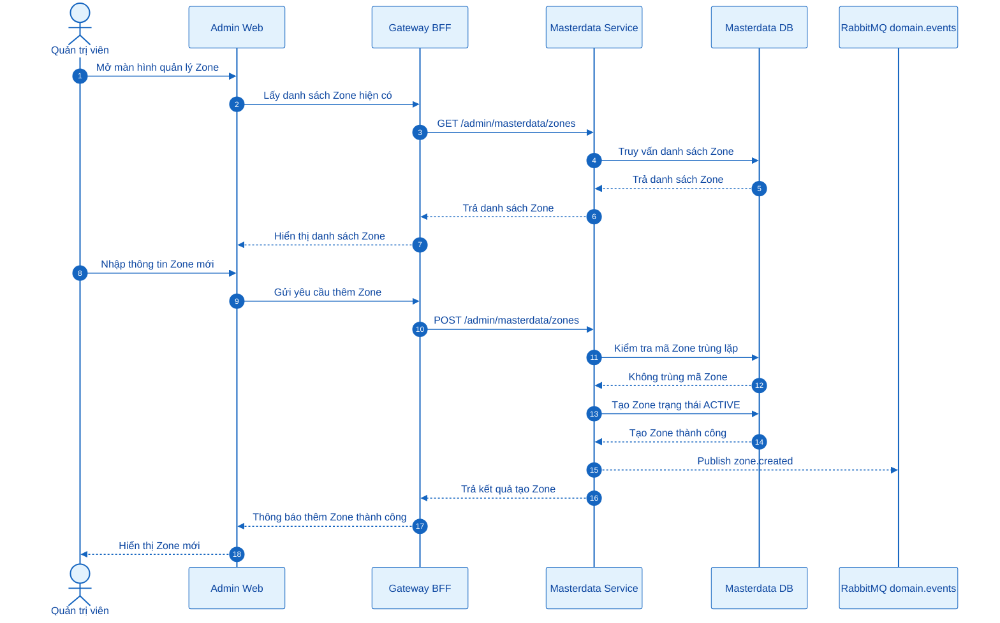

## 5.2 Sửa Zone

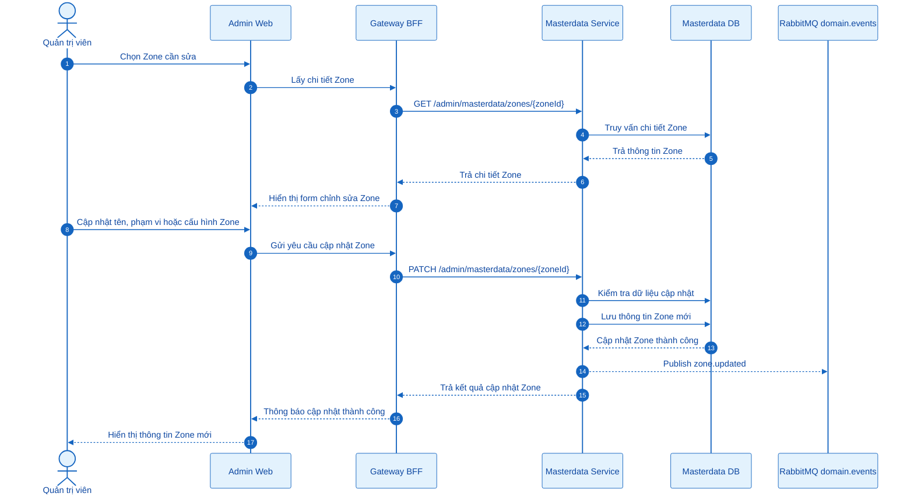

## 5.3 Vô hiệu hóa Zone

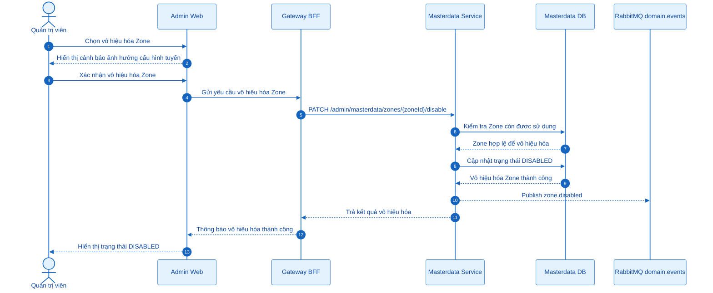

---

# 6. Quản lý phân quyền chức năng app mobile cho OPS/Courier

## 6.1 Thêm cấu hình phân quyền app mobile

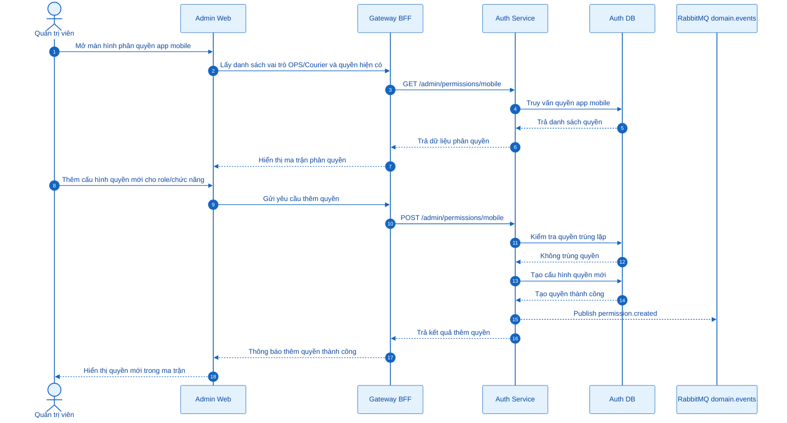

## 6.2 Sửa cấu hình phân quyền app mobile

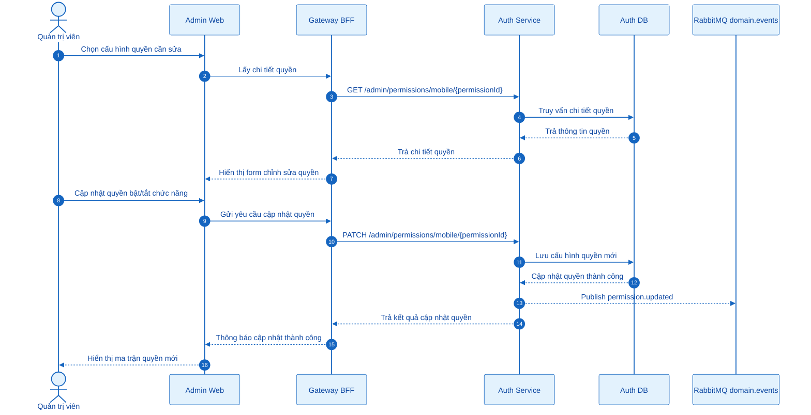

## 6.3 Vô hiệu hóa cấu hình phân quyền app mobile

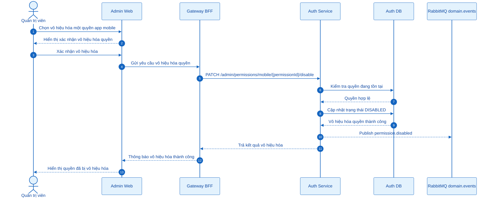

---

# 7. Quản lý bộ mã lý do ngoại lệ giao hàng NDR Reason

## 7.1 Thêm NDR Reason

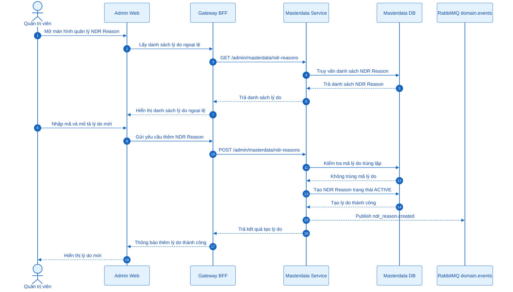

## 7.2 Sửa NDR Reason

```mermaid
%%{init: {"theme":"base","themeVariables":{"background":"#FFFFFF","actorBkg":"#E3F2FD","actorBorder":"#1565C0","actorTextColor":"#0D47A1","actorLineColor":"#1565C0","signalColor":"#1565C0","signalTextColor":"#0D47A1","activationBkgColor":"#BBDEFB","activationBorderColor":"#1565C0","labelBoxBkgColor":"#E3F2FD","labelBoxBorderColor":"#1565C0","labelTextColor":"#0D47A1"}}}%%
sequenceDiagram
    autonumber
    actor Admin as Quản trị viên
    participant AdminWeb as Admin Web
    participant Gateway as Gateway BFF
    participant Masterdata as Masterdata Service
    participant MasterDB as Masterdata DB
    participant EventBus as RabbitMQ domain.events

    Admin->>AdminWeb: Chọn NDR Reason cần sửa
    AdminWeb->>Gateway: Lấy chi tiết NDR Reason
    Gateway->>Masterdata: GET /admin/masterdata/ndr-reasons/{reasonId}
    Masterdata->>MasterDB: Truy vấn chi tiết lý do
    MasterDB-->>Masterdata: Trả thông tin lý do
    Masterdata-->>Gateway: Trả chi tiết lý do
    Gateway-->>AdminWeb: Hiển thị form chỉnh sửa lý do

    Admin->>AdminWeb: Cập nhật tên, mô tả hoặc loại xử lý
    AdminWeb->>Gateway: Gửi yêu cầu cập nhật NDR Reason
    Gateway->>Masterdata: PATCH /admin/masterdata/ndr-reasons/{reasonId}
    Masterdata->>MasterDB: Kiểm tra dữ liệu cập nhật
    Masterdata->>MasterDB: Lưu thông tin lý do mới
    MasterDB-->>Masterdata: Cập nhật lý do thành công
    Masterdata-->>EventBus: Publish ndr_reason.updated
    Masterdata-->>Gateway: Trả kết quả cập nhật lý do
    Gateway-->>AdminWeb: Thông báo cập nhật thành công
    AdminWeb-->>Admin: Hiển thị lý do mới
```

## 7.3 Vô hiệu hóa NDR Reason

```mermaid
%%{init: {"theme":"base","themeVariables":{"background":"#FFFFFF","actorBkg":"#E3F2FD","actorBorder":"#1565C0","actorTextColor":"#0D47A1","actorLineColor":"#1565C0","signalColor":"#1565C0","signalTextColor":"#0D47A1","activationBkgColor":"#BBDEFB","activationBorderColor":"#1565C0","labelBoxBkgColor":"#E3F2FD","labelBoxBorderColor":"#1565C0","labelTextColor":"#0D47A1"}}}%%
sequenceDiagram
    autonumber
    actor Admin as Quản trị viên
    participant AdminWeb as Admin Web
    participant Gateway as Gateway BFF
    participant Masterdata as Masterdata Service
    participant MasterDB as Masterdata DB
    participant EventBus as RabbitMQ domain.events

    Admin->>AdminWeb: Chọn vô hiệu hóa NDR Reason
    AdminWeb-->>Admin: Hiển thị xác nhận vô hiệu hóa lý do
    Admin->>AdminWeb: Xác nhận vô hiệu hóa
    AdminWeb->>Gateway: Gửi yêu cầu vô hiệu hóa NDR Reason
    Gateway->>Masterdata: PATCH /admin/masterdata/ndr-reasons/{reasonId}/disable
    Masterdata->>MasterDB: Kiểm tra lý do đang tồn tại
    MasterDB-->>Masterdata: Lý do hợp lệ
    Masterdata->>MasterDB: Cập nhật trạng thái DISABLED
    MasterDB-->>Masterdata: Vô hiệu hóa lý do thành công
    Masterdata-->>EventBus: Publish ndr_reason.disabled
    Masterdata-->>Gateway: Trả kết quả vô hiệu hóa
    Gateway-->>AdminWeb: Thông báo vô hiệu hóa thành công
    AdminWeb-->>Admin: Hiển thị trạng thái DISABLED
```

---

# 8. State tài khoản người dùng

```mermaid
%%{init: {"theme":"base","themeVariables":{"background":"#FFFFFF","primaryColor":"#E3F2FD","primaryTextColor":"#0D47A1","primaryBorderColor":"#1565C0","lineColor":"#1565C0","secondaryColor":"#BBDEFB","tertiaryColor":"#EAF4FF"}}}%%
stateDiagram-v2
    [*] --> ACTIVE: Admin thêm tài khoản
    ACTIVE --> LOCKED: Admin khóa tài khoản
    LOCKED --> ACTIVE: Admin mở khóa nếu có chức năng
    ACTIVE --> UPDATED: Admin sửa thông tin
    UPDATED --> ACTIVE: Lưu thành công
```

---

# 9. State dữ liệu cấu hình hệ thống

```mermaid
%%{init: {"theme":"base","themeVariables":{"background":"#FFFFFF","primaryColor":"#E3F2FD","primaryTextColor":"#0D47A1","primaryBorderColor":"#1565C0","lineColor":"#1565C0","secondaryColor":"#BBDEFB","tertiaryColor":"#EAF4FF"}}}%%
stateDiagram-v2
    [*] --> ACTIVE: Admin thêm dữ liệu cấu hình
    ACTIVE --> UPDATED: Admin sửa thông tin
    UPDATED --> ACTIVE: Lưu thành công
    ACTIVE --> DISABLED: Admin vô hiệu hóa
    DISABLED --> ACTIVE: Admin kích hoạt lại nếu có chức năng
```

