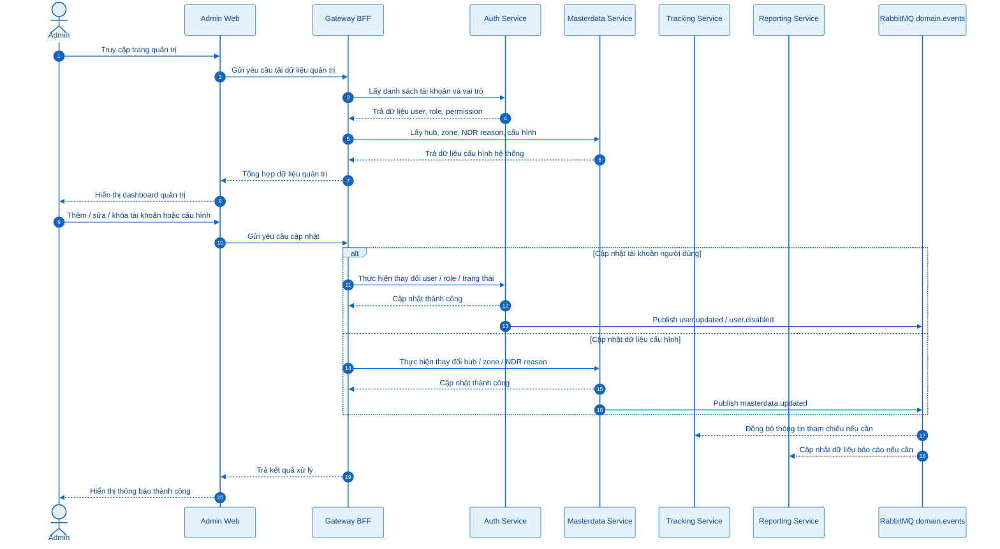
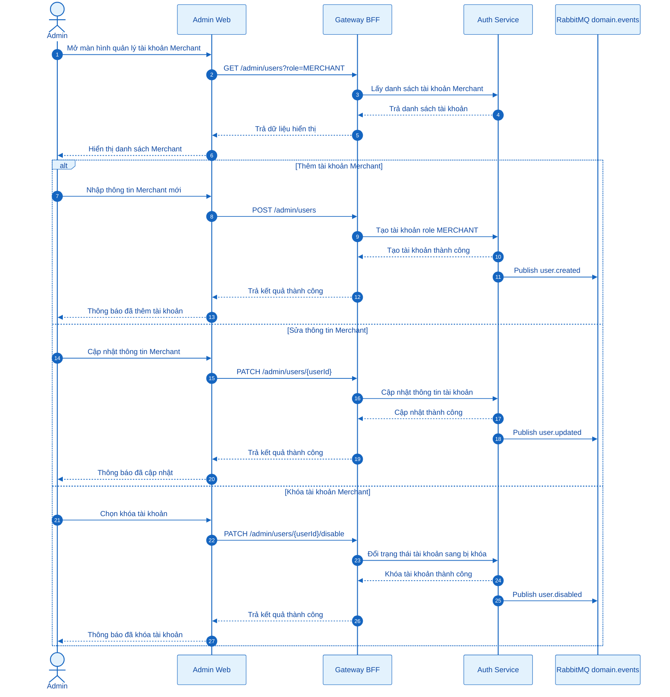
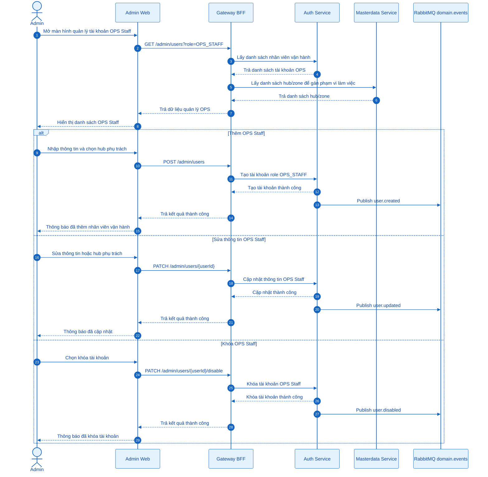
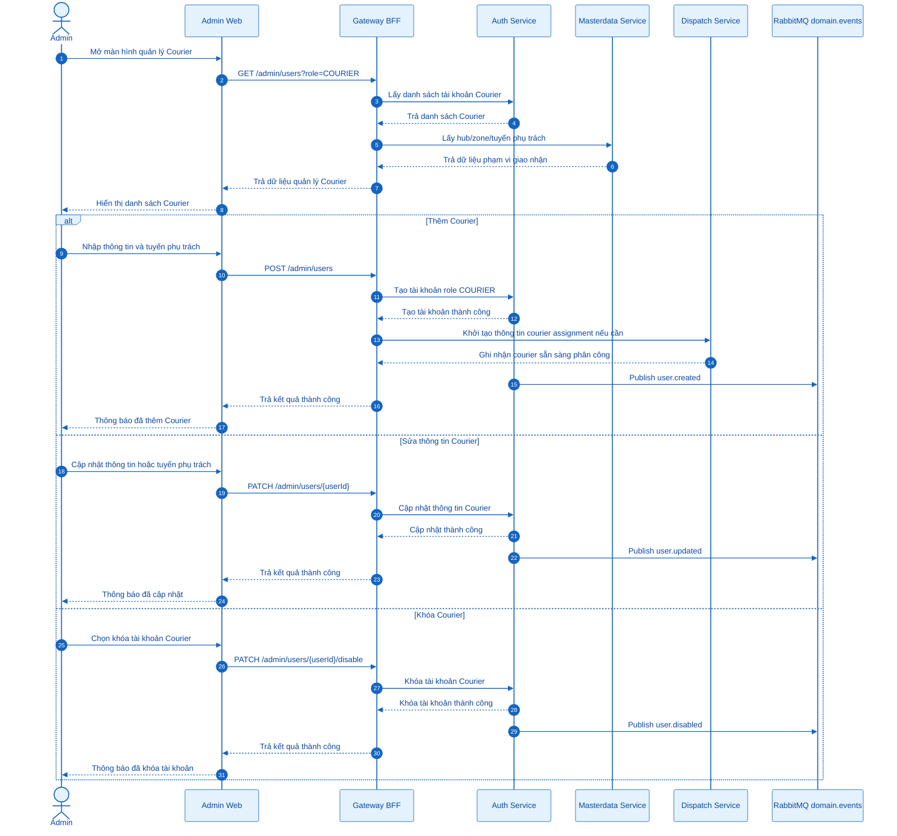
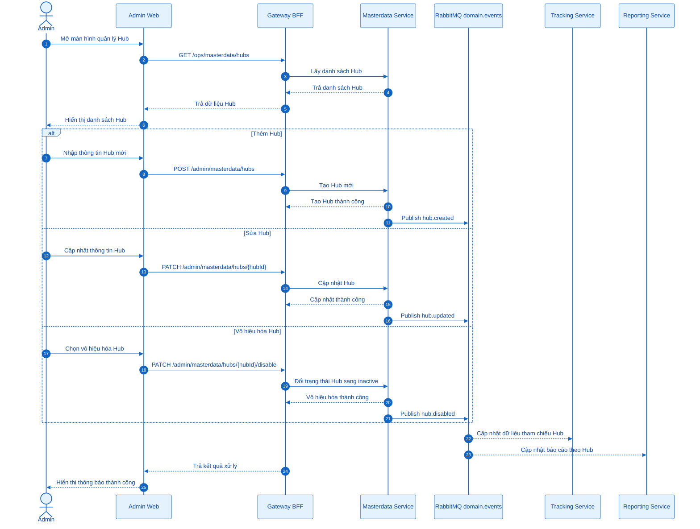
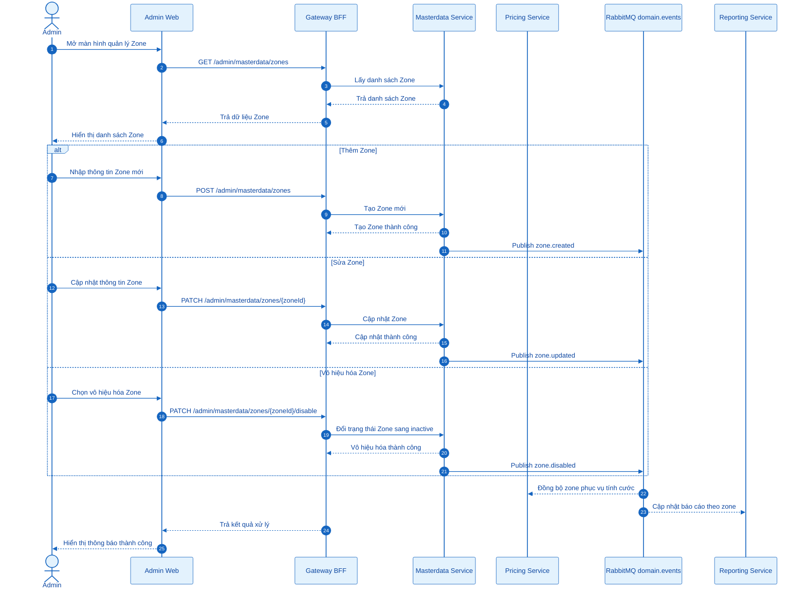
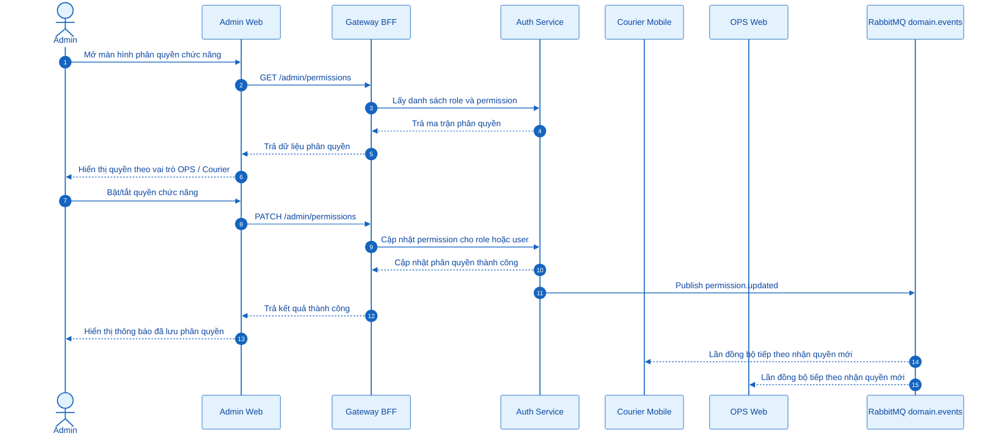
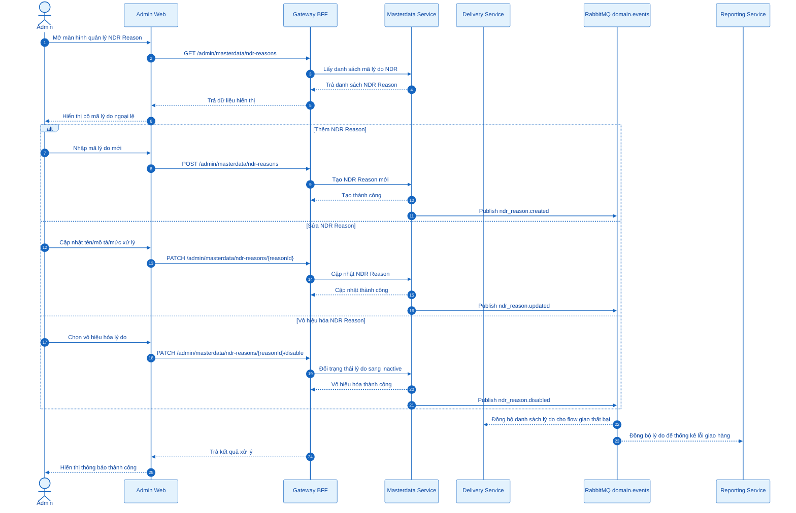
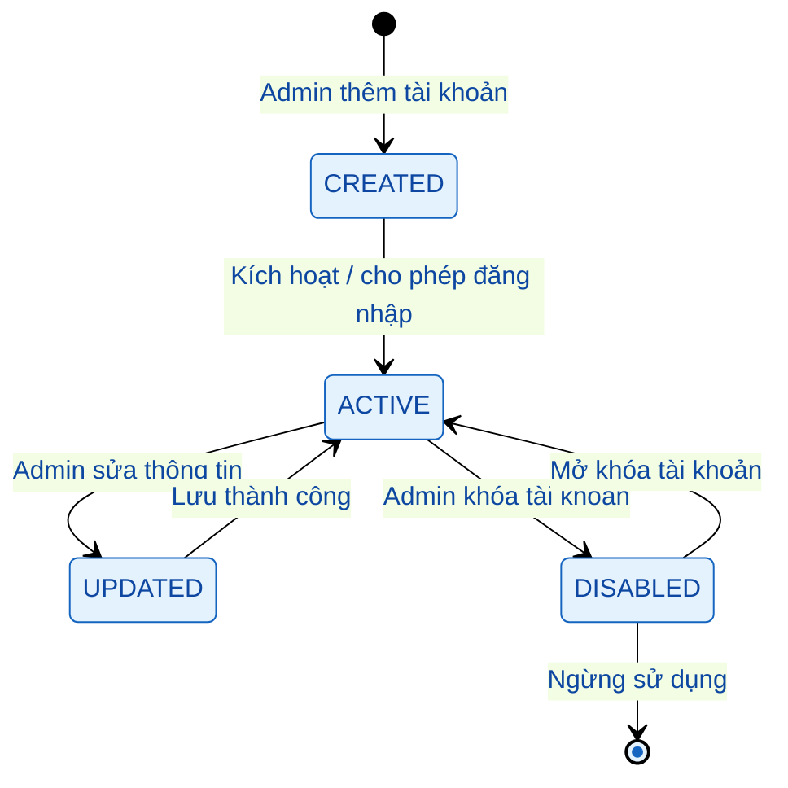
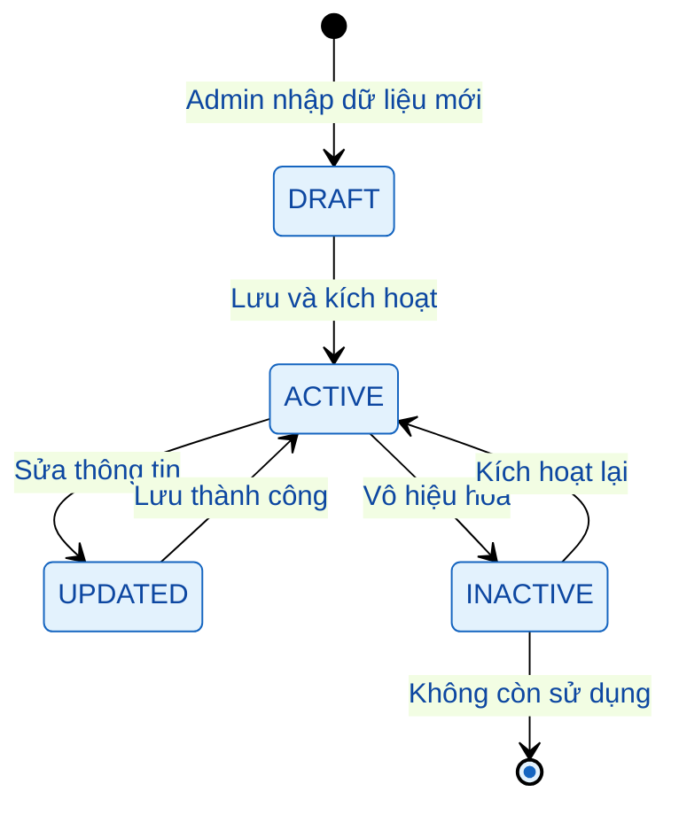

# Admin - Mermaid Sequence Diagrams

> File sơ đồ Mermaid cho nhóm chức năng **Quản trị viên (Admin)** trong Nexus Express System.  
> Mở file này trong VS Code bằng Markdown Preview Mermaid Support để xem và chụp hình sơ đồ.

---

## Mermaid theme xanh dương dùng trong toàn file

Các sơ đồ bên dưới đã được gắn sẵn đoạn `init` màu xanh dương trong từng block Mermaid.

---

## 0. Tổng quan luồng chức năng Admin

---

# NHÓM 1: Quản lý tài khoản người dùng

## 1. Quản lý tài khoản người gửi / Merchant

---

## 2. Quản lý tài khoản nhân viên vận hành / OPS Staff

---

## 3. Quản lý tài khoản nhân viên giao nhận / Courier

---

# NHÓM 2: Cấu hình hệ thống

## 4. Quản lý Hub

---

## 5. Quản lý Zone

---

## 6. Quản lý phân quyền chức năng app mobile cho OPS / Courier

---

## 7. Quản lý bộ mã lý do ngoại lệ giao hàng / NDR Reason

---

## 8. State tài khoản người dùng

---

## 9. State dữ liệu cấu hình Hub / Zone / NDR Reason

---

## 10. Mapping chức năng Admin với service xử lý

| Nhóm chức năng | Chức năng | Endpoint gợi ý | Service xử lý chính | Ghi chú |
|---|---|---|---|---|
| Quản lý tài khoản | Quản lý Merchant | `GET/POST/PATCH /admin/users` | `auth-service` | Role `MERCHANT` |
| Quản lý tài khoản | Quản lý OPS Staff | `GET/POST/PATCH /admin/users` | `auth-service` | Role `OPS_STAFF` |
| Quản lý tài khoản | Quản lý Courier | `GET/POST/PATCH /admin/users` | `auth-service` | Role `COURIER` |
| Cấu hình hệ thống | Quản lý Hub | `/admin/masterdata/hubs` | `masterdata-service` | Dữ liệu vận hành nền |
| Cấu hình hệ thống | Quản lý Zone | `/admin/masterdata/zones` | `masterdata-service` | Phục vụ tuyến, hub và tính cước |
| Cấu hình hệ thống | Quản lý phân quyền mobile/app | `/admin/permissions` | `auth-service` | Kiểm soát quyền theo role/user |
| Cấu hình hệ thống | Quản lý NDR Reason | `/admin/masterdata/ndr-reasons` | `masterdata-service` | Dùng cho giao thất bại/NDR |

---

## 11. Gợi ý nội dung đưa vào báo cáo

Nhóm chức năng Admin tập trung vào quản trị tài khoản người dùng và cấu hình dữ liệu nền của hệ thống. Admin có thể thêm, sửa hoặc khóa tài khoản Merchant, OPS Staff và Courier; đồng thời quản lý các danh mục vận hành như Hub, Zone, phân quyền chức năng và bộ mã lý do ngoại lệ giao hàng. Các thao tác quản lý tài khoản được xử lý bởi `auth-service`, trong khi dữ liệu cấu hình vận hành được xử lý bởi `masterdata-service`. Khi có thay đổi quan trọng, hệ thống có thể phát sinh domain event để các service liên quan như tracking-service, reporting-service, delivery-service hoặc pricing-service cập nhật dữ liệu tham chiếu.
