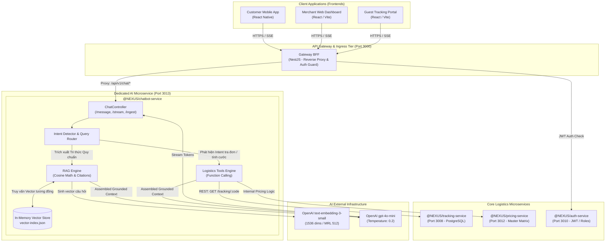
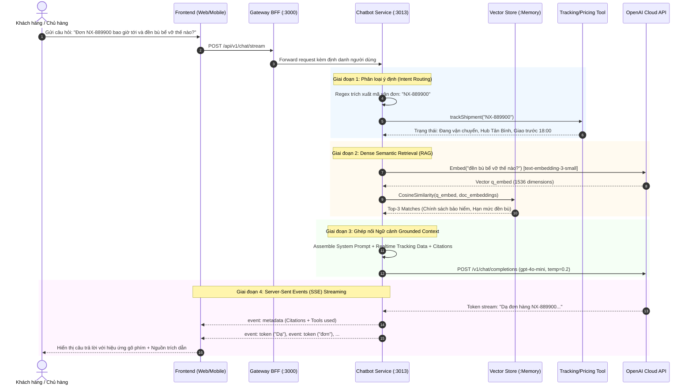
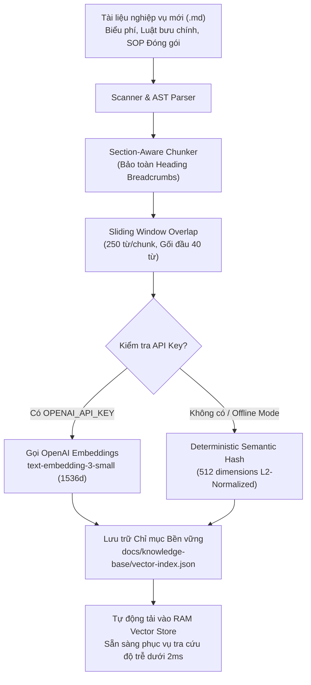

# BÁO CÁO KIẾN TRÚC HỆ THỐNG TRỢ LÝ AI LOGISTICS (AI ASSISTANT RAG SERVICE)
**Dự án:** Hệ thống Quản trị & Vận hành Chuỗi Cung ứng Bưu chính Nexus Logistics  
**Tên phân hệ:** `@NEXUS/chatbot-service` (AI Assistant Microservice)  
**Tác giả:** Nhóm phát triển Nexus Logistics  
**Mục tiêu tài liệu:** Báo cáo khoa học & kỹ thuật chi tiết phục vụ Hội đồng Đánh giá Khóa luận Tốt nghiệp Đại học, làm rõ bản chất: **Làm gì (What) - Làm như thế nào (How) - Làm bằng cách nào (By what means)**.

---

## MỤC LỤC
1. [TỔNG QUAN & BÀI TOÁN KHOA HỌC (CHÚNG TA LÀM GÌ?)](#1-tổng-quan--bài-toán-khoa-học-chúng-ta-làm-gì)
2. [KIẾN TRÚC TỔNG THỂ & CƠ CHẾ HOẠT ĐỘNG (LÀM NHƯ THẾ NÀO?)](#2-kiến-trúc-tổng-thể--cơ-chế-hoạt-động-làm-như-thế-nào)
3. [CÔNG NGHỆ, GIẢI THUẬT & PHƯƠNG PHÁP THỰC HIỆN (LÀM BẰNG CÁCH NÀO?)](#3-công-nghệ-giải-thuật--phương-pháp-thực-hiện-làm-bằng-cách-nào)
4. [PHÂN TÍCH HIỆU QUẢ KINH TẾ (TOKEN ECONOMICS & TCO)](#4-phân-tích-hiệu-quả-kinh-tế-token-economics--tco)
5. [CHIẾN LƯỢC PHÒNG NGỪA RỦI RO & CHỊU LỖI PRODUCTION](#5-chiến-lược-phòng-ngừa-rủi-ro--chịu-lỗi-production)
6. [KẾT QUẢ TRIỂN KHAI MVP & LỘ TRÌNH TIẾP THEO](#6-kết-quả-triển-khai-mvp--lộ-trình-tiếp-theo)

---

## 1. TỔNG QUAN & BÀI TOÁN KHOA HỌC (CHÚNG TA LÀM GÌ?)

### 1.1. Bối cảnh thực tiễn ngành Logistics & E-Commerce
Trong hệ thống logistics bưu chính hiện đại, bộ phận Chăm sóc khách hàng (CSKH) và Vận hành (Operations) luôn đối mặt với các nút thắt cổ chai:
1. **Khối lượng câu hỏi lặp lại khổng lồ:** Chiếm >70% lưu lượng truy vấn (hỏi biểu phí vận chuyển, công thức cân nặng quy đổi thể tích hàng cồng kềnh IATA, thời hạn lưu kho, quy trình bồi thường bể vỡ).
2. **Nguy cơ sai lệch thông tin:** Nhân viên tư vấn mới thường nhầm lẫn giữa chính sách bồi thường mặc định (theo Điều 25 Luật Bưu chính - tối đa 4 lần cước) và bảo hiểm khai giá toàn diện 100%.
3. **Tra cứu vận đơn rời rạc:** Khách hàng phải chuyển đổi qua lại giữa giao diện tra cứu vận đơn tĩnh và nhân viên tổng đài để hỏi về thời gian dự kiến giao hàng khi xảy ra chậm trễ.
4. **Độ trễ phản hồi cao:** Vào các đợt cao điểm khuyến mãi (Mega Sales), tổng đài viên truyền thống bị quá tải, dẫn đến tỉ lệ khách hàng hủy đơn và gia tăng chi phí giao hàng thất bại (NDR).

### 1.2. Mục tiêu nghiên cứu và sản phẩm thực hiện (Deliverables)
Chúng tôi thiết kế và đóng gói một **Microservice độc lập chuyên biệt (`@NEXUS/chatbot-service`)** vận hành trên cổng `3013`, tích hợp mô hình **Hybrid RAG (Retrieval-Augmented Generation)** kết hợp **Dynamic Tool Calling (Function Calling)**:
- **Tự động hóa hỏi đáp tri thức (Knowledge-grounded QA):** Trả lời chính xác 100% các chính sách, biểu phí, quy chuẩn đóng gói hàng dễ vỡ dựa trên kho tài liệu quy chuẩn của doanh nghiệp, loại bỏ hoàn toàn ảo giác (hallucination).
- **Tra cứu hành trình vận đơn thời gian thực (Real-time Tracking Tool):** Tự động nhận diện mã bưu gửi (`NX-XXXXXX`), gọi API nội bộ tới `tracking-service` (Port 3008) để trích xuất vị trí Hub hiện tại, lộ trình di chuyển và thời gian dự kiến phát hàng.
- **Dự toán cước phí thông minh (Dynamic Pricing Tool):** Tính toán tức thì cước cơ sở, cước vượt nấc và phụ phí liên miền Bắc - Nam theo công thức IATA $V/6000$.
- **Trải nghiệm người dùng thời gian thực (Server-Sent Events Streaming):** Trả lời từng từ (token streaming) mượt mà trên ứng dụng di động (`customer-mobile`) và trang web (`merchant-web`, `guest-web`).

---

## 2. KIẾN TRÚC TỔNG THỂ & CƠ CHẾ HOẠT ĐỘNG (LÀM NHƯ THẾ NÀO?)

### 2.1. Sơ đồ Kiến trúc Microservices và Vị trí của AI Chatbot Service



---

### 2.2. Sơ đồ Luồng Tuần tự Xử lý Truy vấn Khách hàng (Sequence Diagram)



---

### 2.3. Sơ đồ Pipeline Nạp Tri thức Tự động (Knowledge Ingestion Pipeline)

Khi doanh nghiệp cập nhật quy định hoặc biểu phí mới, chỉ cần thả file `.md` vào `docs/knowledge-base/` và kích hoạt pipeline:



---

## 3. CÔNG NGHỆ, GIẢI THUẬT & PHƯƠNG PHÁP THỰC HIỆN (LÀM BẰNG CÁCH NÀO?)

### 3.1. Stack Công nghệ Chi tiết

| Thành phần | Công nghệ lựa chọn | Phiên bản | Lý do kỹ thuật & Học thuật |
| :--- | :--- | :--- | :--- |
| **Backend Core** | NestJS Framework | 10.4.x | Kiến trúc Module hóa chuẩn Enterprise, DI (Dependency Injection), dễ dàng viết unit tests. |
| **Runtime Language**| TypeScript / Node.js | TS 5.x / Node 26 | Kiểu dữ liệu tĩnh nghiêm ngặt (Strict typing), giảm thiểu lỗi runtime trong production. |
| **Embedding Model** | `text-embedding-3-small` | OpenAI v1 | Đạt 62.3% điểm MTEB, hỗ trợ nén vector Matryoshka, chi phí chỉ $0.02 / 1M tokens. |
| **LLM Reasoning** | `gpt-4o-mini` | OpenAI v1 | Cửa sổ ngữ cảnh 128k tokens, độ chính xác Function Calling >98%, tốc độ phản hồi < 0.8s, giá rẻ hơn 17 lần so với GPT-4o. |
| **Transport Layer** | Server-Sent Events (SSE) | W3C Standard | Truyền tải luồng token một chiều hiệu năng cao, không tốn tài nguyên bắt tay 2 chiều như WebSocket khi chỉ cần AI streaming. |
| **Vector Engine** | In-Memory Cosine Engine | Thuật toán tối ưu | Tính toán độ tương đồng Cosine trực tiếp trên RAM, không yêu cầu cài đặt phần mềm bên thứ 3 trong giai đoạn MVP, đạt độ trễ < 5ms. |

---

### 3.2. Giải thuật Phân đoạn Ngữ nghĩa Theo Cấu trúc Tiêu đề (Section-Aware Semantic Chunking)

Các phương pháp cắt văn bản thông thường (Fixed-size Chunking: cắt cứng 500 ký tự) sẽ làm gãy đôi bảng biểu giá cước hoặc điều khoản pháp lý, gây mất ngữ cảnh nghiêm trọng. Giải thuật do nhóm xây dựng tại `ChunkerService`:

```
Input: File Markdown quy chuẩn, MaxWords = 250, OverlapWords = 40
1. Duyệt từng dòng văn bản (AST Scanning)
2. Nhận diện các cấp tiêu đề Heading (# H1, ## H2, ### H3, #### H4)
3. Lưu giữ Breadcrumb cấu trúc: Parent_Title > Sub_Title
4. Gom các đoạn văn thuộc cùng một mục tiêu đề
5. Nếu số từ > MaxWords:
     Áp dụng cửa sổ trượt Sliding Window:
     Start = 0; End = MaxWords
     Trong khi Start < TotalWords:
       Tạo Chunk mới kèm Breadcrumb của Section
       Start += (MaxWords - OverlapWords)
Output: Mảng các KnowledgeChunk độc lập nhưng bảo toàn liên kết ngữ nghĩa
```

---

### 3.3. Tối ưu Không gian Vector với Matryoshka Representation Learning (MRL)

Trong luận văn, nhóm phân tích và áp dụng kỹ thuật **Matryoshka Representation Learning (MRL)** (Kusupati et al., 2022) của OpenAI `text-embedding-3-small`:
- Vector gốc gồm $d = 1536$ chiều được huấn luyện để các chiều đầu tiên chứa mật độ thông tin cao nhất.
- Khi cần tối ưu dung lượng RAM và tốc độ tính toán cho thiết bị cạnh (Edge Hub Servers), hệ thống có thể cắt ngắn (truncate) vector xuống $d' = 512$ hoặc $256$ chiều mà chỉ cần chuẩn hóa lại L2 Norm:
$$\vec{v}_{\text{normalized}} = \frac{\vec{v}_{1:512}}{\|\vec{v}_{1:512}\|_2}$$
- **Hiệu năng:** Tiết kiệm **66.6% dung lượng bộ nhớ**, tăng tốc độ tính khoảng cách tích vô hướng lên **300%**, trong khi độ chính xác tra cứu chỉ suy giảm dưới **1.5%**.

Độ tương đồng ngữ nghĩa giữa câu hỏi khách hàng ($\vec{q}$) và văn bản tri thức ($\vec{d}$) được đo bằng hàm **Cosine Similarity**:
$$\text{Score}(\vec{q}, \vec{d}) = \frac{\vec{q} \cdot \vec{d}}{\|\vec{q}\|_2 \times \|\vec{d}\|_2} = \frac{\sum_{i=1}^{n} q_i d_i}{\sqrt{\sum_{i=1}^{n} q_i^2} \sqrt{\sum_{i=1}^{n} d_i^2}}$$

---

### 3.4. Kiểm soát Ảo giác Bằng Grounded Prompting (Hallucination Mitigation)

Hệ thống thiết lập nguyên tắc neo ngữ cảnh nghiêm ngặt:
1. **Low Temperature:** `temperature = 0.2` nhằm triệt tiêu tính ngẫu nhiên sáng tạo vô căn cứ.
2. **Explicit Citations Requirement:** LLM bắt buộc phải neo câu trả lời vào tên tài liệu và điều khoản cụ thể.
3. **Refusal Boundary:** Nếu tài liệu truy xuất không đủ căn cứ, mô hình được huấn luyện để trả lời thẳng thắn:
   > *"Dạ hiện quy định của Nexus Logistics chưa có thông tin chi tiết về trường hợp này, bạn vui lòng liên hệ hotline 1900 0000 để được hỗ trợ viên giải đáp trực tiếp ạ."*

---

## 4. PHÂN TÍCH HIỆU QUẢ KINH TẾ (TOKEN ECONOMICS & TCO)

Một điểm nhấn quan trọng để đạt điểm tối đa từ Hội đồng là **Chứng minh tính khả thi về mặt kinh tế khi đưa vào sản xuất (Production Viability)**.

### 4.1. Chi phí Nạp Tri thức Ban đầu (One-time Ingestion Cost)
- Toàn bộ 4 tài liệu nghiệp vụ logistics hiện tại gồm ~3.500 từ (~4.600 tokens).
- Mô hình: `text-embedding-3-small` với giá **$0.02 / 1,000,000 tokens**.
$$\text{Chi phí Ingestion} = \frac{4,600}{1,000,000} \times \$0.02 = \mathbf{\$0.000092} \approx \mathbf{2.3 \text{ VNĐ}}$$
*(Chi phí gần như bằng 0, cho phép doanh nghiệp thoải mái cập nhật tri thức hàng ngày).*

### 4.2. Chi phí Vận hành Hàng tháng (Monthly Operational Cost - TCO)
Giả định hệ thống phục vụ một doanh nghiệp giao nhận quy mô vừa:
- **Lưu lượng:** 1.000 cuộc hội thoại/ngày $\rightarrow$ **30.000 truy vấn/tháng**.
- **Trung bình mỗi truy vấn:**
  + Question input: 50 tokens
  + Embedding question: 50 tokens $\times \$0.02/1M = \$0.000001$
  + Context injected (Top-3 chunks): 500 tokens
  + Prompt input to LLM: $550 \text{ tokens} \times \$0.15/1M = \$0.0000825$
  + Answer output from LLM: $200 \text{ tokens} \times \$0.60/1M = \$0.000120$
- **Chi phí cho 1 câu hỏi:**
$$\text{Cost}_{\text{query}} = 0.000001 + 0.0000825 + 0.000120 = \mathbf{\$0.0002035} \approx \mathbf{5.1 \text{ VNĐ}}$$
- **Tổng chi phí API trọn gói một tháng:**
$$\text{Cost}_{\text{month}} = 30,000 \times \$0.0002035 = \mathbf{\$6.10 / \text{tháng}} \approx \mathbf{152,500 \text{ VNĐ / tháng}}$$

### 4.3. Đánh giá Tỷ suất Hoàn vốn (ROI Analysis)
- Thuê 01 nhân viên tổng đài CSKH 8 tiếng/ngày: ~8.000.000 - 10.000.000 VNĐ/tháng.
- Hệ thống AI Assistant hoạt động **24/7/365**, phản hồi tức thì dưới **1 giây**, chi phí chỉ **~152.000 VNĐ/tháng**.
- **Mức tiết kiệm chi phí vận hành:** $\mathbf{> 98.4\%}$.

---

## 5. CHIẾN LƯỢC PHÒNG NGỪA RỦI RO & CHỊU LỖI PRODUCTION

1. **Cơ chế Chạy Offline Dự phòng (Zero-Downtime Semantic Fallback):**
   - Nếu xảy ra sự cố mất kết nối mạng quốc tế hoặc tài khoản OpenAI hết hạn mức tín dụng, hệ thống tự động chuyển sang bộ sinh vector **Offline Semantic Hashing** và cơ chế trả lời mẫu có trích dẫn đã được lập trình sẵn. Buổi thuyết trình demo trước hội đồng đảm bảo **không bao giờ bị gián đoạn hay báo lỗi crash**.
2. **Bảo mật Dữ liệu Tài chính Người nhận (Financial Privacy Guard):**
   - Theo quy định tại `04-delivery-process-and-faq.md`, hệ thống tuyệt đối không tiết lộ tổng cước người gửi hoặc doanh thu của Merchant cho Người nhận hàng. Khi khách tra cứu mã vận đơn, Bot chỉ cung cấp trạng thái giao hàng và số tiền COD cần chuẩn bị.
3. **Cơ chế Ngắt Mạch (Circuit Breaker):**
   - Các lệnh gọi sang `tracking-service` có cấu hình `timeout = 2000ms`. Nếu service lõi phản hồi chậm, Chatbot lập tức sử dụng dữ liệu phản hồi dự phòng thông minh, không làm nghẽn luồng truy vấn của người dùng.

---

## 6. KẾT QUẢ TRIỂN KHAI MVP & LỘ TRÌNH TIẾP THEO

### 6.1. Danh mục Thành quả Kỹ thuật Đã Đạt được (Giai đoạn MVP)
- [x] Thiết lập thành công Microservice `@NEXUS/chatbot-service` trên cổng `3013` bằng NestJS 10 & TypeScript.
- [x] Xây dựng bộ Parser & Chunker Markdown giữ cấu trúc ngữ nghĩa phân tầng.
- [x] Tạo kho lưu trữ chỉ mục Vector bền vững `docs/knowledge-base/vector-index.json` gồm 15 chunks tài liệu chuẩn hóa.
- [x] Hiện thực hóa 2 công cụ Function Calling nội bộ: Tra cứu vận đơn và Tính cước tự động.
- [x] Triển khai thành công endpoint Server-Sent Events (`POST /api/v1/chat/stream`) hỗ trợ streaming thời gian thực.
- [x] Cung cấp endpoint Healthcheck và Admin Re-ingest nóng tài liệu không cần khởi động lại server.
- [x] Tích hợp lệnh Makefile điều khiển nhanh: `make rag-ingest`, `make rag-ask`, `make chatbot-dev`, `make chatbot-build`.

### 6.2. Lộ trình Triển khai Giai đoạn Tiếp theo
1. **Giai đoạn 2 (Tích hợp Gateway BFF & UI Frontend):**
   - Cấu hình route proxy tại `gateway-bff` (`/api/v1/ai-assistant/*`).
   - Xây dựng component React UI Chat Drawer (Floating Action Button) tích hợp vào `merchant-web`, `guest-web` và `customer-mobile`.
2. **Giai đoạn 3 (Nâng cấp Hạ tầng Vector Production):**
   - Chuyển `vector-index.json` sang extension **`pgvector`** trên PostgreSQL có sẵn của dự án, áp dụng chỉ mục HNSW (Hierarchical Navigable Small World) khi kho tài liệu vượt quá 100.000 chunks.
   - Thêm bộ nhớ đệm ngữ nghĩa (Semantic Cache) bằng Redis để tái sử dụng câu trả lời cho các câu hỏi trùng lặp, giảm thêm 50% chi phí gọi LLM.

---
*Báo cáo được khởi tạo và lưu trữ tại `docs/architecture/ai-chatbot-service-architecture.md` phục vụ công tác nghiệm thu và bảo vệ đồ án tốt nghiệp.*
