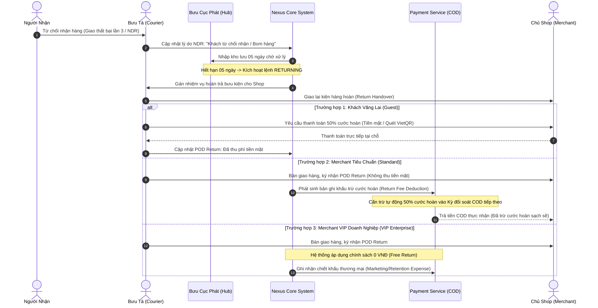

# Quy Chuẩn Phân Tầng Khách Hàng & Cơ Chế Thu Hồi Cước Chuyển Hoàn (Reverse Logistics Policy)

---

## 1. Cơ Sở Lý Luận & Bài Toán Kinh Tế Trong Logistics Bưu Chính

Trong vận hành logistics phục vụ thương mại điện tử (E-Commerce Last-Mile Delivery), tỷ lệ giao hàng không thành công dẫn đến chuyển hoàn (Non-Delivery / Return Rate) bình quân tại thị trường Việt Nam dao động từ **8% đến 15%** (thậm chí lên tới 20% – 30% đối với các shop mới hoặc bán hàng qua livestream rủi ro cao).

Mỗi đơn hàng chuyển hoàn phát sinh chi phí vận chuyển ngược (Reverse Logistics Cost):
- Chi phí phương tiện vận tải đường bộ / đường bay chiều về.
- Chi phí bốc dỡ, phân loại và lưu kho tại các Hub trung chuyển.
- Chi phí nhân công bưu tá liên hệ, giao trả và xác nhận ký nhận hoàn (POD Return).

> [!CAUTION]
> **Lỗ Hổng Trục Lợi Vận Chuyển Ngược (Reverse Logistics Exploitation Gap):**
> Nếu hệ thống cho phép **bất kỳ ai tự đăng ký tài khoản Merchant cũng tự động trở thành VIP và được Miễn Phí Chuyển Hoàn (0 VNĐ)**, doanh nghiệp vận tải sẽ đối mặt với nguy cơ sụp đổ dòng tiền:
> - Kẻ xấu hoặc đối thủ cạnh tranh có thể tạo hàng loạt tài khoản ảo trong vài giây để xả các đơn hàng không có người nhận thật ("bom hàng").
> - Bưu cục và xe tải gánh 100% chi phí vận hành hai chiều mà không thu được bất kỳ khoản cước nào.
> 
> **Vì vậy, Merchant thường TUYỆT ĐỐI KHÔNG mặc định là VIP!**

---

## 2. Mô Hình Phân Tầng 3 Lớp (3-Tier Customer Model)

Nexus Logistics thiết lập mô hình 3 tầng đối tượng khách hàng rõ ràng nhằm cân bằng giữa **an toàn tài chính** và **kích cầu thương mại**:

| Tiêu Chí Đánh Giá | Tầng 1: Khách Vãng Lai (Guest / Walk-in) | Tầng 2: Merchant Tiêu Chuẩn (Standard Merchant / SME) | Tầng 3: Merchant VIP Doanh Nghiệp (VIP Enterprise / Key Account) |
| :--- | :--- | :--- | :--- |
| **Đối tượng áp dụng** | Cá nhân gửi hàng tại bưu cục, khách tạo 1-2 đơn đơn lẻ trên cổng web, không có shop. | Chủ shop online, cá nhân kinh doanh trên sàn TMĐT/Mạng xã hội có xác thực CCCD/MST (< 1.000 đơn/tháng). | Doanh nghiệp lớn (Juno, Coolmate, Routine...), tổng kho phân phối ký hợp đồng khung (> 1.000 đơn/tháng). |
| **Cước Vận Chuyển Chiều Đi** | **100% Biểu giá niêm yết chuẩn** (Không chiết khấu). | **Bảng giá Merchant**: Chiết khấu trực tiếp **5%** trên cước cơ sở + Miễn phí bưu tá lấy hàng tận nơi (First-mile pickup). | **Bảng giá Hợp Đồng Riêng**: Chiết khấu bậc thang từ **15% – 25%** theo cam kết sản lượng tháng. |
| **Cước Chuyển Hoàn (Return Fee)** | **Thu 50% cước chiều đi** | **VẪN THU 50% cước chiều đi** | **0 VNĐ (Miễn phí chuyển hoàn 100%)** hoặc đồng giá 10.000 VNĐ/kiện theo hợp đồng. |
| **Cơ Chế Thu Tiền Hoàn** | Bưu tá hoặc GDV bưu cục **thu tiền mặt hoặc quét VietQR** khi giao trả bưu gửi tận tay (POD Return). | **Tự động cấn trừ vào Bảng kê đối soát tiền thu hộ COD (COD Settlement Batch)** của kỳ tiếp theo. Không dùng tiền mặt. | Miễn phí (Chính sách chiết khấu thương mại giữ chân khách hàng lớn - Customer Retention). |
| **Cơ Chế Kích Hoạt Tier** | Mặc định đối với khách chưa tạo shop. | Tự động khi người dùng đăng ký Merchant và hoàn tất định danh cơ bản. | **Quản trị viên (Admin / Sales Lead) phê duyệt thủ công** trên cổng quản trị sau khi thẩm định pháp nhân / ký quỹ. |
| **Bảo Lãnh Thanh Toán** | Thanh toán ngay từng đơn. | Bảo lãnh bằng dòng tiền COD đang giữ hộ trong kỳ. | Hợp đồng kinh tế, bảo lãnh ngân hàng hoặc ký quỹ doanh nghiệp. |

---

## 3. Sơ Đồ Quy Trình Thu Hồi Cước Hoàn Tự Động (Cashless Reverse Logistics Flow)

---

## 4. Cơ Chế Quản Trị Cấu Hình Phí Chuyển Hoàn (Rule-based Configurable Policy)

Để đảm bảo hệ thống mở rộng linh hoạt theo thời gian mà **không cần can thiệp mã nguồn (Zero Code Modification)**:
1. **Tầng Cấu Hình Động (Masterdata & Pricing Service):**
   - Giá trị cước hoàn và chiết khấu được quản lý qua bảng cấu hình quy tắc (Rule Engine).
   - Tham số mặc định toàn hệ thống: `RETURN_FEE_RATE_STANDARD = 0.50` (50%).
   - Tham số đối tác VIP: `RETURN_FEE_RATE_VIP = 0.00` (0%).
   - Tham số đồng giá: `RETURN_FEE_FLAT_AMOUNT = 10000` (10.000 VNĐ).
2. **Quy Trình Nâng Cấp Tier Của Merchant:**
   - **Thẩm định sản lượng:** Hệ thống báo cáo định kỳ (`reporting-service`) thống kê sản lượng thực tế hàng tháng của từng Merchant. Khi Merchant duy trì đều đặn $\ge 1.000$ đơn/tháng trong 2 tháng liên tiếp, hệ thống gửi đề xuất nâng hạng.
   - **Ký kết hợp đồng:** Đội ngũ Quản lý Khách hàng Doanh nghiệp (Key Account Management) ký Phụ lục Hợp đồng Dịch vụ Khung (SLA).
   - **Kích hoạt quyền lợi:** Quản trị viên truy cập Portal Admin, bật cờ `tier: VIP_ENTERPRISE`. Từ thời điểm này, mọi đơn hoàn của Merchant đều tự động áp dụng cước phí 0 VNĐ.

---

## 5. Kết Luận & Giá Trị Đồ Án

1. **Khép kín dòng tiền:** Không để thất thoát chi phí xe cộ chiều về, loại bỏ hoàn toàn nợ xấu nhờ cơ chế cấn trừ đối soát COD tự động.
2. **Bảo vệ tài nguyên hạ tầng:** Ngăn ngừa tình trạng spam đơn ảo trục lợi của các tài khoản rác.
3. **Thực tiễn thương mại cao:** Mô phỏng trung thực quy chuẩn hoạt động của các tập đoàn bưu chính hàng đầu (Viettel Post, GHN, J&T Express).
