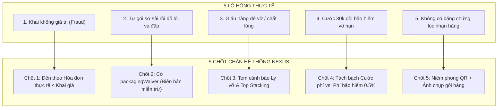
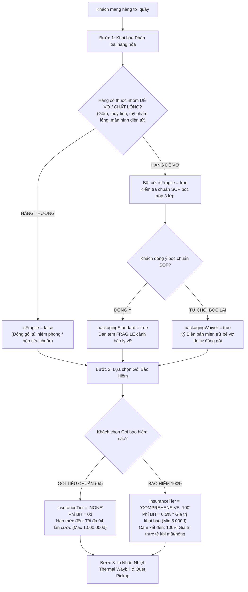

# ĐẶC TẢ NGHIỆP VỤ LOGISTICS: MÔ HÌNH THIẾT GIÁP TINH GỌN (IRONCLAD LEAN MODEL)
## TIẾP NHẬN HÀNG, ĐÓNG GÓI DỄ VỠ, BẢO HIỂM HÀNG HÓA & PHÒNG CHỐNG TRỤC LỢI BỒI THƯỜNG
*(Tài liệu chính thức phục vụ: Viết thuyết minh Đồ án Tốt nghiệp, Slide Phản biện Hội đồng & Cẩm nang Tư vấn Khách hàng)*

---

## 1. TỔNG QUAN: TẠI SAO PHẢI LÀ "MÔ HÌNH THIẾT GIÁP TINH GỌN"?

### 1.1. Triết lý cốt lõi của mô hình
Nhiều hệ thống logistics gặp thất bại hoặc bị giảng viên hội đồng đánh giá thấp vì rơi vào hai thái cực:
1. **Quá ngây thơ (Lý thuyết suông):** Áp dụng "mất hoặc hỏng thì đền 100% tiền hàng" cho tất cả mọi đơn → *Hội đồng sẽ phản biện ngay: Tiền đâu ra mà đền? Khách gửi cục gạch cũ khai 20 triệu rồi cố tình làm vỡ để đòi đền thì doanh nghiệp phá sản à?*
2. **Quá rườm rà (Phức tạp hóa):** Đẻ ra hàng chục loại phụ phí, phân loại hàng chục nhóm hàng, bắt nhân viên đo đạc quá nhiều bước → *Gây tắc nghẽn quầy tiếp nhận bưu cục, khách hàng phản ứng, lập trình viên frontend/backend bị rối loạn logic.*

**MÔ HÌNH THIẾT GIÁP TINH GỌN (IRONCLAD LEAN MODEL)** giải quyết triệt để vấn đề này bằng cách:
* **TINH GỌN:** Chỉ có **02 cờ kiểm soát tại quầy** và **02 gói lựa chọn bảo hiểm** (Khách mất chưa tới 30 giây để hoàn tất).
* **DỄ PHẢN BIỆN:** Bám chặt 100% vào **Luật Bưu chính Việt Nam (Điều 24, Điều 25 Luật số 49/2010/QH12)**.
* **BỊT KÍN MỌI LỖ HỔNG:** Không để lại bất kỳ "vùng xám" (Grey Zone) nào cho hành vi trục lợi bảo hiểm hoặc tranh chấp dân sự.

---

## 2. BỊT KÍN 5 LỖ HỔNG NGHIỆP VỤ CHÍ SƠ TRONG CHUYỂN PHÁT NHANH

Dưới đây là 5 lỗ hổng thực tế khiến các công ty vận chuyển mất hàng tỷ đồng mỗi năm và giải pháp "khóa van rủi ro" bằng phần mềm NEXUS:



### Lỗ hổng 1: Khách hàng khai khống giá trị để trục lợi (Moral Hazard & Valuation Fraud)
* **Kịch bản gian lận:** Món đồ cũ trị giá 300.000 VNĐ nhưng người gửi khai giá 15.000.000 VNĐ. Khi xảy ra sự cố, người gửi đòi đền đủ 15.000.000 VNĐ.
* **Chốt chặn phần mềm:** 
  * Nguyên tắc bồi thường được cố định bằng hợp đồng: **"Bồi thường theo GIÁ TRỊ THIỆT HẠI THỰC TẾ, tối đa bằng Giá trị khai báo"** (Chuẩn Điều 25 Luật Bưu chính).
  * Điều kiện nhận bồi thường 100%: Người gửi phải xuất trình được **Hóa đơn mua hàng hợp lệ (VAT / Hóa đơn điện tử sàn TMĐT / Lịch sử chuyển khoản ngân hàng giao dịch mua bán)**.
  * Nếu không chứng minh được hóa đơn: Hệ thống tự động chuyển sang mức đền bù tối đa theo định mức luật định (tối đa 4 lần cước).

### Lỗ hổng 2: Người gửi tự đóng gói sơ sài rồi đổ lỗi cho nhà vận chuyển làm vỡ
* **Kịch bản gian lận:** Khách tự bỏ lọ nước hoa/đồ gốm vào một chiếc hộp carton mỏng manh không có xốp chèn. Dọc đường xe tải rung lắc khiến lọ tự va vào thành hộp nứt vỡ, nhưng bên ngoài vỏ thùng vẫn còn nguyên vẹn. Khách làm ầm lên đòi bưu điện đền tiền.
* **Chốt chặn phần mềm:** 
  * Khi hàng là Dễ vỡ (`isFragile: true`), nhân viên giao dịch kiểm tra theo chuẩn 3 lớp xốp (Bubble Wrap).
  * Nếu khách hàng từ chối đóng gói chuẩn, nhân viên bật cờ **`packagingWaiver: true` (Biên bản cam kết miễn trừ bể vỡ do người gửi tự đóng gói)**.
  * Bưu điện **chỉ bồi thường nếu làm mất nguyên kiện**, và **miễn trừ 100% trách nhiệm bể vỡ bên trong nếu vỏ thùng bên ngoài còn nguyên niêm phong**.

### Lỗ hổng 3: Khách cố tình giấu không khai báo hàng dễ vỡ / chất lỏng
* **Kịch bản rủi ro:** Gửi chai mật ong hoặc rượu thủy tinh nhưng khai là "quần áo" để trốn đóng gói. Chai bị bục vỡ chảy tràn làm ướt hỏng hàng chục bưu kiện của người khác trên xe.
* **Chốt chặn phần mềm:**
  * Điều khoản giao dịch ghi rõ: Nếu người gửi cố ý che giấu thông tin hàng hóa, người gửi không những **không được bồi thường** mà còn phải **chịu trách nhiệm liên đới bồi hoàn thiệt hại** cho các bưu kiện khác bị ảnh hưởng theo Bộ luật Dân sự 2015.

### Lỗ hổng 4: Cước vận chuyển 30.000đ nhưng đòi hỏi bảo hiểm vô hạn
* **Kịch bản thâm hụt:** Cước thu 30.000đ chỉ đủ trang trải chi phí xăng xe, lương bưu tá, khấu hao xe tải. Nếu một đơn 20.000.000đ bị mất mà phải đền, công ty mất đứt lợi nhuận của gần 1.000 đơn hàng khác.
* **Chốt chặn phần mềm:**
  * Tách bạch 2 dòng tiền: **Cước vận chuyển (Service Fee)** và **Phí bảo hiểm khai giá (Insurance Fee - 0.5%)**.
  * Khoản phí 0.5% được đưa thẳng vào **Quỹ dự phòng bồi thường rủi ro (Risk Reserve Fund)**. Ai có nhu cầu bảo vệ tài sản giá trị cao thì đóng góp vào quỹ, ai không tham gia thì chấp nhận rủi ro theo hạn mức cơ bản.

### Lỗ hổng 5: Tranh cãi về tình trạng hàng hóa trước và sau khi vận chuyển
* **Kịch bản tranh cãi:** Lúc gửi không rõ bưu kiện méo hay tròn, lúc phát người nhận bảo hàng bị cấn móp từ trước.
* **Chốt chặn phần mềm:**
  * Cho phép nhân viên chụp nhanh 01 bức ảnh gói hàng dán tem niêm phong lúc tiếp nhận và upload lên trường `packagePhotoUrl`. Ảnh được ghim vĩnh viễn vào mã vận đơn, xóa tan mọi tranh cãi lúc giao nhận.

---

## 3. QUY TRÌNH TIẾP NHẬN ĐƠN HÀNG 3 BƯỚC TẠI QUẦY (3-STEP POS INTAKE)

Quy trình tại màn hình tiếp nhận bưu cục (`BranchBusinessOrderCreatePage`) được thiết kế trực quan, thao tác trong 30 giây:



---

## 4. MA TRẬN PHÂN ĐỊNH TRÁCH NHIỆM BỒI THƯỜNG (2X2 IRONCLAD MATRIX)
*(Bảng ma trận xử lý tự động trong Module Claims & Liability Management)*

Hội đồng chấm đồ án hoặc khách hàng có thể hỏi bất kỳ tình huống nào, bạn chỉ cần chiếu vào bảng 4 ô kinh điển này:

| TÌNH HUỐNG SỰ CỐ | CÓ MUA BẢO HIỂM 100%<br/>*(Đã đóng phí 0.5%)* | KHÔNG MUA BẢO HIỂM<br/>*(Phí bảo hiểm 0đ)* |
| :--- | :--- | :--- |
| **THẤT LẠC / MẤT NGUYÊN KIỆN**<br/>*(Lỗi mạng lưới Hub/Tài xế làm mất)* | **ĐỀN ĐÚNG 100% GIÁ TRỊ KHAI BÁO**<br/>*(Căn cứ theo hóa đơn/chứng từ hợp lệ)* | **ĐỀN 04 LẦN CƯỚC VẬN CHUYỂN**<br/>*(Trần tối đa 1.000.000 VNĐ theo Luật Bưu chính)* |
| **BỂ VỠ / HƯ HỎNG BÊN TRONG**<br/>*(Đã đóng gói chuẩn 3 lớp xốp SOP)* | **ĐỀN 100% GIÁ TRỊ THỰC TẾ**<br/>*(Hoặc đền theo tỷ lệ % hư hại nếu vỡ một phần)* | **ĐỀN 04 LẦN CƯỚC GỬI**<br/>*(Theo tỷ lệ hư hại thực tế)* |
| **BỂ VỠ KHI CÓ BIÊN BẢN MIỄN TRỪ**<br/>*(Khách tự đóng gói sơ sài, thùng ngoài nguyên)* | **TỪ CHỐI BỒI THƯỜNG BỂ VỠ**<br/>*(Do khách đã ký cam kết packagingWaiver)* | **TỪ CHỐI BỒI THƯỜNG BỂ VỠ**<br/>*(Miễn trừ trách nhiệm theo Điều 24 Luật Bưu chính)* |

---

## 5. BỘ CÂU HỎI PHẢN BIỆN TRƯỚC HỘI ĐỒNG ĐỒ ÁN (DEFENSE Q&A)

Dưới đây là 5 câu hỏi "bẫy" kinh điển mà Hội đồng Thầy Cô thường hỏi và câu trả lời chuẩn xác nhất:

### Câu 1: *"Hệ thống của em lấy cơ sở pháp lý nào để giới hạn mức đền bù chỉ có 4 lần cước khi khách không mua bảo hiểm?"*
> **Câu trả lời chuẩn:**  
> *"Dạ thưa Thầy/Cô, hệ thống áp dụng đúng theo **Điều 25 Khoản 2 Luật Bưu chính số 49/2010/QH12** và **Nghị định 47/2011/NĐ-CP**. Luật quy định đối với bưu gửi không sử dụng dịch vụ khai giá, doanh nghiệp bưu chính được quyền ấn định mức bồi thường theo giới hạn luật định (từ 4 đến 10 lần cước). Các doanh nghiệp chuyển phát thực tế tại Việt Nam như Viettel Post, VNPost, J&T Express đều áp dụng mức 4 lần cước này để đảm bảo cân đối quỹ hoạt động."*

### Câu 2: *"Nếu khách hàng gửi một chiếc iPhone cũ hỏng sẵn, bọc kỹ, khai giá 20 triệu và mua bảo hiểm 100%, sau đó cố tình đổ lỗi làm hỏng thì hệ thống giải quyết thế nào?"*
> **Câu trả lời chuẩn:**  
> *"Dạ thưa Thầy/Cô, hệ thống đã bịt kín kẽ hở này bằng 2 chốt chặn:  
> 1. Quy định bồi thường yêu cầu khách phải cung cấp **Hóa đơn mua bán/chứng từ chứng minh giá trị thực tế**.  
> 2. Quy trình giám định đối chiếu với **ảnh chụp gói hàng lúc gửi (`packagePhotoUrl`)** và video kiểm hàng mở kiện đồng kiểm của bưu tá. Nếu phát hiện dấu hiệu gian lận khai giá khống, hồ sơ sẽ chuyển sang trạng thái từ chối chi trả theo điều khoản gian lận thương mại."*

### Câu 3: *"Tại sao không bắt buộc 100% đơn hàng đều phải mua bảo hiểm?"*
> **Câu trả lời chuẩn:**  
> *"Dạ thưa Thầy/Cô, trong thương mại điện tử, trên 70% đơn hàng là quần áo, đồ chơi, sách vở có giá trị thấp hoặc khó vỡ. Nếu bắt buộc mua bảo hiểm sẽ làm đội chi phí đơn hàng, giảm năng lực cạnh tranh của doanh nghiệp so với thị trường. Việc chia thành 2 gói minh bạch giúp tối ưu chi phí cho khách gửi hàng thông thường, đồng thời bảo vệ tối đa cho khách gửi hàng giá trị cao."*

### Câu 4: *"Cờ packagingWaiver có giá trị pháp lý không nếu khách kiện ra tòa?"*
> **Câu trả lời chuẩn:**  
> *"Dạ thưa Thầy/Cô, hoàn toàn có giá trị pháp lý. Theo **Điều 24 Luật Bưu chính**, doanh nghiệp được miễn trừ trách nhiệm bồi thường nếu thiệt hại xảy ra do lỗi của người gửi không tuân thủ hướng dẫn đóng gói. Khi khách hàng đồng ý gửi với cờ `packagingWaiver: true`, hợp đồng vận chuyển điện tử đã ghi nhận sự thỏa thuận miễn trừ trách nhiệm bể vỡ giữa hai bên."*

### Câu 5: *"Phí bảo hiểm 0.5% được tính toán dựa trên cơ sở kinh tế nào?"*
> **Câu trả lời chuẩn:**  
> *"Dạ thưa Thầy/Cô, tỷ lệ 0.5% (tương đương 5.000đ trên mỗi 1.000.000đ giá trị) là tỷ lệ bảo hiểm tiêu chuẩn của ngành logistics nội địa (tương đương với J&T Express, GHTK, GHN). Theo thống kê thực tế, tỷ lệ thất lạc hoặc hư hại nghiêm trọng của mạng lưới vận chuyển hiện đại được kiểm soát ở mức dưới 0.1% - 0.2%. Do đó, tỷ lệ phí 0.5% vừa đủ để trích lập Quỹ dự phòng rủi ro chi trả sòng phẳng 100%, vừa có biên độ an toàn tài chính cho doanh nghiệp."*

---

## 6. THIẾT KẾ DỮ LIỆU & GIAO DIỆN HỆ THỐNG NEXUS

### 6.1. Cấu trúc trường dữ liệu (Shipment Metadata Schema)
```typescript
interface ShipmentIntakeData {
  // Định danh & Thông số cơ bản
  shipmentCode: string;          // Mã vận đơn (VD: 333000000001)
  itemType: string;              // Phân loại: "Đồ gốm", "Quần áo", "Điện tử"...
  weightKg: number;              // Trọng lượng thực tế (kg)
  declaredValue: number;         // Giá trị hàng hóa khai báo (VNĐ)
  
  // Chốt chặn 1: Kiểm soát Hàng dễ vỡ & Đóng gói SOP
  isFragile: boolean;            // true nếu là hàng dễ vỡ/chất lỏng
  packagingStandardMet: boolean; // true nếu bọc bubble wrap 3 lớp đạt chuẩn
  packagingWaiver: boolean;      // true nếu khách ký cam kết miễn trừ bể vỡ
  
  // Chốt chặn 2: Gói Bảo hiểm & Phí rủi ro
  insuranceTier: 'NONE' | 'COMPREHENSIVE_100';
  insuranceFee: number;          // 0đ nếu NONE, 0.5% declaredValue nếu COMPREHENSIVE_100 (min 5.000đ)
  maxLiabilityLimit: number;     // Hạn mức bảo vệ: 4x cước hoặc 100% declaredValue
  
  // Bằng chứng số hóa
  packagePhotoUrl?: string;      // Ảnh chụp gói hàng tại quầy
  invoiceProofRequired: boolean; // Bắt buộc hóa đơn khi khiếu nại nếu mua gói 100%
}
```

### 6.2. Nhãn in nhiệt Thermal Label (Dán lên kiện hàng)
```text
+------------------------------------------------------------------------+
|  NEXUS LOGISTICS SYSTEM - CHI NHÁNH TIẾP NHẬN                          |
|  MÃ VẬN ĐƠN: 333000000001                   NGÀY: 13/09/2026           |
+------------------------------------------------------------------------+
|  ||||||||||||||||||||||||||||||||||||||||||||||||||||||||||||||||||    |
|                          333000000001                                  |
+------------------------------------------------------------------------+
|  [!] CẢNH BÁO: HÀNG DỄ VỠ - XIN NHẸ TAY    |  GÓI: BẢO HIỂM 100%       |
|  (Biểu tượng ly vỡ | Xếp hàng tầng trên)   |  Khai giá: 12.000.000 đ   |
|  Đóng gói: ĐẠT CHUẨN SOP 3 LỚP             |  Phí BH: 60.000 đ         |
+------------------------------------------------------------------------+
|  Người gửi: Cửa Hàng Gốm Bát Tràng - 0912.345.xxx                     |
|  Người nhận: Nguyễn Văn An - 0988.765.xxx                              |
|  Địa chỉ: Tòa nhà Bitexco, Q.1, TP. Hồ Chí Minh                        |
|  Hàng hóa: Bộ ấm chén hoàng gia cao cấp (1.2 kg)                       |
+------------------------------------------------------------------------+
|  TIỀN THU HỘ COD: 12.000.000 đ | TỔNG CƯỚC THU: 95.000 đ               |
+------------------------------------------------------------------------+
```

---

## 7. KẾT LUẬN

Mô hình này đạt được **3 mục tiêu lớn nhất** của một đồ án tốt nghiệp xuất sắc:
1. **Tính khả thi và thực tế (Feasibility):** Không xa rời thực tế, giải quyết đúng nỗi đau lớn nhất của ngành chuyển phát nhanh Việt Nam.
2. **Tính chặt chẽ về học thuật & pháp lý (Academic Rigor):** Căn cứ chuẩn xác theo Luật Bưu chính 2010, Bộ luật Dân sự 2015 và các thông tư liên bộ.
3. **Tính hoàn chỉnh về kỹ thuật phần mềm (Software Engineering Excellence):** Luồng dữ liệu khép kín từ Tiếp nhận &rarr; In ấn vận đơn &rarr; Giám định bồi thường tự động.
