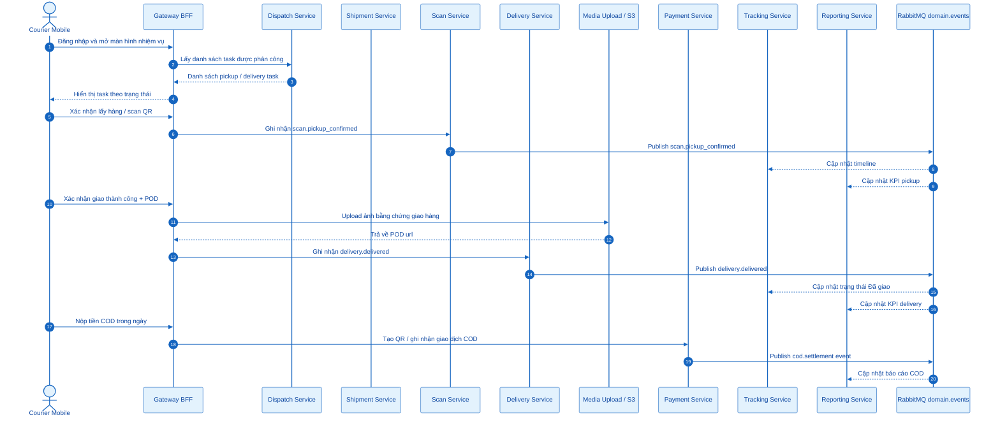
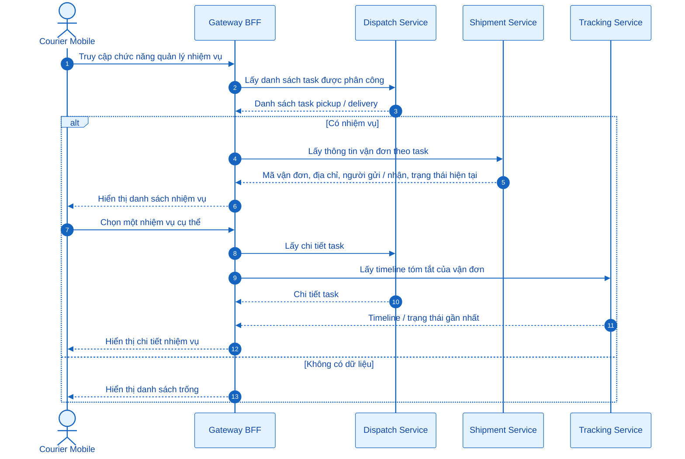
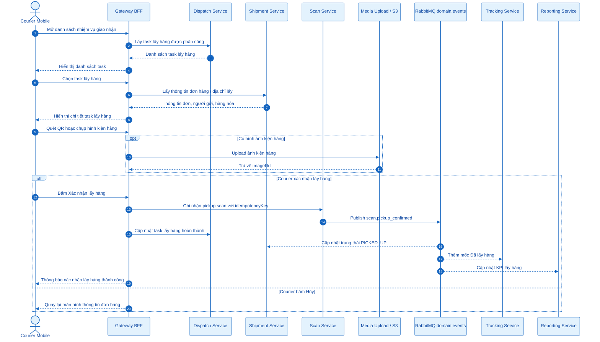
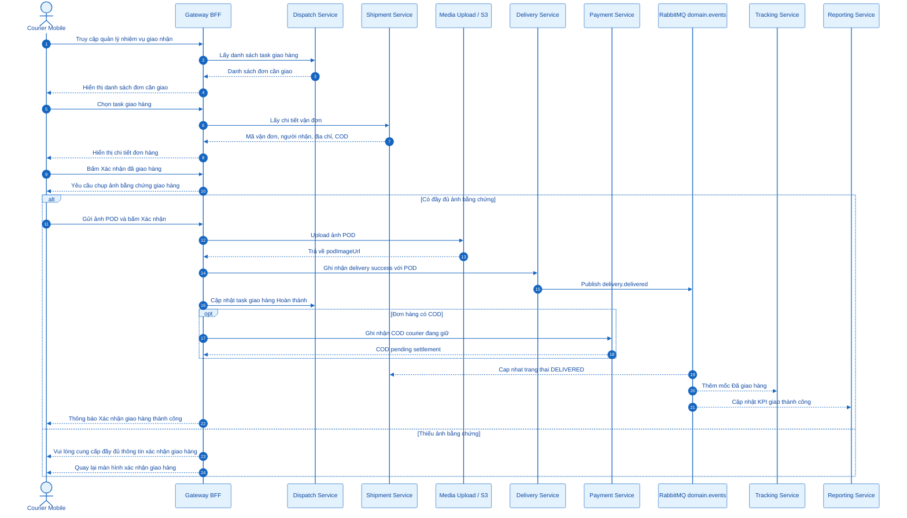
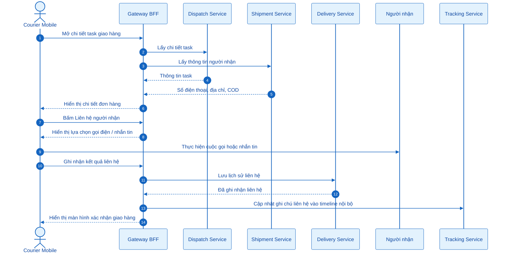
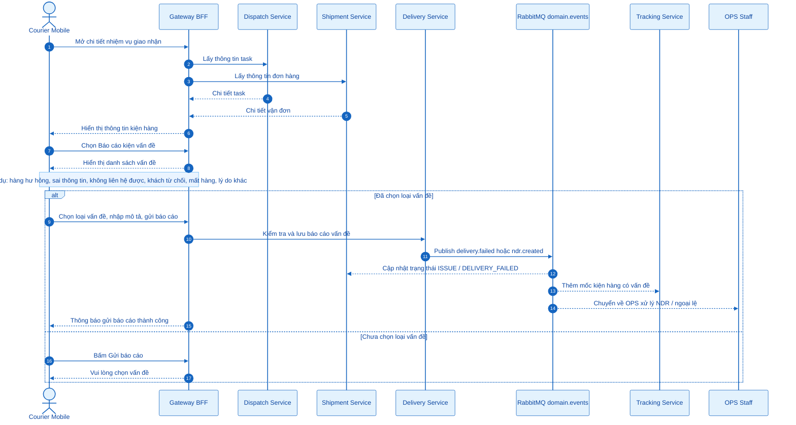
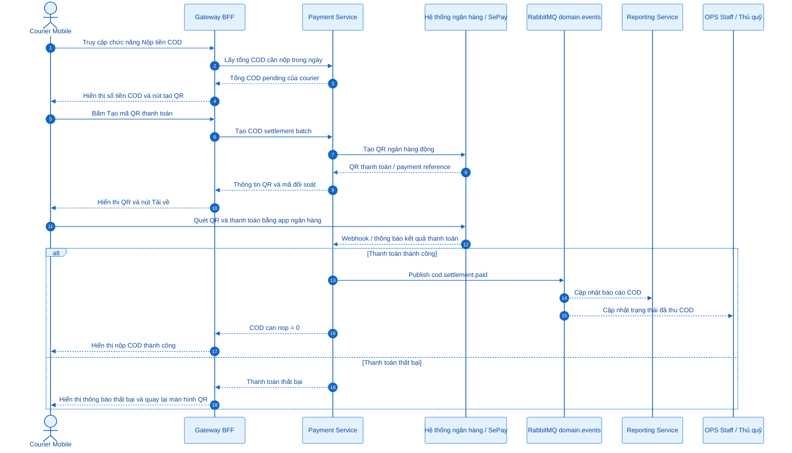
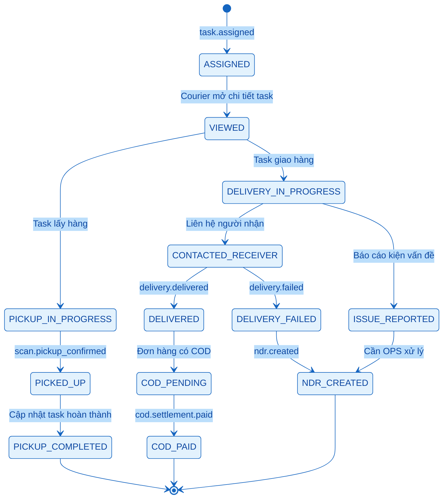

# Courier Staff - Mermaid Sequence Diagrams

Tài liệu này gồm các sơ đồ Mermaid cho nhóm chức năng Courier / Nhân viên giao nhận trong Nexus Express System.

> Cách dùng: mở file này trong VS Code, cài extension Markdown Preview Mermaid Support, sau đó bấm `Ctrl + Shift + V` de xem so do.

---

## 0. Tổng quan luồng vận hành Courier

---

## 3.2.5.1 Quản lý nhiệm vụ giao nhận

---

## 3.2.5.2 Xác nhận lấy hàng

---

## 3.2.5.3 Xác nhận đã giao hàng

---

## 3.2.5.4 Liên hệ người nhận

---

## 3.2.5.5 Báo cáo kiện vấn đề

---

## 3.2.5.6 Nộp tiền COD

---

## 4. State tổng quát của Courier Task

---

## 5. Mapping chức năng Courier với service xử lý

| Chức năng | Endpoint đại diện gợi ý | Service chính | Event / State liên quan |
|---|---|---|---|
| Quản lý nhiệm vụ giao nhận | `GET /courier/tasks` | `dispatch-service` | `task.assigned`, `task.completed` |
| Xem chi tiết nhiệm vụ | `GET /courier/tasks/:id` | `dispatch-service`, `shipment-service` | Trạng thái task và shipment hiện tại |
| Xác nhận lấy hàng | `POST /courier/pickups/confirm` | `scan-service` | `scan.pickup_confirmed`, `PICKED_UP` |
| Xác nhận đã giao hàng | `POST /courier/deliveries/success` | `delivery-service` | `delivery.delivered`, `DELIVERED` |
| Liên hệ người nhận | `POST /courier/deliveries/contact-log` | `delivery-service` | Lịch sử liên hệ nội bộ |
| Báo cáo kiện vấn đề | `POST /courier/deliveries/issues` | `delivery-service` | `delivery.failed`, `ndr.created`, `ISSUE_REPORTED` |
| Upload ảnh POD | `POST /media/upload` | `gateway-bff`, MinIO/S3 | POD image URL |
| Nộp tiền COD | `POST /courier/cod/settlements` | `payment-service` | `cod.settlement.created`, `cod.settlement.paid` |

---

## 6. Ghi chú trình bày báo cáo

- Courier không xử lý trực tiếp database của service nào. Tất cả thao tác đi qua Gateway BFF.
- `dispatch-service` là source of truth cho task được phân công.
- `scan-service` ghi nhận hành động quét mã khi lấy hàng hoặc bàn giao.
- `delivery-service` là source of truth cho kết quả giao hàng, giao thất bại, vấn đề và NDR.
- `payment-service` quản lý COD pending, QR thanh toán và settlement.
- `tracking-service` va `reporting-service` cập nhật dữ liệu thông qua domain events.

%%{init: {
  "theme": "base",
  "themeVariables": {
    "background": "#FFFFFF",
    "primaryColor": "#E3F2FD",
    "primaryTextColor": "#0D47A1",
    "primaryBorderColor": "#1565C0",
    "actorBkg": "#E3F2FD",
    "actorBorder": "#1565C0",
    "actorTextColor": "#0D47A1",
    "actorLineColor": "#1565C0",
    "signalColor": "#1565C0",
    "signalTextColor": "#0D47A1",
    "activationBkgColor": "#BBDEFB",
    "activationBorderColor": "#1565C0",
    "noteBkgColor": "#EAF4FF",
    "noteBorderColor": "#64B5F6",
    "noteTextColor": "#0D47A1",
    "labelBoxBkgColor": "#E3F2FD",
    "labelBoxBorderColor": "#1565C0",
    "labelTextColor": "#0D47A1"
  }
}}%%
sequenceDiagram
    autonumber
    actor Guest as Khách vãng lai
    participant Web as Website / Tracking Page
    participant Gateway as Gateway BFF
    participant Shipment as Shipment Service
    participant Tracking as Tracking Service

    Guest->>Web: Truy cập trang tra cứu hành trình đơn hàng
    Web-->>Guest: Hiển thị ô nhập mã đơn hàng

    Guest->>Web: Nhập mã đơn hàng và bấm Tra cứu
    Web->>Gateway: Gửi yêu cầu tra cứu theo mã đơn hàng

    Gateway->>Shipment: Kiểm tra mã đơn hàng có tồn tại không

    alt Mã đơn hàng hợp lệ
        Shipment-->>Gateway: Trả về thông tin cơ bản của đơn hàng
        Gateway->>Tracking: Lấy hành trình / timeline của đơn hàng
        Tracking-->>Gateway: Trả về các mốc trạng thái vận chuyển
        Gateway-->>Web: Trả về thông tin đơn hàng và hành trình
        Web-->>Guest: Hiển thị hành trình đơn hàng
    else Mã đơn hàng không tồn tại
        Shipment-->>Gateway: Không tìm thấy đơn hàng
        Gateway-->>Web: Trả về lỗi không tìm thấy
        Web-->>Guest: Hiển thị thông báo mã đơn hàng không hợp lệ
    end