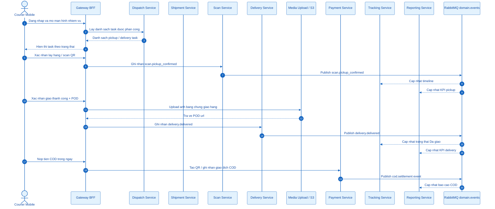
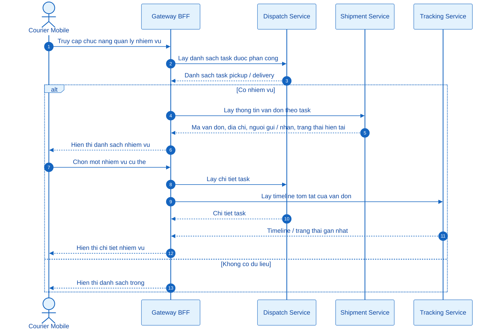
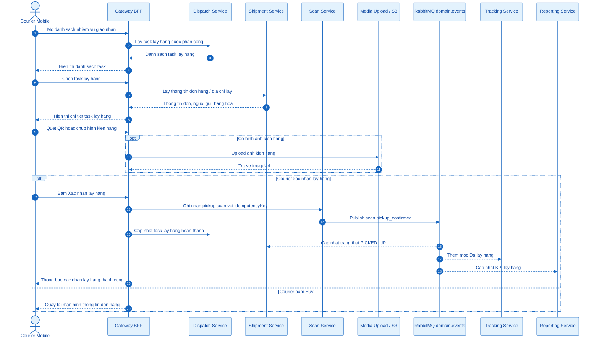
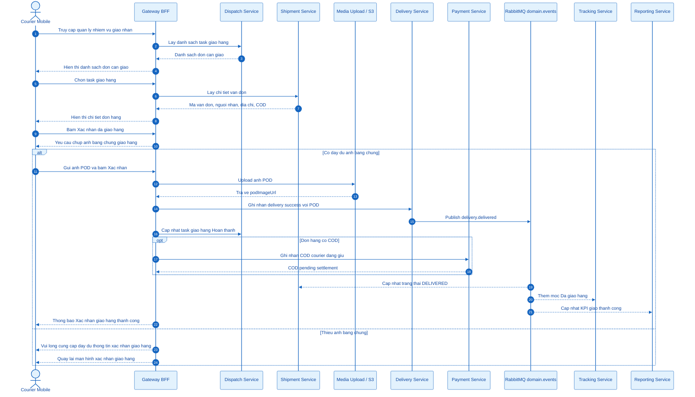
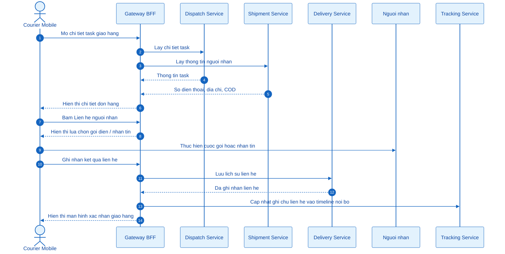
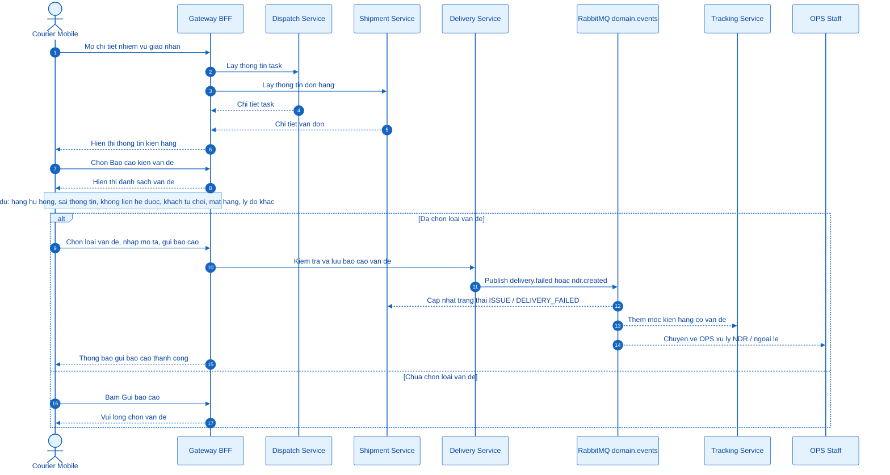
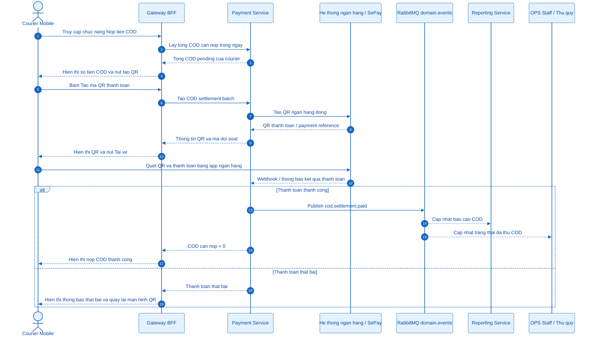
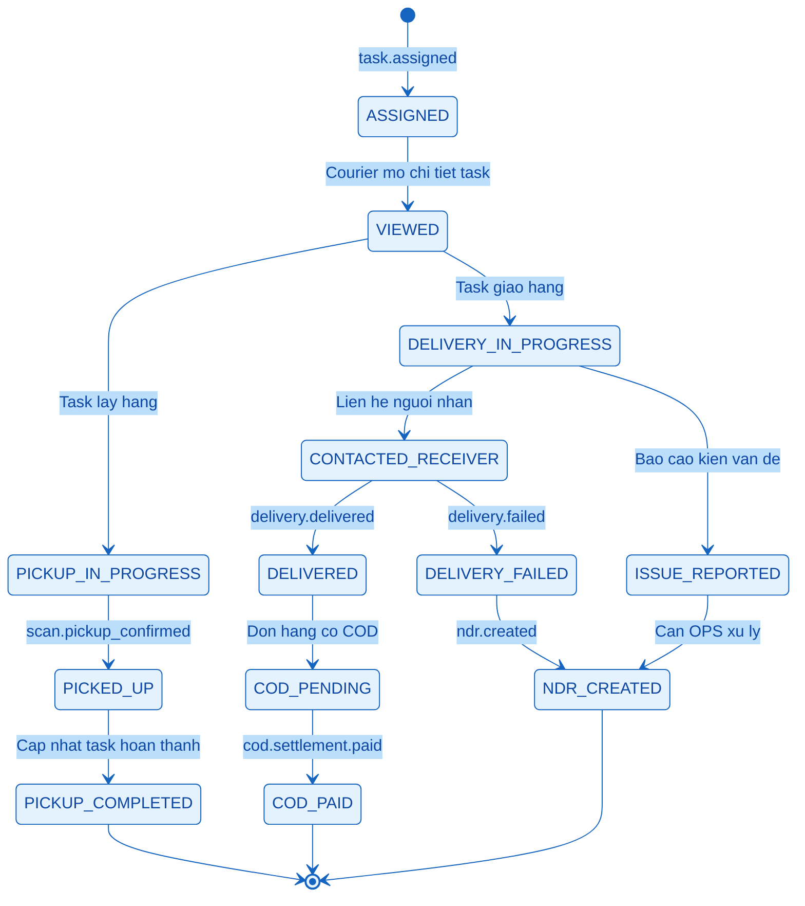

# Courier Staff - Mermaid Sequence Diagrams

Tai lieu nay gom cac so do Mermaid cho nhom chuc nang Courier / Nhan vien giao nhan trong Nexus Express System.

> Cach dung: mo file nay trong VS Code, cai extension Markdown Preview Mermaid Support, sau do bam `Ctrl + Shift + V` de xem so do.

---

## 0. Tong quan luong van hanh Courier

---

## 3.2.5.1 Quan ly nhiem vu giao nhan

---

## 3.2.5.2 Xac nhan lay hang

---

## 3.2.5.3 Xac nhan da giao hang

---

## 3.2.5.4 Lien he nguoi nhan

---

## 3.2.5.5 Bao cao kien van de

---

## 3.2.5.6 Nop tien COD

---

## 4. State tong quat cua Courier Task

---

## 5. Mapping chuc nang Courier voi service xu ly

| Chuc nang | Endpoint dai dien goi y | Service chinh | Event / State lien quan |
|---|---|---|---|
| Quan ly nhiem vu giao nhan | `GET /courier/tasks` | `dispatch-service` | `task.assigned`, `task.completed` |
| Xem chi tiet nhiem vu | `GET /courier/tasks/:id` | `dispatch-service`, `shipment-service` | Trang thai task va shipment hien tai |
| Xac nhan lay hang | `POST /courier/pickups/confirm` | `scan-service` | `scan.pickup_confirmed`, `PICKED_UP` |
| Xac nhan da giao hang | `POST /courier/deliveries/success` | `delivery-service` | `delivery.delivered`, `DELIVERED` |
| Lien he nguoi nhan | `POST /courier/deliveries/contact-log` | `delivery-service` | Lich su lien he noi bo |
| Bao cao kien van de | `POST /courier/deliveries/issues` | `delivery-service` | `delivery.failed`, `ndr.created`, `ISSUE_REPORTED` |
| Upload anh POD | `POST /media/upload` | `gateway-bff`, MinIO/S3 | POD image URL |
| Nop tien COD | `POST /courier/cod/settlements` | `payment-service` | `cod.settlement.created`, `cod.settlement.paid` |

---

## 6. Ghi chu trinh bay bao cao

- Courier khong xu ly truc tiep database cua service nao. Tat ca thao tac di qua Gateway BFF.
- `dispatch-service` la source of truth cho task duoc phan cong.
- `scan-service` ghi nhan hanh dong quet ma khi lay hang hoac ban giao.
- `delivery-service` la source of truth cho ket qua giao hang, giao that bai, van de va NDR.
- `payment-service` quan ly COD pending, QR thanh toan va settlement.
- `tracking-service` va `reporting-service` cap nhat du lieu thong qua domain events.
