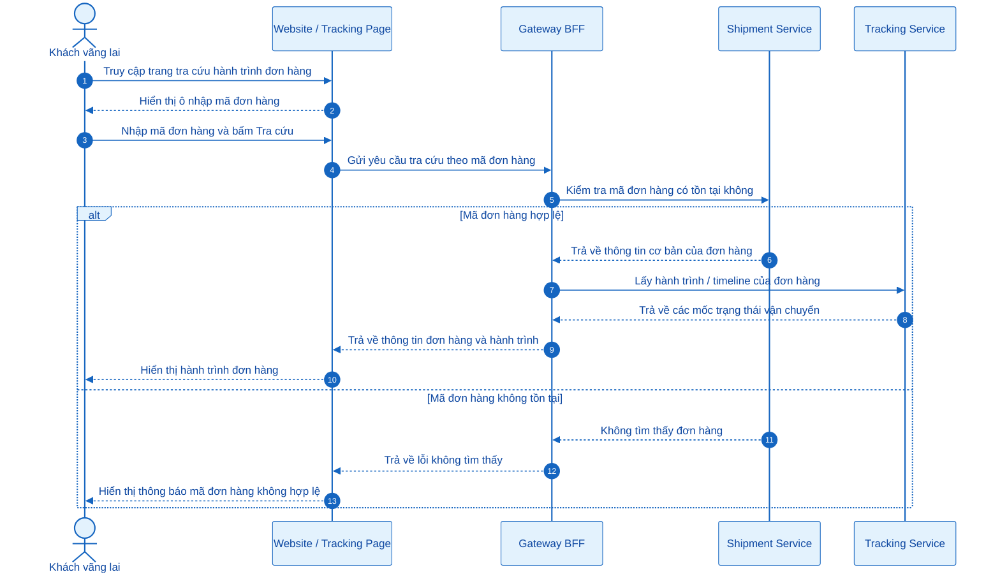

# Sơ đồ khách vãng lai tra cứu hành trình đơn hàng

```mermaid
%%{init: {
  "theme": "base",
  "themeVariables": {
    "background": "#FFFFFF",
    "primaryColor": "#E3F2FD",
    "primaryTextColor": "#0D47A1",
    "primaryBorderColor": "#1565C0",
    "actorBkg": "#E3F2FD",
    "actorBorder": "#1565C0",
    "actorTextColor": "#0D47A1",
    "actorLineColor": "#1565C0",
    "signalColor": "#1565C0",
    "signalTextColor": "#0D47A1",
    "activationBkgColor": "#BBDEFB",
    "activationBorderColor": "#1565C0",
    "noteBkgColor": "#EAF4FF",
    "noteBorderColor": "#64B5F6",
    "noteTextColor": "#0D47A1",
    "labelBoxBkgColor": "#E3F2FD",
    "labelBoxBorderColor": "#1565C0",
    "labelTextColor": "#0D47A1"
  }
}}%%
sequenceDiagram
    autonumber
    actor Guest as Khách vãng lai
    participant Web as Website / Tracking Page
    participant Gateway as Gateway BFF
    participant Shipment as Shipment Service
    participant Tracking as Tracking Service

    Guest->>Web: Truy cập trang tra cứu hành trình đơn hàng
    Web-->>Guest: Hiển thị ô nhập mã đơn hàng

    Guest->>Web: Nhập mã đơn hàng và bấm Tra cứu
    Web->>Gateway: Gửi yêu cầu tra cứu theo mã đơn hàng

    Gateway->>Shipment: Kiểm tra mã đơn hàng có tồn tại không

    alt Mã đơn hàng hợp lệ
        Shipment-->>Gateway: Trả về thông tin cơ bản của đơn hàng
        Gateway->>Tracking: Lấy hành trình / timeline của đơn hàng
        Tracking-->>Gateway: Trả về các mốc trạng thái vận chuyển
        Gateway-->>Web: Trả về thông tin đơn hàng và hành trình
        Web-->>Guest: Hiển thị hành trình đơn hàng
    else Mã đơn hàng không tồn tại
        Shipment-->>Gateway: Không tìm thấy đơn hàng
        Gateway-->>Web: Trả về lỗi không tìm thấy
        Web-->>Guest: Hiển thị thông báo mã đơn hàng không hợp lệ
    end

```
