# Mermaid Diagrams - Nhóm chức năng Merchant (Người gửi / Shop)

> File này dùng để mở trong VS Code bằng Markdown Preview Mermaid Support.
> Mỗi sơ đồ Mermaid đã được cấu hình màu xanh dương để dễ nhìn khi chụp hình đưa vào báo cáo.

---

## 0. Tổng quan luồng vận hành Merchant

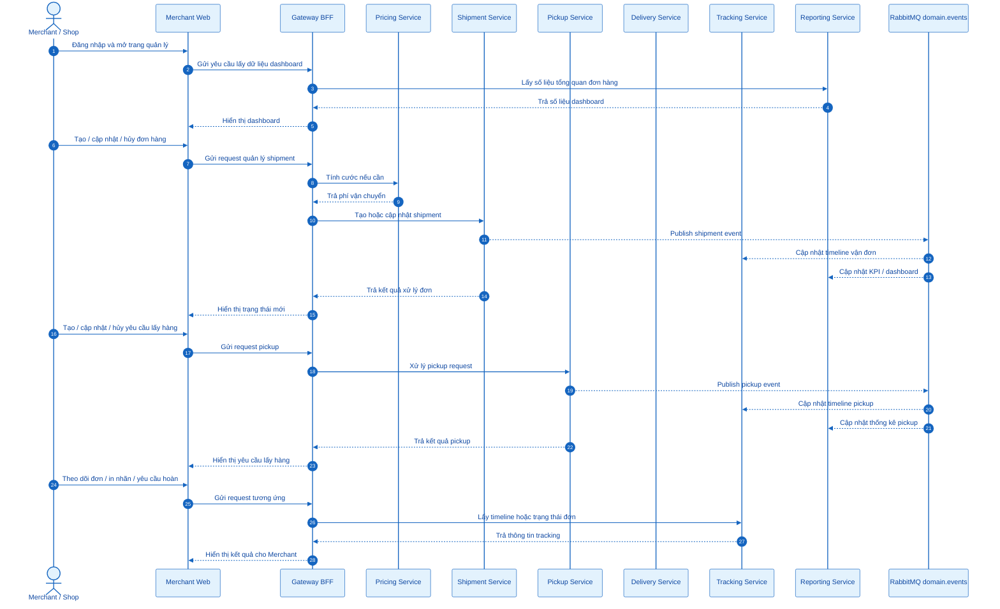

---

## 3.5.2.1.1 Tạo đơn hàng

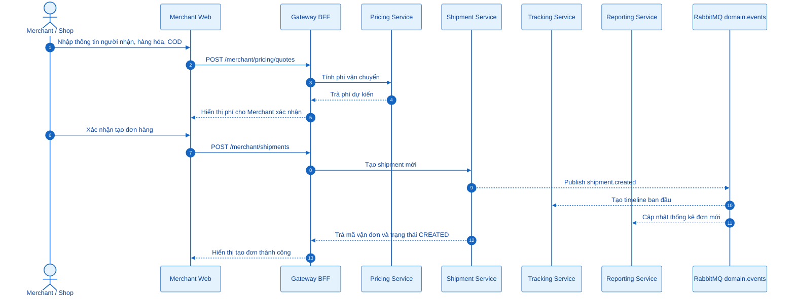

---

## 3.5.2.1.2 Cập nhật đơn hàng

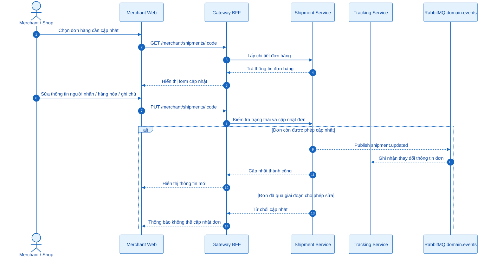

---

## 3.5.2.1.3 Theo dõi đơn hàng

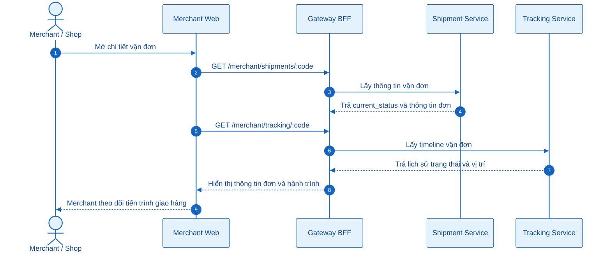

---

## 3.5.2.1.4 Tìm kiếm đơn hàng

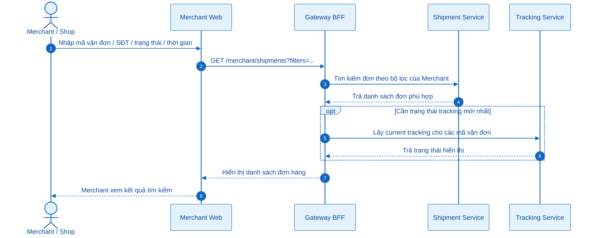

---

## 3.5.2.1.5 Hủy đơn hàng

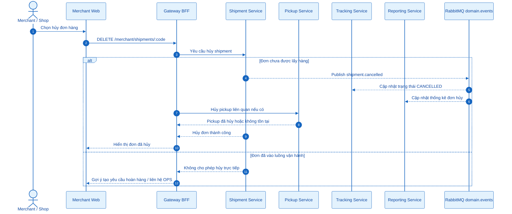

---

## 3.5.2.2.1 Tạo yêu cầu lấy hàng

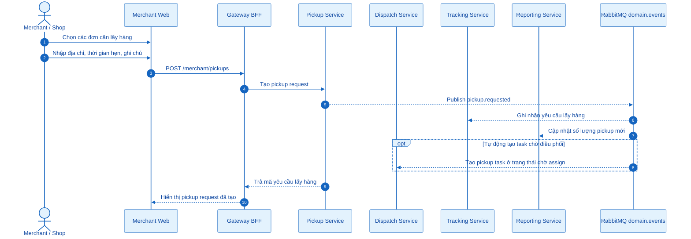

---

## 3.5.2.2.2 Cập nhật yêu cầu lấy hàng

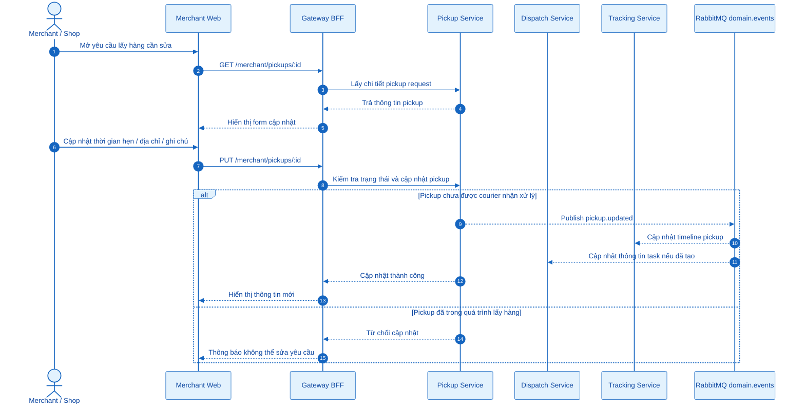

---

## 3.5.2.2.3 Hủy yêu cầu lấy hàng

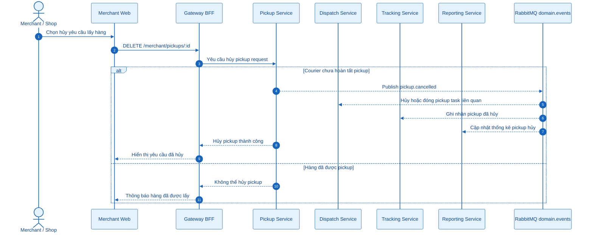

---

## 3.5.2.3 Tạo yêu cầu hoàn hàng

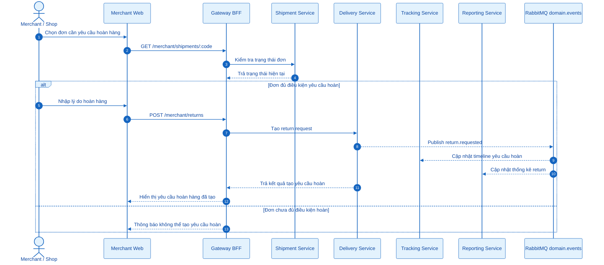

---

## 3.5.2.4 In nhãn vận đơn

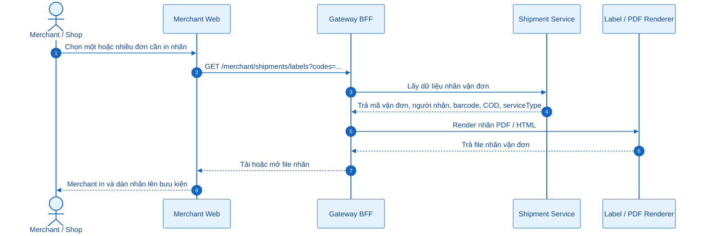

---

## 3.5.2.5 Xem dashboard tổng quan đơn hàng

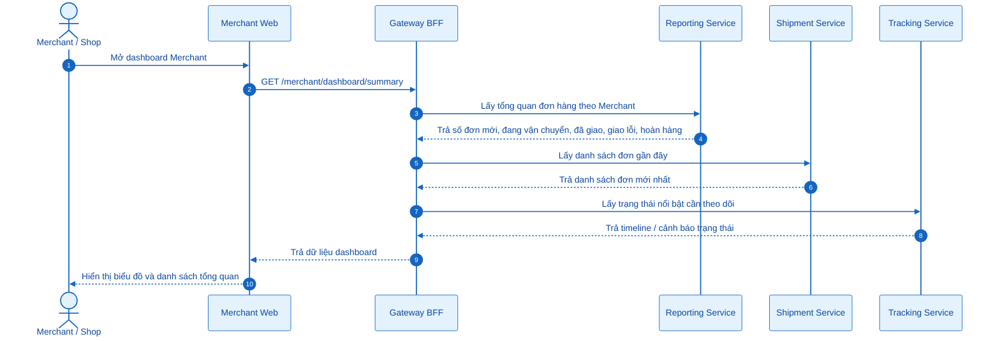

---

## 4. State tổng quát của đơn hàng nhìn từ Merchant

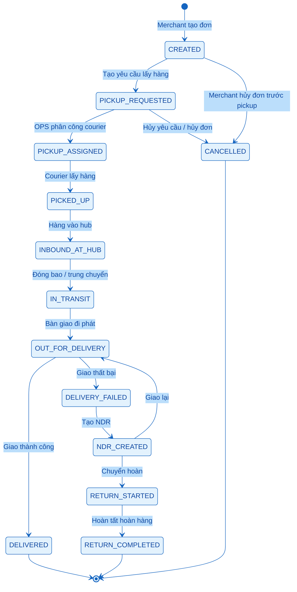

---

## 5. Mapping chức năng Merchant với service xử lý

| Nhóm chức năng | Chức năng | Service chính | Event / trạng thái liên quan |
| --- | --- | --- | --- |
| Quản lý đơn hàng | Tạo đơn hàng | shipment-service, pricing-service | shipment.created, CREATED |
| Quản lý đơn hàng | Cập nhật đơn hàng | shipment-service | shipment.updated |
| Quản lý đơn hàng | Theo dõi đơn hàng | tracking-service, shipment-service | tracking timeline |
| Quản lý đơn hàng | Tìm kiếm đơn hàng | shipment-service | current_status |
| Quản lý đơn hàng | Hủy đơn hàng | shipment-service, pickup-service | shipment.cancelled, CANCELLED |
| Quản lý yêu cầu lấy hàng | Tạo yêu cầu lấy hàng | pickup-service | pickup.requested, PICKUP_REQUESTED |
| Quản lý yêu cầu lấy hàng | Cập nhật yêu cầu lấy hàng | pickup-service, dispatch-service | pickup.updated |
| Quản lý yêu cầu lấy hàng | Hủy yêu cầu lấy hàng | pickup-service, dispatch-service | pickup.cancelled |
| Hoàn hàng | Tạo yêu cầu hoàn hàng | delivery-service | return.requested / return.started |
| Nhãn vận đơn | In nhãn vận đơn | shipment-service, gateway-bff | shipping label / barcode |
| Dashboard | Xem tổng quan đơn hàng | reporting-service, tracking-service | KPI, aggregate, timeline |
