# OPS Staff - Mermaid Sequence Diagrams

> File này dùng để mở bằng VS Code + extension **Markdown Preview Mermaid Support**.  
> Mỗi mục bên dưới là một sơ đồ Mermaid riêng, có thể chụp/copy hình để đưa vào báo cáo hoặc slide.

---

## 0. Tổng quan luồng vận hành OPS Staff

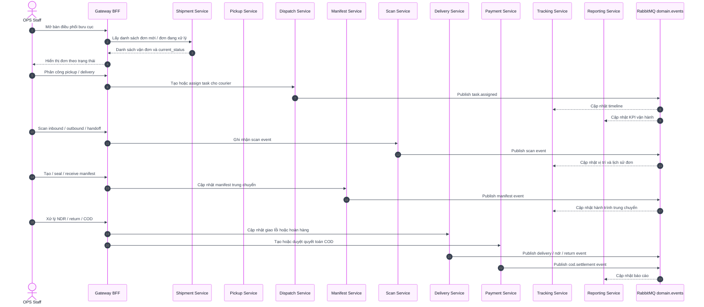

---

# NHÓM 1: TIẾP NHẬN ĐƠN & ĐIỀU PHỐI LẤY HÀNG

## 3.2.4.1. Tiếp nhận đơn hàng tự động

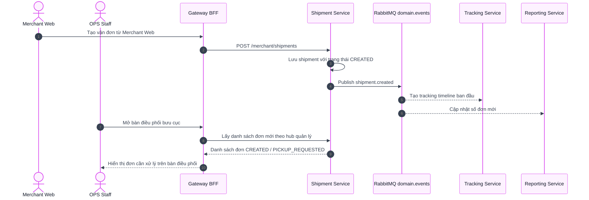

## 3.2.4.2. Tạo đơn hàng Walk-in tại quầy

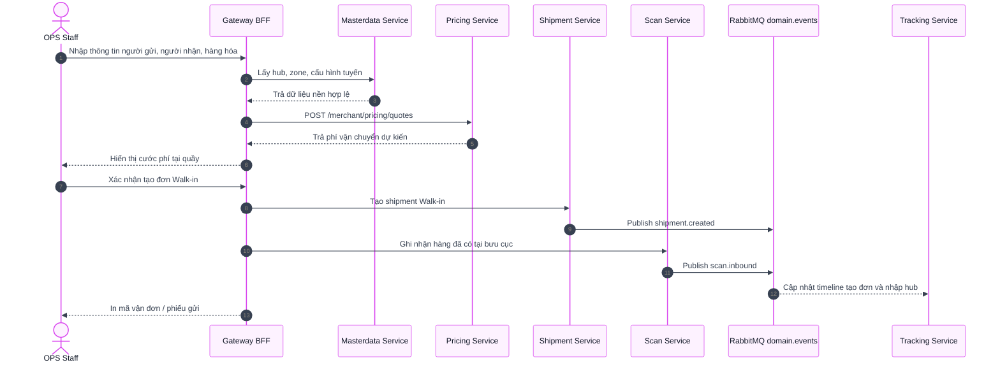

## 3.2.4.3. Phân công đi lấy hàng

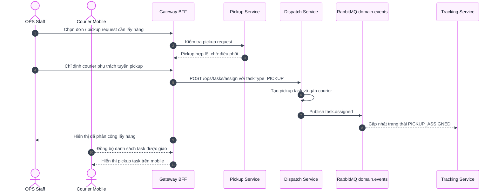

---

# NHÓM 2: ĐÓNG BAO TRUNG CHUYỂN

## 3.2.4.4. Khởi tạo bao trung chuyển

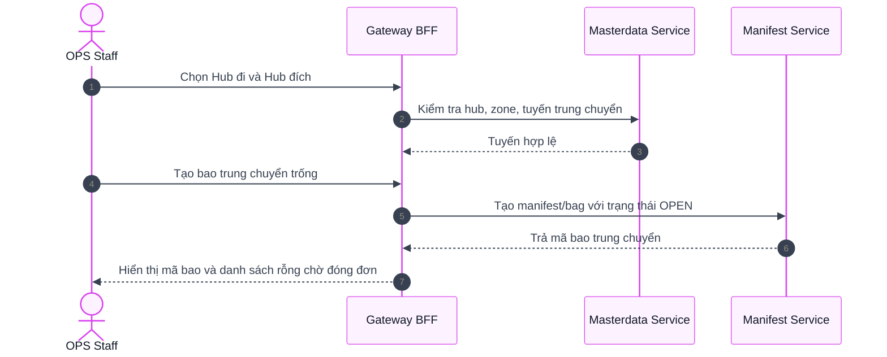

## 3.2.4.5. Đóng đơn lẻ vào bao tải

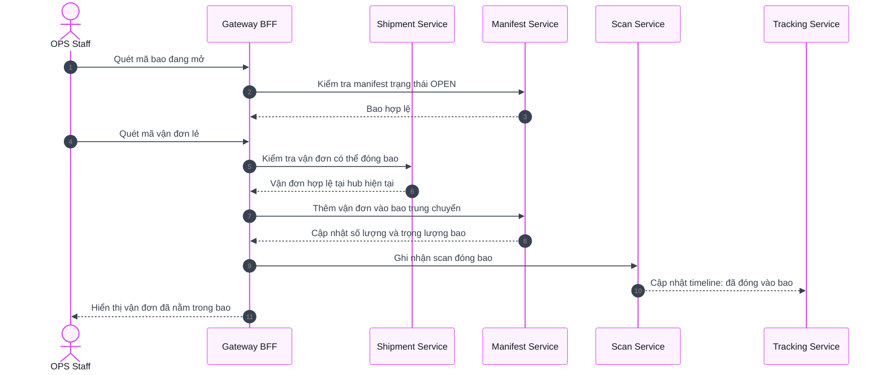

## 3.2.4.6. Niêm phong bao tải Seal

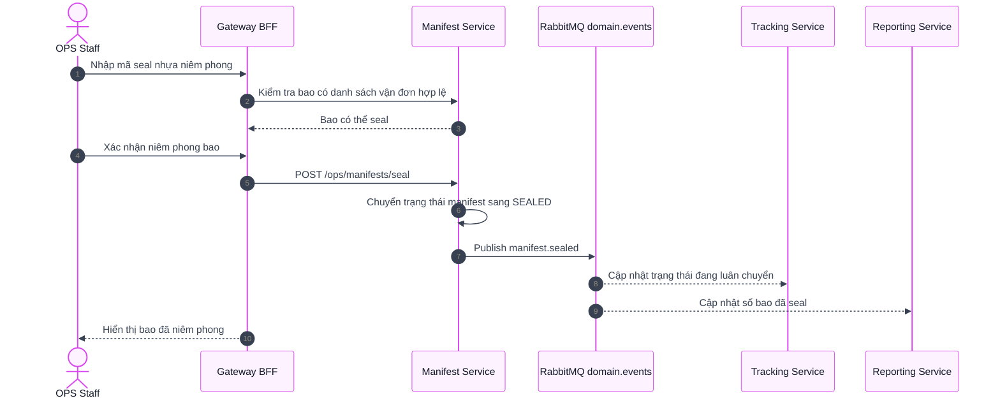

---

# NHÓM 3: VẬN CHUYỂN XE TẢI LINEHAUL

## 3.2.4.7. Tạo niêm phong xe tải

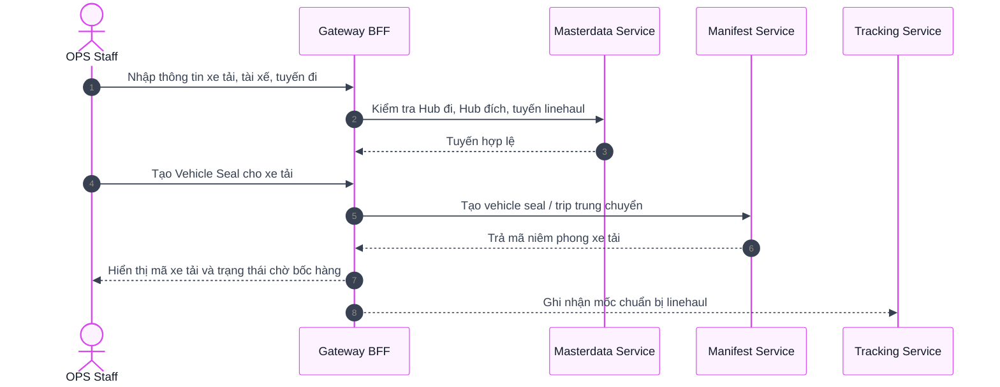

## 3.2.4.8. Quét xuất hàng lên xe tải đi

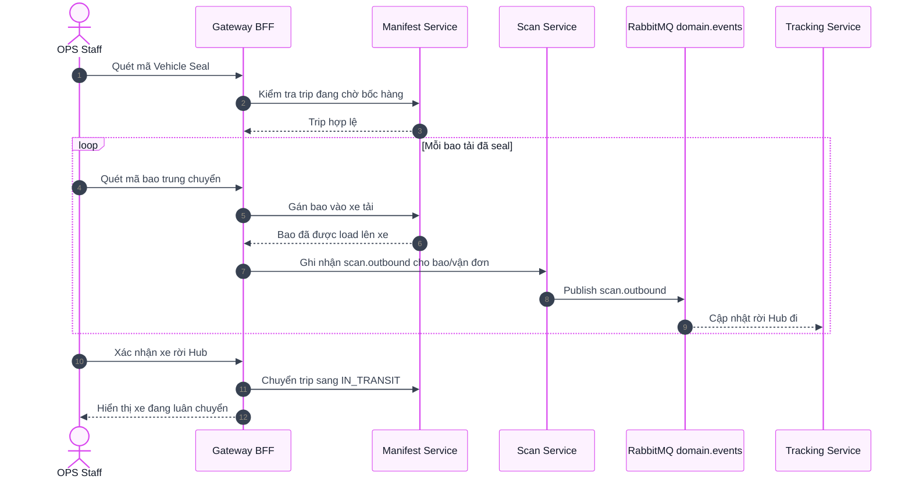

## 3.2.4.9. Quét dỡ hàng xe tải đến

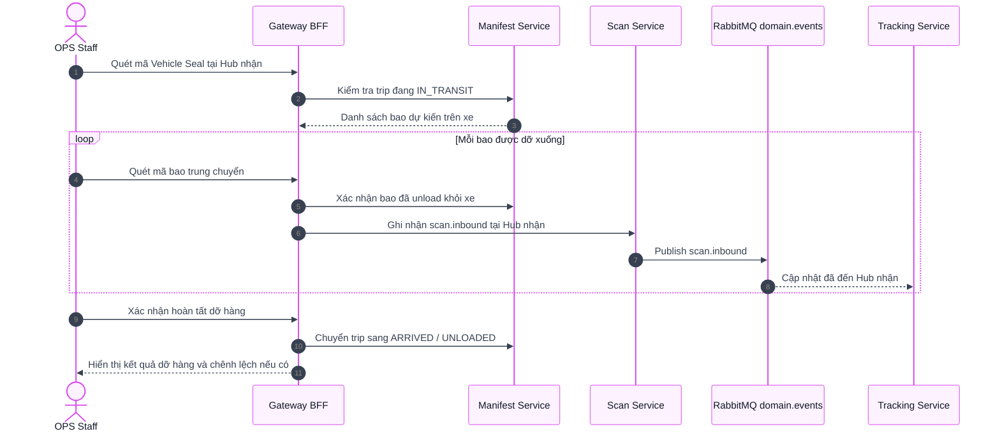

---

# NHÓM 4: TIẾP NHẬN HÀNG ĐẾN & GỠ BAO

## 3.2.4.10. Quét nhận bao hàng đến Hub

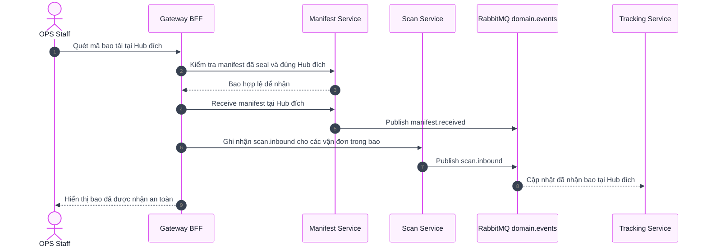

## 3.2.4.11. Gỡ bao và phân loại đơn lẻ

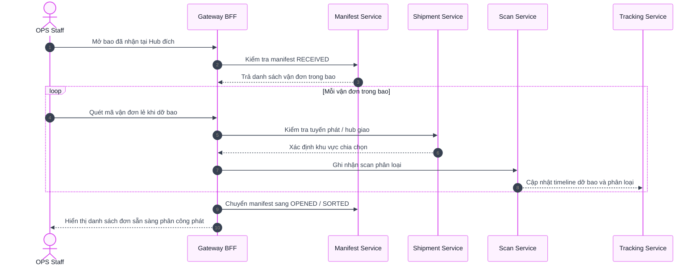

---

# NHÓM 5: BÀN GIAO ĐI PHÁT

## 3.2.4.12. Phân công đi phát hàng

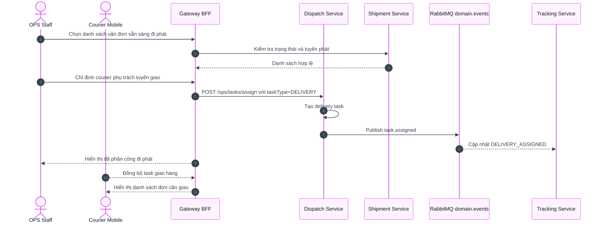

## 3.2.4.13. Quét bàn giao bưu kiện

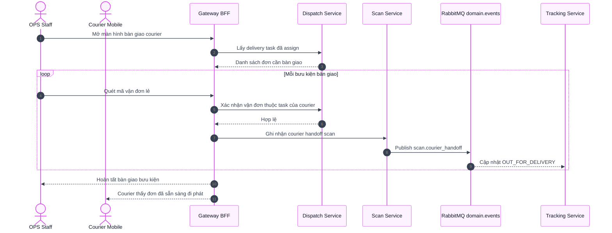

---

# NHÓM 6: QUYẾT TOÁN COD TRONG NGÀY

## 3.2.4.14. Quyết toán tiền mặt qua QR

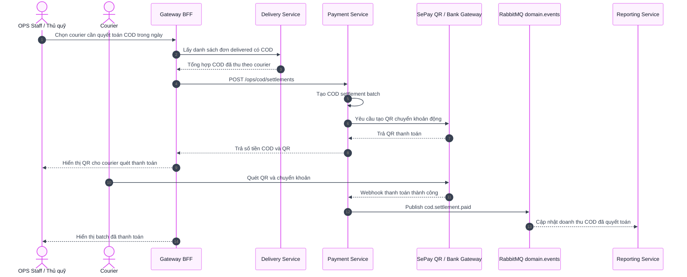

## 3.2.4.15. Phê duyệt quyết toán thủ công

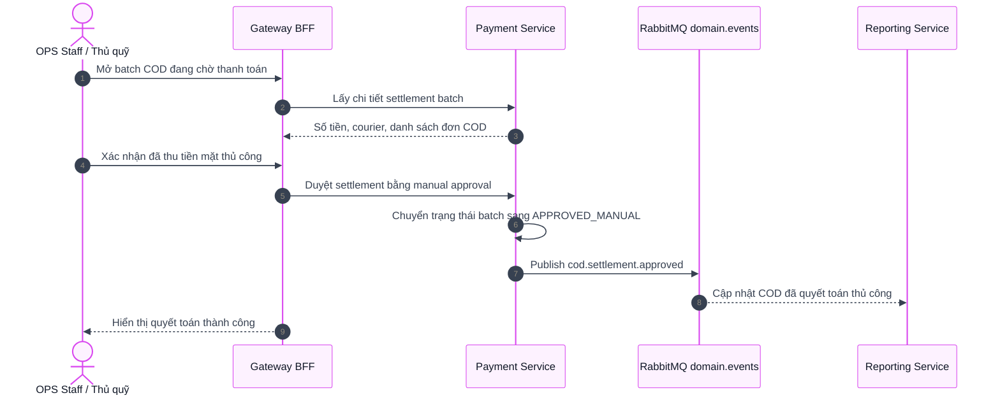

---

# NHÓM 7: VẬN HÀNH NGOẠI LỆ & HỖ TRỢ

## 3.2.4.16. Tra cứu hành trình đơn Tracking

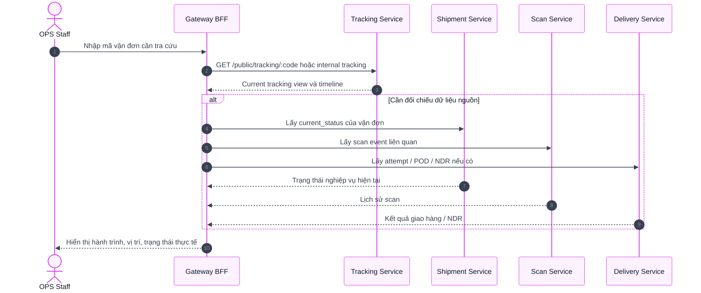

## 3.2.4.17. Xử lý đơn giao lỗi NDR

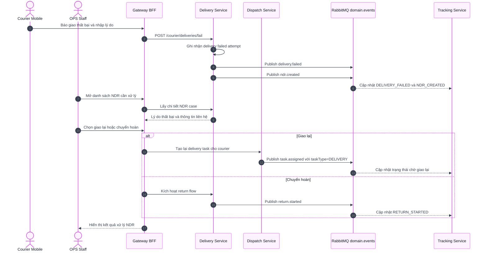

## 3.2.4.18. Quản lý quy trình hoàn hàng

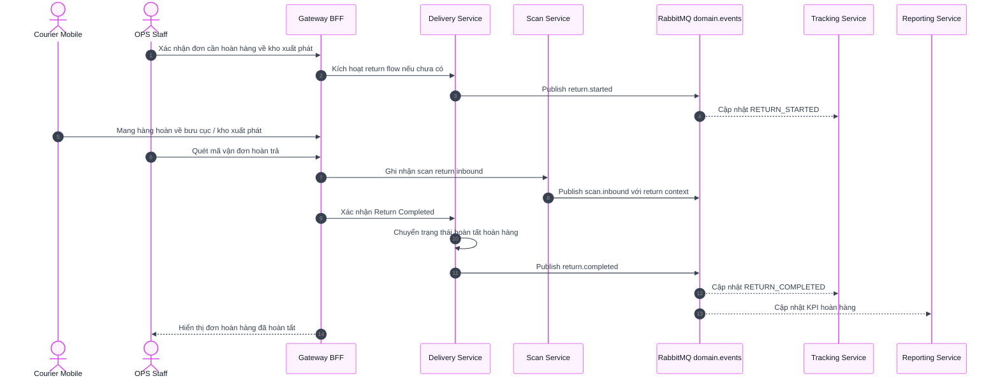

---

# Phụ lục: State tổng quát của vận đơn cho OPS

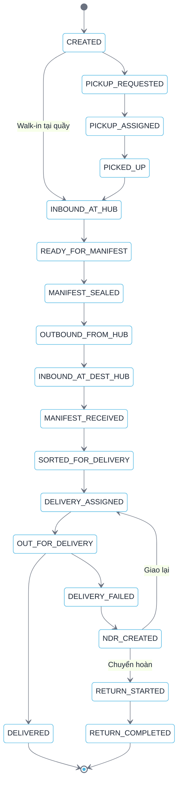
