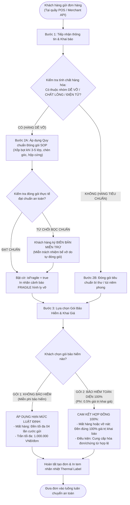

# ĐẶC TẢ NGHIỆP VỤ: TIẾP NHẬN ĐƠN HÀNG, ĐÓNG GÓI HÀNG DỄ VỠ & CHÍNH SÁCH BẢO HIỂM HÀNG HÓA
*(Phục Vụ Tư Vấn Khách Hàng, Đào Tạo Vận Hành & Báo Cáo Đồ Án Tốt Nghiệp Hệ Thống Logistics)*

---

## 1. TỔNG QUAN & BỐI CẢNH NGHIỆP VỤ

### 1.1. Bối cảnh ngành chuyển phát nhanh (Express Logistics)
Trong chuỗi cung ứng logistics thương mại điện tử (E-Commerce Logistics), khâu **Tiếp nhận đơn hàng (Order Intake / First-mile Reception)** là "cửa ngõ" quyết định chất lượng toàn bộ hành trình vận chuyển. 

Một kiện hàng từ lúc nhận đến lúc phát phải trải qua trung bình:
- **02 lần vận chuyển chặng đầu / chặng cuối (First-mile & Last-mile):** Bằng xe máy hoặc xe tải van nhỏ, chịu rung lắc đường phố.
- **02 đến 04 lần phân loại tự động tại Hub:** Qua băng chuyền con lăn, máng trượt dốc (Chute) với tốc độ cao.
- **01 đến 02 chuyến xe tải đường dài (Linehaul):** Xếp chồng các bao tải hàng (Stacking) lên đến 2 - 3 tầng trong thùng xe tải liên tỉnh.

### 1.2. Bài toán rủi ro: Tại sao không thể đền 100% vô điều kiện?
Nếu doanh nghiệp vận chuyển áp dụng chính sách **mặc định đền 100% giá trị hàng hóa cho mọi trường hợp hư hỏng hoặc mất mát**, hệ thống sẽ lập tức đối mặt với các nguy cơ nghiêm trọng:

1. **Rủi ro đạo đức và trục lợi bồi thường (Moral Hazard & Fraud):**
   - Khách hàng có thể gửi các mặt hàng đã qua sử dụng, hàng lỗi sẵn, hoặc đóng gói cực kỳ sơ sài, sau đó kê khai giá khống (ví dụ: món đồ cũ trị giá 200.000 VNĐ nhưng khai giá 10.000.000 VNĐ).
   - Khi xảy ra vỡ nát bên trong thùng carton (mà bên ngoài hộp vẫn nguyên vẹn), khách hàng sẽ đòi bồi thường 100% số tiền 10.000.000 VNĐ.
2. **Hàng dễ vỡ không được phân luồng xử lý riêng (Fragile Special Handling):**
   - Nếu không có cơ chế đánh dấu phân loại **"Hàng dễ vỡ (Fragile)"** ngay tại quầy tiếp nhận, kiện hàng thủy tinh, gốm sứ, màn hình điện tử sẽ bị xử lý như một kiện quần áo: bị ném qua máng chia chọn tự động hoặc bị các bao tải nặng đè lên trong xe tải tuyến.
3. **Mất cân đối tài chính (Financial Deficit):**
   - Cước phí vận chuyển cơ bản thông thường chỉ từ 18.000 VNĐ – 35.000 VNĐ/kiện. Nếu không thu **Phí bảo hiểm khai giá (Insurance Fee)** để trích lập quỹ dự phòng rủi ro, một đơn hàng bị đền 10.000.000 VNĐ sẽ làm xóa sạch toàn bộ lợi nhuận của hơn 500 – 1.000 đơn hàng vận chuyển thành công khác.

---

## 2. CƠ SỞ PHÁP LÝ & QUY CHUẨN NGÀNH

Hệ thống quản lý logistics NEXUS được thiết kế tuân thủ nghiêm ngặt khung pháp lý bưu chính Việt Nam và tập quán thương mại quốc tế:

1. **Luật Bưu chính số 49/2010/QH12:**
   - **Điều 24 (Trách nhiệm bồi thường thiệt hại):** Doanh nghiệp cung ứng dịch vụ bưu chính có trách nhiệm bồi thường thiệt hại do lỗi của mình gây ra đối với bưu phẩm, bưu kiện. Doanh nghiệp được **miễn trừ trách nhiệm** nếu thiệt hại xảy ra do lỗi của người gửi (đóng gói không đúng quy chuẩn kỹ thuật) hoặc do bản chất tự nhiên của hàng hóa.
   - **Điều 25 (Nguyên tắc và mức bồi thường):**
     - Đối với dịch vụ bưu chính **có kê khai giá (có bảo hiểm):** Mức bồi thường thiệt hại được tính theo giá trị thiệt hại thực tế, tối đa bằng giá trị đã kê khai.
     - Đối với dịch vụ bưu chính **không kê khai giá (không mua bảo hiểm):** Mức bồi thường được xác định theo hạn mức giới hạn luật định, thông thường tối đa từ **04 đến 10 lần cước phí dịch vụ đã thu**.
2. **Nghị định 47/2011/NĐ-CP:** Hướng dẫn chi tiết thi hành Luật Bưu chính về hợp đồng cung ứng và sử dụng dịch vụ bưu chính.
3. **Tiêu chuẩn đóng gói hàng hóa dễ vỡ TCVN / IATA Standard:** Hàng hóa lỏng, dễ vỡ phải được đệm lót tối thiểu 3 lớp xốp khí chống sốc và chịu được bài kiểm tra rơi tự do ở độ cao 80cm.

---

## 3. QUY TRÌNH TIẾP NHẬN ĐƠN HÀNG 3 BƯỚC (3-STEP ORDER INTAKE)



---

### BƯỚC 1: TIẾP NHẬN THÔNG TIN & PHÂN LOẠI TÍNH CHẤT HÀNG HÓA

Khi khách hàng mang hàng đến quầy bưu cục (Walk-in) hoặc tạo đơn qua phần mềm Merchant, nhân viên tiếp nhận thực hiện rà soát danh mục hàng hóa:

#### Danh mục hàng hóa bắt buộc gắn cờ `isFragile` (Hàng dễ vỡ):
1. **Đồ gốm, sứ, thủy tinh, pha lê:** Chai lọ, chén dĩa, đồ mỹ nghệ, gương, bóng đèn.
2. **Chất lỏng và hóa chất đóng chai:** Nước hoa, rượu, mỹ phẩm dạng lỏng, mật ong, dầu gội (yêu cầu thêm nắp khóa seal chống rò rỉ).
3. **Thiết bị công nghệ có linh kiện màn hình / kính:** Điện thoại, máy tính bảng, màn hình vi tính, linh kiện phần cứng dễ gãy.
4. **Hàng thực phẩm / bánh trái dễ biến dạng:** Bánh quy hộp mềm, socola nhạy nhiệt độ, hoa quả tươi.

---

### BƯỚC 2: QUY CHUẨN ĐÓNG GÓI SOP & BIÊN BẢN MIỄN TRỪ

Đối với các đơn hàng có đánh dấu `isFragile`, quy trình tiếp nhận phân nhánh như sau:

#### 1. Quy chuẩn đóng gói SOP bắt buộc (Standard Operating Procedure):
- **Lớp bảo vệ trực tiếp:** Quấn bọc xốp bọt khí (Bubble Wrap) hạt lớn dày tối thiểu 3 đến 5 lớp xung quanh sản phẩm.
- **Lớp chèn cố định:** Không để khoảng trống bên trong hộp. Sử dụng xốp định hình EPS/PE Foam hoặc giấy chèn chặt 6 mặt để khi lắc hộp không có tiếng lạch cạch.
- **Hộp bảo vệ:** Thùng carton sóng cứng (tối thiểu 3 lớp sóng hoặc 5 lớp sóng với hàng nặng).
- **Tem nhãn nhận diện:** Hệ thống tự động in ký hiệu **`FRAGILE - HÀNG DỄ VỠ - XIN NHẸ TAY` (Biểu tượng ly vỡ màu đỏ)** trên tem nhiệt bưu chính.
- **Chế độ phân loại đặc biệt:** Kiện có tem FRAGILE sẽ **không được đổ vào máng trượt tự động**, được chuyển qua luồng phân loại thủ công (Manual Chute) và luôn xếp ở **tầng trên cùng (Top Stacking)** trên xe tải.

#### 2. Cơ chế xử lý khi khách hàng từ chối đóng gói chuẩn (Packaging Waiver):
- Nhiều trường hợp khách hàng tự mang gói hàng đã bọc sơ sài (chỉ bọc 1 lớp túi nylon hoặc hộp carton mềm) và từ chối trả thêm phí đóng gói xốp/hộp gỗ.
- **Quy tắc vận hành:** 
  - Nhân viên tiếp nhận cảnh báo nguy cơ bể vỡ.
  - Nếu khách hàng vẫn yêu cầu gửi, hệ thống bật cờ **`packagingWaiver: true` (Biên bản miễn trừ trách nhiệm bể vỡ do đóng gói không đạt chuẩn SOP)**.
  - Khách hàng xác nhận điện tử hoặc ký biên lai miễn trừ: *"NEXUS chỉ bồi thường nếu mất nguyên đai nguyên kiện, không bồi thường trường hợp bể vỡ, móp méo bên trong do người gửi tự đóng gói không đạt chuẩn."*

---

### BƯỚC 3: LỰA CHỌN GÓI BẢO HIỂM HÀNG HÓA & KHAI GIÁ

Doanh nghiệp bưu chính cung cấp **02 Gói dịch vụ bảo hiểm** minh bạch để khách hàng lựa chọn:

| Tiêu chí | GÓI 1: VẬN CHUYỂN TIÊU CHUẨN<br/>*(Không mua bảo hiểm)* | GÓI 2: BẢO HIỂM TOÀN DIỆN 100%<br/>*(Có mua bảo hiểm khai giá)* |
| :--- | :--- | :--- |
| **Đối tượng phù hợp** | Quần áo, tài liệu, hàng hóa giá trị thấp (&le; 1.000.000 VNĐ). | Điện thoại, laptop, mỹ phẩm cao cấp, hàng trị giá &gt; 1.000.000 VNĐ. |
| **Phí bảo hiểm** | **0 VNĐ (Miễn phí)** | **0.5% giá trị khai báo** (Tối thiểu 5.000 VNĐ).<br/>*VD: Hàng 10 triệu &rarr; Phí bảo hiểm 50.000 VNĐ.* |
| **Chứng từ khi gửi** | Không bắt buộc hóa đơn. | Khuyến nghị chụp ảnh sản phẩm, lưu hóa đơn mua hàng / link sản phẩm. |
| **Hạn mức bồi thường nếu MẤT HÀNG** | **Tối đa 04 lần cước vận chuyển**<br/>*(Trần tối đa không quá 1.000.000 VNĐ/đơn theo Luật Bưu chính).* | **BỒI THƯỜNG ĐÚNG 100% GIÁ TRỊ KHAI BÁO**<br/>*(Tối đa lên tới 50.000.000 VNĐ/đơn).* |
| **Hạn mức bồi thường nếu BỂ VỠ / HƯ HỎNG** | Bồi thường theo tỷ lệ hư hại thực tế nhân với hạn mức cước (tối đa 4 lần cước). | **Bồi thường theo tỷ lệ hư hại thực tế nhân với 100% giá trị khai báo** (hoặc đền 100% nếu hỏng toàn bộ). |
| **Điều kiện bồi thường bể vỡ** | Đóng gói đạt chuẩn cơ bản. | Bắt buộc đóng gói đúng quy chuẩn SOP của hàng dễ vỡ. |

---

## 4. MA TRẬN PHÂN ĐỊNH TRÁCH NHIỆM BỒI THƯỜNG (COMPENSATION MATRIX)

Bảng ma trận xử lý sau đây là cơ sở cho các buổi họp thẩm định giám định tranh chấp (Claims & Liability Hearing):

| Tình huống sự cố | Trạng thái bảo hiểm | Quy chuẩn đóng gói SOP | Kết luận phán quyết của Ban Giám Định | Mức chi trả bồi thường |
| :--- | :---: | :---: | :--- | :--- |
| **1. Mất tích / Thất lạc nguyên kiện** | CÓ MUA (100%) | Đạt / Không xét | Lỗi thuộc về mạng lưới vận chuyển (Hub/Tài xế làm mất). | **Đền đúng 100% giá trị khai giá** |
| **2. Mất tích / Thất lạc nguyên kiện** | KHÔNG MUA | Đạt / Không xét | Lỗi thuộc về mạng lưới vận chuyển, áp dụng hạn mức cơ bản. | **Đền 04 lần cước gửi** (Tối đa 1.000.000 đ) |
| **3. Bể vỡ nát hoàn toàn bên trong** | CÓ MUA (100%) | ĐẠT CHUẨN SOP | Lỗi do va đập chèn lót hoặc tai nạn vận chuyển. | **Đền đúng 100% giá trị khai giá** |
| **4. Bể vỡ bên trong (Hộp ngoài nguyên)** | CÓ MUA (100%) | CÓ BIÊN BẢN MIỄN TRỪ (Không đạt SOP) | Người gửi tự đóng gói không đạt tiêu chuẩn chống sốc. | **TỪ CHỐI BỒI THƯỜNG** (Theo biên bản miễn trừ) |
| **5. Bể vỡ nát hoàn toàn** | KHÔNG MUA | ĐẠT CHUẨN | Lỗi vận chuyển nhưng khách không mua bảo hiểm. | **Đền 04 lần cước gửi** |
| **6. Bể vỡ một phần (VD: Vỡ 1/4 chai lọ)** | CÓ MUA (100%) | ĐẠT CHUẨN SOP | Xác định tỷ lệ hư hại thực tế (25%). | **Đền 25% giá trị khai giá** |

---

## 5. MÔ HÌNH DỮ LIỆU ĐỀ XUẤT (DATA SCHEMA & MOCKUP)

### 5.1. Các trường dữ liệu bổ sung trong bảng `Shipment`
```prisma
model Shipment {
  // ... các trường định danh hiện tại
  code              String   @unique
  declaredValue     Float    @default(0)     // Giá trị hàng hóa khai báo (VNĐ)
  
  // Kiểm soát Hàng dễ vỡ
  isFragile         Boolean  @default(false) // Cờ hàng dễ vỡ / chất lỏng
  fragileCategory   String?                  // 'CERAMICS' | 'LIQUID' | 'ELECTRONICS' | 'GLASS'
  packagingStandard Boolean  @default(true)  // Đã bọc xốp chống sốc đạt chuẩn SOP
  packagingWaiver   Boolean  @default(false) // Khách ký cam kết miễn trừ bể vỡ do tự gói
  
  // Hợp đồng Bảo hiểm
  insuranceTier     String   @default("NONE") // 'NONE' | 'COMPREHENSIVE_100'
  insuranceFee      Float    @default(0)      // Phí bảo hiểm tự động tính (0.5% giá trị)
  maxLiabilityLimit Float    @default(0)      // Hạn mức đền bù tối đa được bảo vệ
  
  // Chứng từ chứng minh giá trị
  invoiceUrl        String?                  // Ảnh chụp hóa đơn VAT / Hóa đơn mua hàng
  packagePhotoUrl   String?                  // Ảnh chụp gói hàng trước khi niêm phong
}
```

### 5.2. Nhãn in nhiệt bưu chính tiêu chuẩn (Thermal Label Mockup)

```text
+-------------------------------------------------------------------+
|  NEXUS EXPRESS - CHUYỂN PHÁT NHANH TOÀN QUỐC                     |
|  MÃ ĐƠN: 101000000005                      NGÀY GỬI: 12/09/2026   |
+-------------------------------------------------------------------+
|  [BARCODE CHÍNH: 101000000005]                                    |
|                                                                   |
|  TUYẾN: BƯU CỤC TÂN BÌNH (SGN) ➔ BƯU CỤC HOÀN KIẾM (HAN)         |
+-------------------------------------------------------------------+
|  CẢNH BÁO ĐẶC BIỆT:                                               |
|  [!] HÀNG DỄ VỠ - XIN NHẸ TAY (FRAGILE)    |  [BẢO HIỂM 100%]     |
|  (Biểu tượng: Ly nứt | Top Stacking)      |  Khai giá: 18.500.000đ|
+-------------------------------------------------------------------+
|  Người gửi: Cửa Hàng Apple Care Authorized - 0918.888.xxx         |
|  Người nhận: Trần Văn Long - 0988.123.xxx                         |
|  Đ/c nhận: Số 45 Tràng Tiền, Quận Hoàn Kiếm, Hà Nội               |
|  Nội dung: Máy tính bảng iPad Air M2 11-inch (0.85 kg)            |
+-------------------------------------------------------------------+
|  TIỀN THU HỘ (COD): 18.500.000 đ                                  |
|  CƯỚC CHUYỂN PHÁT: 45.000 đ | PHÍ BẢO HIỂM 100%: 92.500 đ        |
+-------------------------------------------------------------------+
```

---

## 6. KỊCH BẢN TƯ VẤN KHÁCH HÀNG THỰC TẾ (CONSULTING SCRIPTS)

### Kịch bản 1: Tư vấn khách hàng gửi hàng giá trị cao (Điện thoại, Laptop)
- **Khách hàng:** *"Sao đơn hàng 15 triệu của tôi phí ship 40.000đ mà lại có thêm phí bảo hiểm 75.000đ nữa vậy shop?"*
- **Nhân viên tiếp nhận:** 
  > *"Dạ em chào anh/chị, kiện hàng của mình là sản phẩm công nghệ giá trị cao (15.000.000đ). Phí 40.000đ là cước vận chuyển tiêu chuẩn. Khoản phí 75.000đ (tương đương 0.5%) là **Gói bảo hiểm toàn diện 100% giá trị hàng hóa** của NEXUS.  
  > Khi tham gia gói bảo hiểm này, đơn hàng sẽ được đưa vào luồng giám sát an ninh camera và kẹp chì riêng. Nếu có bất kỳ sự cố rủi ro mất mát hoặc hư hỏng nào dọc đường, NEXUS cam kết **bồi thường đúng 100% toàn bộ 15.000.000đ** cho anh/chị. Nếu không mua bảo hiểm, theo quy định Luật Bưu chính mức đền bù tối đa chỉ được 4 lần cước (khoảng 160.000đ) thôi ạ. Anh/chị hoàn toàn yên tâm khi sử dụng gói bảo hiểm 100% này nhé!"*

### Kịch bản 2: Tư vấn khách hàng gửi đồ dễ vỡ nhưng đóng gói chưa đạt chuẩn
- **Khách hàng:** *"Hàng này tôi bọc trong thùng carton này rồi, dán băng keo là xong, cần gì phải quấn xốp nổ thêm tốn tiền?"*
- **Nhân viên tiếp nhận:**
  > *"Dạ thưa anh/chị, chai nước hoa / đồ gốm bên trong là chất liệu rất dễ nứt vỡ khi xe tải rung lắc liên tỉnh hoặc xếp dỡ. Theo quy chuẩn bảo đảm an toàn của NEXUS, kiện hàng bắt buộc phải quấn tối thiểu 3 lớp xốp khí giảm chấn và chèn mút cố định các góc.  
  > Nếu mình để nguyên hiện trạng này chuyển đi, khi va đập rất dễ vỡ bên trong. Nếu anh/chị nhất quyết không gia cố đóng gói lại, em buộc phải tích vào hệ thống biên bản **'Miễn trừ trách nhiệm bể vỡ do người gửi tự đóng gói'**. Khi đó nếu xảy ra nứt vỡ bên trong, bên em sẽ không thể giải quyết bồi thường bể vỡ được ạ. Để an tâm tuyệt đối, anh/chị để bên em hỗ trợ bọc xốp đạt chuẩn SOP chỉ mất 2 phút thôi ạ!"*

---

## 7. KẾT LUẬN & ĐÓNG GÓP CHO ĐỒ ÁN HỆ THỐNG

1. **Về mặt học thuật và bảo vệ đồ án:**
   - Đồ án chứng minh được **tính thực tiễn sâu sắc (Real-world applicability)**: Không vẽ ra một hệ thống "mơ mộng đền 100% cho mọi thứ" mà giải quyết bài toán cốt lõi của ngành: Quản trị rủi ro, phân loại hàng hóa và tính toán kinh tế bưu chính.
   - Bám sát **khung pháp lý bưu chính Việt Nam (Luật Bưu chính 2010)** và cơ chế tự động hóa phân luồng trên hệ thống phần mềm.
2. **Về mặt kỹ thuật triển khai:**
   - Dữ liệu được cấu trúc tường minh từ bảng `Shipment` sang `Pricing Service`, in ấn `Thermal Label` và đồng bộ sang module `Claims & Investigation` để phân xử trách nhiệm tự động bằng phần mềm.
