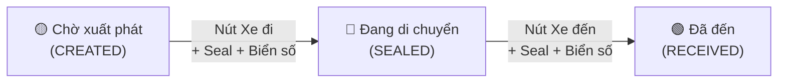

# Giai đoạn 2 (Middle Mile) — Báo cáo thay đổi

## Tổng quan
Refactor toàn bộ luồng **Đóng bao → Lên xe → Xe đi → Xe đến → Gỡ bao** trên hệ thống ops-web.

---

## 1. ManifestDetailPage — Viết lại hoàn toàn ⚡

### File thay đổi
- `apps/ops-web/src/pages/manifests/ManifestDetailPage.tsx`
- `apps/ops-web/src/pages/manifests/ManifestDetailPage.css` *(tạo mới)*

### Thay đổi

| Tính năng | Trước | Sau |
|-----------|-------|-----|
| **Layout** | Text thuần (`
`) | Card layout với header tối, stats, badge |
| **Danh sách vận đơn** | Chuỗi text phẳng | Chip list với index + mã monospace |
| **Đếm kiện** | ❌ Không hiển thị | ✅ Hiển thị số kiện trong header + badge |
| **Status Badge** | Text thuần | 🟡 Khởi tạo / 🔵 Đang luân chuyển / 🟢 Đã đến |
| **Form thao tác** | 4 form giống nhau, không phân biệt | 4 card riêng biệt, mỗi card có màu + icon riêng |
| **Validation trạng thái** | ❌ Không có | ✅ Disable card khi trạng thái không hợp lệ + thông báo lý do |
| **Kiểm tra bao trống** | ❌ Không có | ✅ Không cho niêm phong bao 0 kiện |
| **Confirm Modal** | ❌ Không có | ✅ Modal xác nhận cho Niêm phong + Nhận bàn giao |
| **Toast notification** | ❌ Không có | ✅ Toast thành công/thất bại bay từ phải |
| **Response JSON** | Hiện JSON thô `<pre>` | Đã bỏ → dùng toast message thay thế |

### Quy tắc Validation mới
- **Thêm vận đơn**: Chỉ khi status = `CREATED`, check trùng mã
- **Gỡ vận đơn**: Chỉ khi status = `CREATED`
- **Niêm phong (Đóng bao)**: Chỉ khi `CREATED` + phải có ≥1 kiện + phải nhập mã seal
- **Nhận bàn giao (Gỡ bao)**: Chỉ khi `SEALED` (bao đã niêm phong + đang di chuyển)

---

## 2. ManifestsTable — Cập nhật status badges 🎨

### File thay đổi
- `apps/ops-web/src/pages/manifests/ManifestsTable.tsx`
- `apps/ops-web/src/pages/manifests/ManifestsTable.css` *(tạo mới)*

| Badge | Màu | Trạng thái |
|-------|-----|------------|
| `mt-badge--created` | 🟡 Vàng | Khởi tạo |
| `mt-badge--sealed` | 🔵 Xanh dương | Đang luân chuyển |
| `mt-badge--received` | 🟢 Xanh lá | Đã đến |
| `mt-badge--closed` | ⚪ Xám | Đã đóng |

Thêm cột **Số kiện** trong bảng.

---

## 3. LinehaulTripManagementPage — Thêm nút Xe đi / Xe đến + Confirm Modal 🚛

### File thay đổi
- `apps/ops-web/src/pages/function-groups/operations-platform/linehaul/LinehaulTripManagementPage.tsx`
- `apps/ops-web/src/pages/function-groups/operations-platform/linehaul/LinehaulStyles.css`

### Thay đổi chính

| Tính năng | Trước | Sau |
|-----------|-------|-----|
| **Status Badge** | `ops-badge--default/info/success` (generic) | `ops-badge--pending` 🟡 / `ops-badge--transit` 🔵 / `ops-badge--arrived` 🟢 |
| **Nút Xe đi** | ❌ Không có | ✅ Hiển thị khi status = "Chờ xuất phát", gọi API seal manifest |
| **Nút Xe đến** | ❌ Không có | ✅ Hiển thị khi status = "Đang di chuyển", gọi API receive manifest |
| **Confirm Modal** | ❌ Không có | ✅ Modal với 2 field bắt buộc: Biển số xe + Mã Seal |
| **Validation Seal** | ❌ Không có | ✅ Không cho submit nếu seal/biển số trống |
| **Toast** | `window.alert()` | ✅ Toast notification bay từ phải, tự biến mất |
| **API Integration** | Chỉ có edit vehicle info | ✅ Gọi `manifests/{id}/seal` cho Xe đi, `manifests/{id}/receive` cho Xe đến |

### Flow trạng thái chuyến xe

---

## 4. LinehaulStyles.css — Sửa CSS hỏng + thêm styles mới 🔧

> **⚠ Lưu ý:** File CSS cũ có lỗi nghiêm trọng: rule `.ops-input--highlight` không đóng ngoặc nhọn `}`, dẫn tới toàn bộ code CSS phía sau (~200 dòng) bị trùng lặp và parse sai. Đã sửa lại hoàn toàn.

### Styles mới được thêm:
- **Badge màu chuẩn**: `.ops-badge--pending` / `--transit` / `--arrived`
- **Transit buttons**: `.ops-transit-btn--depart` / `--arrive`
- **Toast container**: `.lh-toast-container`, `.lh-toast--success/error/info`
- **Confirm modal**: `.lh-modal-overlay`, `.lh-modal`, `.lh-modal__warning`
- **Success button**: `.ops-btn--success` (xanh lá cho nút Xe đến)

---

## Tổng kết file đã thay đổi

| File | Hành động |
|------|-----------|
| `ManifestDetailPage.tsx` | Viết lại hoàn toàn |
| `ManifestDetailPage.css` | Tạo mới |
| `ManifestsTable.tsx` | Viết lại |
| `ManifestsTable.css` | Tạo mới |
| `LinehaulTripManagementPage.tsx` | Thêm confirm modal, badge, transit buttons |
| `LinehaulStyles.css` | Sửa CSS hỏng + thêm styles mới |
