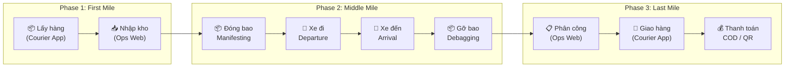

# 📋 Kế hoạch Nắn nót Nghiệp vụ Cốt lõi (Core Workflow Polishing)

> **Mục tiêu:** Tối ưu hóa và chuẩn hóa toàn bộ luồng vận hành logistics E2E — từ Lấy hàng → Trung chuyển → Giao hàng & Thanh toán.

## Tổng quan 3 giai đoạn

## Tài liệu chi tiết

| Tài liệu | Mô tả | Trạng thái |
|-----------|--------|------------|
| [Kế hoạch tổng thể](./00-core-workflow-plan.md) | Kế hoạch chia 3 giai đoạn + prompt tái sử dụng | ✅ Hoàn thành |
| [Phase 1: First Mile](./01-phase1-first-mile.md) | Lấy hàng (Pickup) & Nhập kho (Inbound Scan) | ✅ Hoàn thành |
| [Phase 2: Middle Mile](./02-phase2-middle-mile.md) | Đóng bao, Xe đi/đến, Gỡ bao (Linehaul) | ✅ Hoàn thành |
| [Phase 3: Last Mile](./03-phase3-last-mile.md) | Giao hàng, Ký nhận, Thanh toán COD/QR | ✅ Hoàn thành |

## Nguyên tắc thiết kế xuyên suốt

- 🎨 **Badge màu chuẩn**: 🟡 Vàng (Chờ) → 🔵 Xanh dương (Đang xử lý) → 🟢 Xanh lá (Hoàn thành)
- 🔒 **Validation chặt**: Mọi action quan trọng đều có Confirm Modal + kiểm tra trạng thái
- 🔔 **Toast notification**: Thay thế `window.alert()` / JSON thô bằng toast chuyên nghiệp
- 🇻🇳 **Tiếng Việt có dấu**: Toàn bộ text hiển thị cho người dùng cuối
- 📊 **Audit trail**: Ghi nhận đầy đủ tên NV, mã NV, hub vào mọi thao tác

## File đã thay đổi (tổng hợp)

### Ops Web (`apps/ops-web/`)
| File | Phase | Hành động |
|------|-------|-----------|
| `src/pages/scans/HubScanPage.tsx` | 1 | Viết lại hoàn toàn |
| `src/pages/scans/HubScanPage.css` | 1 | Tạo mới |
| `src/pages/manifests/ManifestDetailPage.tsx` | 2 | Viết lại hoàn toàn |
| `src/pages/manifests/ManifestDetailPage.css` | 2 | Tạo mới |
| `src/pages/manifests/ManifestsTable.tsx` | 2 | Viết lại |
| `src/pages/manifests/ManifestsTable.css` | 2 | Tạo mới |
| `src/pages/.../linehaul/LinehaulTripManagementPage.tsx` | 2 | Thêm confirm modal, badges |
| `src/pages/.../linehaul/LinehaulStyles.css` | 2 | Sửa CSS hỏng + thêm styles |
| `src/pages/tasks/TaskAssignmentPage.tsx` | 3 | Thêm search + hub warning |

### Courier Mobile (`apps/courier-mobile/`)
| File | Phase | Hành động |
|------|-------|-----------|
| `src/screens/scan/PickupScanScreen.tsx` | 1 | Fix ~17 text Vietnamese |
| `src/screens/tasks/TaskDetailScreen.tsx` | 3 | Fix ~30 text Vietnamese |
| `src/screens/delivery/DeliveryProofScreen.tsx` | 3 | Thêm bảng tính tiền, ô tên người nhận, QR |
